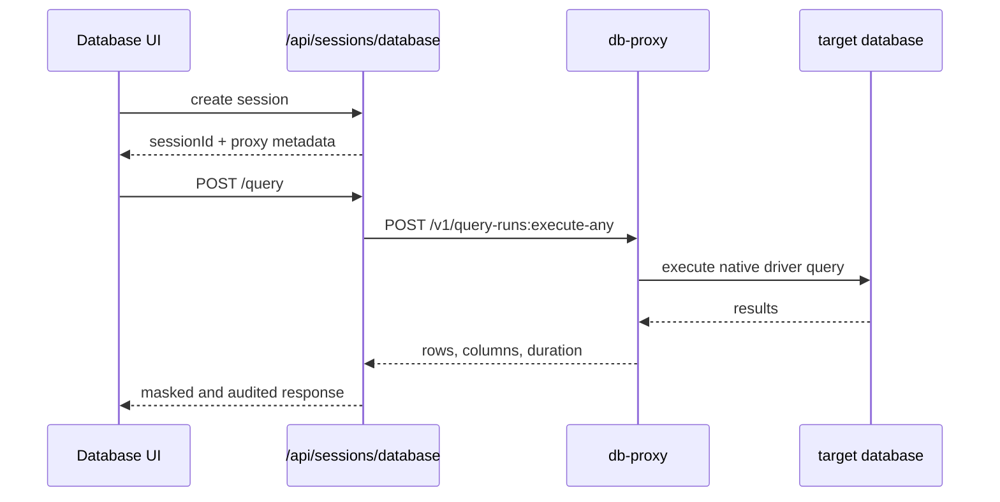

## 🌐 Surface Overview

The public edge is the Go control plane under `https://localhost:3000/api` in development. The route inventory is defined in `backend/cmd/control-plane-api/routes*.go`.

Authentication behavior is implemented in `client/src/api/client.ts`:

- bearer token in `Authorization: Bearer <token>`
- browser CSRF cookie in `X-CSRF-Token` for state-changing requests
- browser-session restore via `GET /api/auth/session` after authenticated 401s
- activity touches through `POST /api/auth/activity` and `POST /api/vault/touch`

One architectural change matters more than any raw endpoint count: the surface is now feature-gated. `backend/internal/runtimefeatures/manifest.go` decides which route families are registered, and `GET /api/auth/config` exposes that same manifest to the client.

## 🧩 Runtime Capability Switches

| Capability | Public effect |
|------------|---------------|
| `connectionsEnabled` | Enables connection CRUD, folders, SSH/RDP/VNC sessions, RDGW, and active-session streaming |
| `databaseProxyEnabled` | Enables database sessions, DB tunnels, DB audit, and AI SQL helpers |
| `keychainEnabled` | Enables vault, secrets, files, vault folders, and external vault providers |
| `recordingsEnabled` | Enables recording list, playback, analysis, and export |
| `zeroTrustEnabled` | Enables gateways, templates, tunnel overview, instance logs, and tunnel metrics |
| `enterpriseAuthEnabled` | Enables SAML, OAuth, OIDC, LDAP, and auth-provider admin APIs |
| `sharingApprovalsEnabled` | Enables public sharing, approvals, checkouts, and connection sharing APIs |
| `cliEnabled` | Enables CLI device auth and CLI connection list surfaces |
| `agenticAIEnabled` | Enables AI provider configuration, natural-language-to-SQL generation, and query optimization |

The practical source of truth is:

- `backend/cmd/control-plane-api/routes.go`
- the feature-gated route files under the same directory
- `GET /api/auth/config`

## 📚 Route Groups

| Group | Primary files | Notes |
|-------|---------------|-------|
| Public bootstrap | `routes_public.go` | Health, setup, public share access, CLI device auth |
| Auth and SSO | `routes_auth*.go` | Local auth, OAuth, OIDC, SAML, MFA login, recovery |
| User account and MFA | `routes_user_account.go`, `routes_user_mfa.go` | Profile, password, avatar, MFA lifecycle |
| Resources | `routes_resources.go` | Connections, folders, files, external vaults, teams, sync profiles |
| Vault and secrets | `routes_secrets.go` | Personal vault, keychain, tenant vault, rotation |
| Sessions | `routes_sessions.go` | SSH, RDP, VNC, database, DB tunnel, proxy grants |
| Tenants | `routes_tenants.go` | Tenant CRUD, users, invite, membership controls |
| Operations | `routes_operations.go` | Admin, gateways, recordings, audit, DB audit, AI |
| Live streams | `routes_live.go` | SSE endpoints for gateways, notifications, sessions, and audit |
| Internal contracts | `routes_internal.go` | `/v1` contracts used by runtime services |

## 🔐 Authentication, Setup, And Public Endpoints

Representative public endpoints:

| Method | Path | Purpose |
|--------|------|---------|
| `GET` | `/api/health` | Public health check through the API edge |
| `GET` | `/api/ready` | Public readiness check with structured dependency status |
| `GET` | `/api/setup/status` | First-run setup state |
| `GET` | `/api/setup/db-status` | Database readiness for initial setup |
| `POST` | `/api/setup/complete` | Finish first-run bootstrap |
| `GET` | `/api/auth/config` | Read self-signup state and runtime feature manifest |
| `POST` | `/api/cli/auth/device` | Start CLI device auth when `cliEnabled` is true |
| `POST` | `/api/cli/auth/device/token` | Poll device auth token |
| `POST` | `/api/cli/auth/device/authorize` | Approve device auth from a signed-in user |
| `GET` | `/api/share/{token}/info` | Inspect public share metadata when sharing and keychain are enabled |
| `POST` | `/api/share/{token}` | Access a public share |

Authentication and SSO endpoints:

| Method | Path | Purpose |
|--------|------|---------|
| `POST` | `/api/auth/register` | Local registration |
| `POST` | `/api/auth/passkey/options` | Start passwordless passkey login |
| `POST` | `/api/auth/passkey/verify` | Complete passwordless passkey login |
| `POST` | `/api/auth/login` | Email/password fallback login |
| `POST` | `/api/auth/request-email-code` | Request email MFA code |
| `POST` | `/api/auth/verify-email-code` | Complete email MFA |
| `POST` | `/api/auth/verify-totp` | Complete TOTP step |
| `POST` | `/api/auth/request-sms-code` | Request MFA SMS |
| `POST` | `/api/auth/verify-sms` | Complete SMS MFA |
| `POST` | `/api/auth/request-webauthn-options` | Start WebAuthn secondary MFA |
| `POST` | `/api/auth/verify-webauthn` | Complete WebAuthn secondary MFA |
| `POST` | `/api/auth/refresh` | Refresh access token |
| `GET` | `/api/auth/session` | Inspect current auth session |
| `POST` | `/api/auth/activity` | Extend the current browser session after user activity |
| `POST` | `/api/auth/logout` | Revoke current login |
| `POST` | `/api/auth/switch-tenant` | Change active tenant |

Enterprise-auth-only paths remain under `/api/auth/*` as well:

- `/api/auth/saml/*`
- `/api/auth/oauth/providers`
- `/api/auth/oauth/{provider}`
- `/api/auth/oauth/accounts`
- `/api/auth/oauth/link-code`
- `/api/auth/oauth/link/{provider}`
- `/api/auth/oauth/vault-setup`

Recovery endpoints stay under `/api/auth/*`:

- `/api/auth/verify-email`
- `/api/auth/resend-verification`
- `/api/auth/forgot-password`
- `/api/auth/reset-password/validate`
- `/api/auth/reset-password/request-sms`
- `/api/auth/reset-password/complete`

## 👤 User, Tenant, Team, And Resource APIs

### User and MFA

| Method | Path | Purpose |
|--------|------|---------|
| `GET` | `/api/user/profile` | Current profile |
| `GET` | `/api/user/permissions` | Current user's effective permissions for the active tenant |
| `PUT` | `/api/user/profile` | Update profile |
| `PUT` | `/api/user/password` | Change password |
| `POST` | `/api/user/avatar` | Upload avatar |
| `GET` | `/api/user/search` | Tenant-scoped user search |
| `GET` | `/api/user/domain-profile` | Read directory profile |
| `PUT` | `/api/user/domain-profile` | Update directory profile |
| `GET` | `/api/user/2fa/status` | MFA status |
| `POST` | `/api/user/2fa/setup` | Start TOTP setup |
| `POST` | `/api/user/2fa/webauthn/register` | Register WebAuthn credential |
| `PUT` | `/api/user/ssh-defaults` | Update SSH connection defaults |
| `PUT` | `/api/user/rdp-defaults` | Update RDP connection defaults |
| `DELETE` | `/api/user/domain-profile` | Clear directory profile |
| `GET` | `/api/user/notification-schedule` | Read notification schedule |
| `PUT` | `/api/user/notification-schedule` | Update notification schedule |
| `POST` | `/api/user/password-change/initiate` | Initiate password change with verification |
| `POST` | `/api/user/identity/initiate` | Initiate identity verification |
| `POST` | `/api/user/identity/confirm` | Confirm identity verification |
| `POST` | `/api/user/email-change/initiate` | Initiate email change |
| `POST` | `/api/user/email-change/confirm` | Confirm email change |

### Tenant administration

| Method | Path | Purpose |
|--------|------|---------|
| `POST` | `/api/tenants` | Create tenant |
| `GET` | `/api/tenants/mine` | Current tenant summary |
| `GET` | `/api/tenants/mine/all` | All accessible tenants |
| `PUT` | `/api/tenants/{id}` | Update tenant |
| `DELETE` | `/api/tenants/{id}` | Delete tenant |
| `GET` | `/api/tenants/{id}/users` | List tenant users |
| `POST` | `/api/tenants/{id}/invite` | Invite user |
| `PUT` | `/api/tenants/{id}/users/{userId}` | Update user role |
| `PATCH` | `/api/tenants/{id}/users/{userId}/expiry` | Set membership expiry |
| `PUT` | `/api/tenants/{id}/ip-allowlist` | Update tenant IP allowlist |
| `POST` | `/api/tenants/{id}/users` | Create user directly in tenant |
| `GET` | `/api/tenants/{id}/users/{userId}/profile` | Get user profile details |
| `PATCH` | `/api/tenants/{id}/users/{userId}/enabled` | Toggle user enabled state |
| `PUT` | `/api/tenants/{id}/users/{userId}/email` | Admin change user email |
| `PUT` | `/api/tenants/{id}/users/{userId}/password` | Admin change user password |
| `GET` | `/api/tenants/{id}/users/{userId}/permissions` | Get user permissions |
| `PUT` | `/api/tenants/{id}/users/{userId}/permissions` | Update user permissions |
| `GET` | `/api/tenants/{id}/mfa-stats` | Get tenant MFA adoption stats |

### Connections, folders, files, teams, and sync profiles

| Path prefix | Purpose |
|-------------|---------|
| `/api/connections` | CRUD, sharing, import/export, favorites, CLI listing |
| `/api/folders` | Connection folder CRUD |
| `/api/vault-folders` | Secret folder CRUD via manual method dispatch |
| `/api/files` | Connection-scoped managed transfer sandbox for RDP workspace staging and cleanup (`connectionId` required) |
| `/api/files/history` | Connection-scoped retained-upload history list/download/restore/delete for the generic CLI and RDP surfaces |
| `/api/files/ssh/*` | SSH sandbox workspace list/mkdir/delete/rename/upload/download APIs, sandbox-relative only |
| `/api/files/ssh/history/*` | SSH retained-upload history list/download/restore/delete APIs used by the SSH browser |
| `/api/checkouts` | Approval-style credential checkout flow |
| `/api/teams` | Team CRUD and membership management |
| `/api/vault-providers` | External vault integration CRUD and test |
| `/api/sync-profiles` | Directory or provider sync profile CRUD, test, run, and logs |

`/api/connections/*` and `/api/folders/*` require at least one connection-capable feature. `/api/vault-folders`, `/api/files`, `/api/files/ssh/*`, and `/api/vault-providers/*` additionally require `keychainEnabled`.

`/api/files` now requires `connectionId` on every request. `GET` and `DELETE` take it as a query parameter. `POST` takes it as a multipart form field. The RDP shared-drive view is staged through the object store and then materialized into the Guacamole drive cache. SSH file browsing uses the `/api/files/ssh/*` REST surface instead of terminal WebSocket file-transfer events, and the CLI and UI only accept sandbox-relative paths inside `workspace/current/`. Retained uploads are exposed through the generic `/api/files/history` routes for the CLI and RDP surfaces, while the SSH browser uses the protocol-specific `/api/files/ssh/history/*` handlers for the same retained-upload namespace. SSH session responses keep the legacy browser flag false while `fileBrowserSupported: true` so the client can hide outdated affordances.

## 🔒 Vault, Secrets, And Tenant Vault

The secrets surface uses plural `/api/secrets` paths. That is the current authoritative path family.

| Method | Path | Purpose |
|--------|------|---------|
| `POST` | `/api/vault/unlock` | Unlock personal vault |
| `POST` | `/api/vault/lock` | Lock personal vault |
| `GET` | `/api/vault/status` | Current vault state |
| `POST` | `/api/vault/touch` | Extend active vault-session TTL after user activity |
| `GET` | `/api/vault/auto-lock` | Current auto-lock timeout |
| `PUT` | `/api/vault/auto-lock` | Update auto-lock timeout |
| `POST` | `/api/vault/recover-with-key` | Recovery-key unlock |
| `POST` | `/api/vault/explicit-reset` | Reset locked vault intentionally |
| `GET` | `/api/secrets` | List secrets |
| `POST` | `/api/secrets` | Create secret |
| `GET` | `/api/secrets/counts` | Lightweight secret counts |
| `POST` | `/api/secrets/breach-check` | Bulk breach scan |
| `GET` | `/api/secrets/tenant-vault/status` | Tenant vault state |
| `POST` | `/api/secrets/tenant-vault/init` | Initialize tenant vault |
| `POST` | `/api/secrets/tenant-vault/distribute` | Distribute tenant vault shares |
| `POST` | `/api/vault/unlock-mfa/totp` | Unlock vault with TOTP verification |
| `POST` | `/api/vault/unlock-mfa/webauthn-options` | Request WebAuthn unlock options |
| `POST` | `/api/vault/unlock-mfa/webauthn` | Unlock vault with WebAuthn |
| `POST` | `/api/vault/unlock-mfa/request-sms` | Request SMS code for vault unlock |
| `POST` | `/api/vault/unlock-mfa/sms` | Unlock vault with SMS code |
| `POST` | `/api/vault/reveal-password` | Reveal stored password from vault |
| `GET` | `/api/vault/recovery-status` | Check vault recovery key status |
| `GET` | `/api/secrets/{id}` | Get secret details |
| `PUT` | `/api/secrets/{id}` | Update secret |
| `DELETE` | `/api/secrets/{id}` | Delete secret |
| `POST` | `/api/secrets/{id}/breach-check` | Check single secret for breaches |
| `GET` | `/api/secrets/{id}/versions` | List secret versions |
| `GET` | `/api/secrets/{id}/versions/{version}/data` | Get version data |
| `POST` | `/api/secrets/{id}/versions/{version}/restore` | Restore a version |
| `POST` | `/api/secrets/{id}/share` | Share secret with user |
| `DELETE` | `/api/secrets/{id}/share/{userId}` | Revoke secret share |
| `PUT` | `/api/secrets/{id}/share/{userId}` | Update share permission |
| `GET` | `/api/secrets/{id}/shares` | List secret shares |
| `POST` | `/api/secrets/{id}/external-shares` | Create external share link |
| `GET` | `/api/secrets/{id}/external-shares` | List external shares |
| `DELETE` | `/api/secrets/external-shares/{shareId}` | Revoke external share |

Password rotation endpoints remain nested under `/api/secrets`:

- `/api/secrets/{id}/rotation/enable`
- `/api/secrets/{id}/rotation/disable`
- `/api/secrets/{id}/rotation/trigger`
- `/api/secrets/rotation/status`
- `/api/secrets/rotation/history`

## 🖥 Session APIs

Session creation endpoints:

| Method | Path | Purpose |
|--------|------|---------|
| `POST` | `/api/sessions/ssh` | Start SSH session when `connectionsEnabled` is true. Response returns a terminal-broker token, keeps the legacy browser flag false, and sets `fileBrowserSupported: true` |
| `POST` | `/api/sessions/rdp` | Start RDP session |
| `POST` | `/api/sessions/vnc` | Start VNC session |
| `POST` | `/api/sessions/database` | Start database session when `databaseProxyEnabled` is true |
| `POST` | `/api/sessions/db-tunnel` | Start database tunnel session when both connections and DB proxy are enabled |

`POST /api/sessions/rdp` returns `resolvedUsername` and `resolvedDomain` alongside the desktop token so the SPA can deduplicate RDP tabs by the actual remote identity, not only the requested credentials.

Operational session endpoints:

| Method | Path | Purpose |
|--------|------|---------|
| `GET` | `/api/sessions/active` | List active sessions |
| `GET` | `/api/sessions/console` | List unified session-console rows keyed by session id, including recording summary fields |
| `GET` | `/api/sessions/count` | Count active sessions |
| `GET` | `/api/sessions/count/gateway` | Session counts by gateway |
| `POST` | `/api/sessions/{sessionId}/pause` | Persist `PAUSED` session state and freeze SSH or desktop transport until resumed |
| `POST` | `/api/sessions/{sessionId}/resume` | Clear `PAUSED` state and resume SSH or desktop transport |
| `POST` | `/api/sessions/{sessionId}/terminate` | Terminate a session centrally |
| `POST` | `/api/sessions/ssh/{sessionId}/observe` | Issue a read-only observer terminal token for an active tenant-scoped SSH session when the caller has `canObserveSessions` |
| `POST` | `/api/sessions/rdp/{sessionId}/observe` | Issue a read-only desktop observer token that joins an active tenant-scoped RDP session when the caller has `canObserveSessions` |
| `POST` | `/api/sessions/vnc/{sessionId}/observe` | Issue a read-only desktop observer token that joins an active tenant-scoped VNC session when the caller has `canObserveSessions` |
| `POST` | `/api/sessions/ssh-proxy/token` | Mint SSH proxy token |
| `GET` | `/api/sessions/ssh-proxy/status` | SSH proxy health and status |
| `GET` | `/api/sessions/db-tunnel` | List active DB tunnels |
| `POST` | `/api/sessions/db-tunnel/{tunnelId}/heartbeat` | Keep DB tunnel alive |
| `DELETE` | `/api/sessions/db-tunnel/{tunnelId}` | Close a DB tunnel |

Active-session list, count, and stream payloads surface the persisted `status` field directly. Session states now include `PAUSED` alongside `ACTIVE`, `IDLE`, and `CLOSED`. Tenant members with `canViewSessions` still see tenant-wide activity. Tenant members without `canViewSessions` now fall back to their own active sessions for `GET /api/sessions/active`, `GET /api/sessions/count`, and `GET /api/sessions/active/stream` instead of being hard-blocked. `GET /api/sessions/console` is the broader unified console feed: tenant-wide viewers get tenant-scoped rows, own-scope members are limited to their own active rows, and every row includes recording summary metadata (`exists`, `id`, `status`, `format`, `completedAt`, `fileSize`, `duration`) keyed by session id. `POST /api/sessions/ssh/{sessionId}/observe` returns a short-lived read-only observer grant for the existing `/ws/terminal` runtime instead of starting a second SSH connection. `POST /api/sessions/{rdp|vnc}/{sessionId}/observe` returns short-lived read-only desktop observer grants that join the existing Guacamole connection instead of opening a second remote desktop session. The stable client contract is the relative `webSocketPath`; browsers compose same-origin WebSocket URLs locally.

## 🗄 Database Query And Audit APIs

Database sessions are the most gateway-sensitive part of the platform. The public control plane handles auth, tenancy, and audit, but the actual query work is forwarded to a DB proxy gateway.

Database session endpoints:

| Method | Path | Purpose |
|--------|------|---------|
| `PUT` | `/api/sessions/database/{sessionId}/config` | Apply session config |
| `GET` | `/api/sessions/database/{sessionId}/config` | Read active session config |
| `POST` | `/api/sessions/database/{sessionId}/query` | Execute query |
| `GET` | `/api/sessions/database/{sessionId}/schema` | Fetch schema |
| `POST` | `/api/sessions/database/{sessionId}/explain` | Request execution plan |
| `POST` | `/api/sessions/database/{sessionId}/introspect` | Fetch indexes, row counts, version, and other metadata |
| `GET` | `/api/sessions/database/{sessionId}/history` | Read per-session query history |
| `POST` | `/api/sessions/database/{sessionId}/heartbeat` | Keep session alive |
| `POST` | `/api/sessions/database/{sessionId}/end` | End session |

Current protocol support for interactive querying:

- PostgreSQL
- MySQL / MariaDB
- MongoDB
- Oracle
- SQL Server

DB audit endpoints:

| Path prefix | Purpose |
|-------------|---------|
| `/api/db-audit/logs` | Query audit search and filters |
| `/api/db-audit/logs/connections` | Distinct audited connections |
| `/api/db-audit/logs/users` | Distinct audited users |
| `/api/db-audit/firewall-rules` | SQL firewall rule CRUD |
| `/api/db-audit/masking-policies` | Masking policy CRUD |
| `/api/db-audit/rate-limit-policies` | Query rate-limit policy CRUD |
| `/api/db-audit/logs/stream` | Live audit SSE feed |

The persisted execution-plan feature is controlled per connection through `dbSettings.persistExecutionPlan`. When enabled for a supported SQL protocol, the plan is stored in the DB audit log and remains visible after the session closes.

Connection-level DB controls also live under `dbSettings`:

- `firewallEnabled`, `maskingEnabled`, and `rateLimitEnabled` decide whether firewall, masking, and query rate limiting are active at all for that connection.
- `firewallPolicyMode`, `maskingPolicyMode`, and `rateLimitPolicyMode` choose whether the connection inherits tenant defaults, merges local policies with tenant-wide policies, or uses connection-only policy sets.
- `firewallRules`, `maskingPolicies`, and `rateLimitPolicies` hold full connection-scoped policy objects so the DB proxy can enforce per-connection overrides instead of only tenant-wide rules.
- `aiQueryGenerationEnabled`, `aiQueryGenerationBackend`, `aiQueryGenerationModel`, `aiQueryOptimizerEnabled`, `aiQueryOptimizerBackend`, and `aiQueryOptimizerModel` let a database connection override the tenant AI defaults for generation and optimization.

## ⚙️ Gateways, Recordings, Admin, AI, And Misc Operations

Operational domains under `routes_operations.go` include:

| Path prefix | Purpose |
|-------------|---------|
| `/api/admin/*` | Email status, app config, and system settings |
| `/api/ai/*` | Named AI backend config, per-feature defaults, SQL generation, and optimization |
| `/api/access-policies` | Access policy CRUD |
| `/api/keystroke-policies` | Keystroke policy CRUD |
| `/api/gateways` | Gateway CRUD, tunnel overview, templates, scaling, deploy, and tunnel controls |
| `/api/rdgw/*` | RD Gateway config and RDP file generation |
| `/api/recordings/*` | Recording list, metadata, stream, audit trail, and video export with session-visibility RBAC |
| `/api/ldap/*` | LDAP status, test, and sync |
| `/api/notifications` | Notification list, preference management, and read state |
| `/api/audit/*` | Tenant and connection audit search |
| `/api/tabs` | UI tab state sync |

Notable gateway subpaths:

- `GET /api/gateways` now returns derived `operationalStatus`, `operationalReason`, and `healthyInstances` fields alongside the legacy probe fields so clients can render managed and tunnel-backed gateway health consistently.
- `/api/gateways/{id}/deploy`
- `/api/gateways/{id}/scale`
- `/api/gateways/{id}/scaling`
- `/api/gateways/{id}/instances`
- `/api/gateways/{id}/instances/{instanceId}/restart`
- `/api/gateways/{id}/instances/{instanceId}/logs`
- `/api/gateways/{id}/tunnel-token`
- `/api/gateways/{id}/tunnel-disconnect`
- `/api/gateways/{id}/tunnel-events`
- `/api/gateways/{id}/tunnel-metrics`
- `/api/gateways/templates`

### Audit Endpoints

| Method | Path | Purpose |
|--------|------|---------|
| `GET` | `/api/audit` | Search audit logs |
| `GET` | `/api/audit/tenant` | Tenant-scoped audit logs |
| `GET` | `/api/audit/connection/{connectionId}` | Connection-specific audit logs |
| `GET` | `/api/audit/connection/{connectionId}/users` | Users who accessed a connection |
| `GET` | `/api/audit/session/{sessionId}/recording` | Get the recording linked to a visible session using the same tenant/own scope rules as `/api/recordings/*` |
| `GET` | `/api/audit/gateways` | List gateways in audit context |
| `GET` | `/api/audit/countries` | List countries in audit data |
| `GET` | `/api/audit/tenant/gateways` | Tenant-scoped gateway audit |
| `GET` | `/api/audit/tenant/countries` | Tenant-scoped country audit |
| `GET` | `/api/audit/tenant/geo-summary` | Geographic summary of tenant audit |
| `GET` | `/api/geoip/{ip}` | GeoIP lookup for IP address |

### Notification Endpoints

| Method | Path | Purpose |
|--------|------|---------|
| `GET` | `/api/notifications` | List notifications |
| `GET` | `/api/notifications/preferences` | Get notification preferences |
| `PUT` | `/api/notifications/preferences` | Bulk update preferences |
| `PUT` | `/api/notifications/preferences/{type}` | Update single preference |
| `PUT` | `/api/notifications/read-all` | Mark all read |
| `PUT` | `/api/notifications/{id}/read` | Mark one read |
| `DELETE` | `/api/notifications/{id}` | Delete notification |

### Tabs Sync

| Method | Path | Purpose |
|--------|------|---------|
| `GET` | `/api/tabs` | List saved tab state |
| `PUT` | `/api/tabs` | Sync tab state |
| `DELETE` | `/api/tabs` | Clear tab state |

Saved tab entries are tab-instance scoped. The `GET`/`PUT` payload uses `{ id, connectionId, sortOrder, isActive }`, which lets the client restore multiple simultaneous tabs for the same connection without collapsing them together.

## 📡 Live Streams

Server-sent event endpoints in `routes_live.go`:

- `GET /api/gateways/stream`
- `GET /api/gateways/{id}/instances/{instanceId}/logs/stream`
- `GET /api/notifications/stream`
- `GET /api/vault/status/stream`
- `GET /api/sessions/active/stream`
- `GET /api/audit/stream`
- `GET /api/db-audit/logs/stream`

These are feature-gated in the same way as their non-stream route families.
Vault status streams also subscribe to Redis `vault:status` updates so lock/unlock changes are pushed immediately instead of waiting for the polling tick.

## 🔌 WebSocket and Real-Time Protocols

In addition to the REST API, Arsenale exposes real-time WebSocket endpoints for terminal, desktop, and notification services.

### SSH Terminal WebSocket

The terminal broker exposes a WebSocket endpoint at `/ws/terminal` (port 8090 in dev). The protocol uses JSON text frames and supports one control client plus multiple live read-only observers on the same SSH runtime:

| Event | Direction | Purpose |
|-------|-----------|---------|
| `input` | Client → Server | Terminal keystrokes from the controlling SSH client only |
| `data` | Server → Client | Terminal output data fan-out to the owner and any observers |
| `resize` | Client → Server | Terminal dimensions change from the controlling SSH client only |
| `ping` | Client → Server | Keep terminal session alive or keep the observer socket open |
| `close` | Client → Server | Close the controlling terminal session, or disconnect one observer socket without ending the shared SSH runtime |

Observer-mode grants receive the same `ready`, `data`, `error`, and `closed` events as the controlling client, but `input` and `resize` messages are rejected with `READ_ONLY` and do not touch SSH stdin or the PTY. SSH file browsing is no longer multiplexed over `/ws/terminal`. The browser uses authenticated REST endpoints under `/api/files/ssh/*` for remote listing and staged upload/download, while `/ws/terminal` carries terminal I/O only.

### Desktop WebSocket (Guacamole)

RDP and VNC sessions use the Guacamole WebSocket protocol at `/guacamole` (port 8091 in dev). The desktop broker translates between the Guacamole wire protocol and the browser client.

### Server-Sent Events (SSE)

Live streaming endpoints (listed in the Live Streams section above) use standard SSE. The client subscribes with `EventSource` and receives JSON-encoded event payloads.

For detailed WebSocket event specifications, see [api/websocket.md](api/websocket.md).

## 🧪 Internal `/v1` Contracts

The control plane also exposes internal contracts used by runtime and agent services:

| Method | Path | Purpose |
|--------|------|---------|
| `GET` | `/v1/services` | Discover services |
| `GET` | `/v1/capabilities` | Discover capability catalog |
| `POST` | `/v1/orchestrators:validate` | Validate orchestrator request |
| `GET` | `/v1/orchestrators` | List orchestrators |
| `PUT` | `/v1/orchestrators/{name}` | Upsert orchestrator |
| `POST` | `/v1/desktop/session-grants:issue` | Desktop grant issuance |
| `POST` | `/v1/database/sessions:issue` | Database session issuance |
| `POST` | `/v1/database/sessions/{sessionId}/config` | Internal DB session config update |

The DB proxy and query-runner binaries expose the shared query middleware contract from `backend/internal/queryrunnerapi/service.go`:

- `POST /v1/connectivity:validate`
- `POST /v1/query-runs:execute`
- `POST /v1/query-runs:execute-any`
- `POST /v1/schema:fetch`
- `POST /v1/query-plans:explain`
- `POST /v1/introspection:run`

## 📌 Source Of Truth Reminder

If documentation and runtime ever disagree, trust these in order:

1. `backend/internal/runtimefeatures/manifest.go`
2. `backend/cmd/control-plane-api/routes.go`
3. the specific `routes_*.go` file for the route family in question
