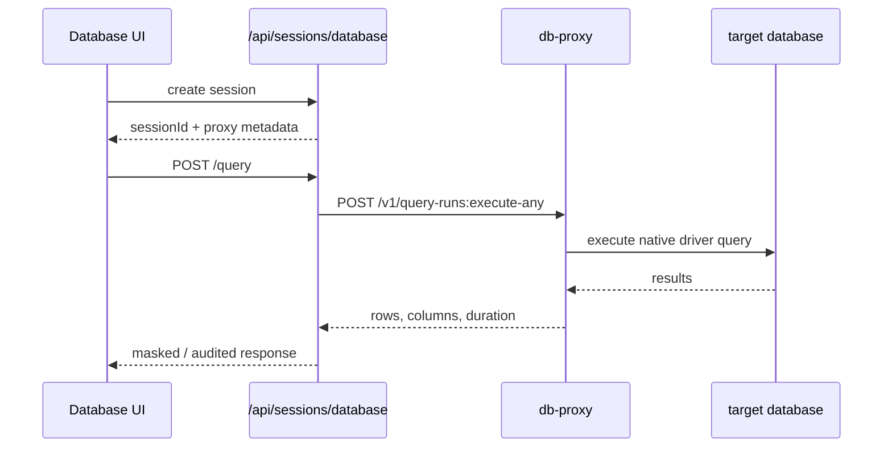

## 🌐 Surface Overview

The public edge is the Go control plane under `https://localhost:3000/api` in development. The route inventory is defined in `backend/cmd/control-plane-api/routes_*.go`.

Authentication behavior is implemented in `client/src/api/client.ts`:

- bearer token in `Authorization: Bearer <token>`
- CSRF token in `X-CSRF-Token` for state-changing requests
- automatic token refresh via `POST /api/auth/refresh`

The current route files register **at least 318 method-specific endpoints**, plus additional manually dispatched prefixes such as:

- `/api/vault-folders`
- `/api/teams`
- `/api/gateways/...`
- `/api/notifications/...`

That means the route-file counts below are a minimum, not a full mathematical total of every concrete handler branch.

## 📚 Route Groups

| Group | Primary files | Notes |
|-------|---------------|-------|
| Public bootstrap | `routes_public.go` | Health, setup, public share access, CLI device auth |
| Auth and SSO | `routes_auth*.go` | Local auth, OAuth, OIDC, SAML, MFA login, recovery |
| User account and MFA | `routes_user_account.go`, `routes_user_mfa.go` | Profile, password, avatar, MFA lifecycle |
| Resources | `routes_resources.go` | Connections, folders, files, external vaults, teams, sync profiles |
| Vault and secrets | `routes_secrets.go` | Personal vault, keychain, tenant vault, rotation |
| Sessions | `routes_sessions.go` | SSH, RDP, VNC, database, DB tunnel, proxy grants |
| Tenants | `routes_tenants.go` | Tenant CRUD, users, invite, membership controls |
| Operations | `routes_operations.go` | Admin, gateways, recordings, audit, DB audit, AI |
| Live streams | `routes_live.go` | SSE endpoints for gateways, notifications, sessions, audit |
| Internal contracts | `routes_internal.go` | `/v1` contracts used by runtime services |

## 🔐 Authentication, Setup, and Public Endpoints

Representative public endpoints:

| Method | Path | Purpose |
|--------|------|---------|
| `GET` | `/api/health` | Public health check through the API edge |
| `GET` | `/api/ready` | Public readiness check |
| `GET` | `/api/setup/status` | First-run setup state |
| `GET` | `/api/setup/db-status` | Database readiness for initial setup |
| `POST` | `/api/setup/complete` | Finish first-run bootstrap |
| `POST` | `/api/cli/auth/device` | Start CLI device auth |
| `POST` | `/api/cli/auth/device/token` | Poll device auth token |
| `POST` | `/api/cli/auth/device/authorize` | Approve device auth from a signed-in user |
| `GET` | `/api/share/{token}/info` | Inspect public share metadata |
| `POST` | `/api/share/{token}` | Access a public share |

Authentication and SSO endpoints:

| Method | Path | Purpose |
|--------|------|---------|
| `POST` | `/api/auth/register` | Local registration |
| `POST` | `/api/auth/login` | Primary login |
| `POST` | `/api/auth/verify-totp` | Complete TOTP step |
| `POST` | `/api/auth/request-sms-code` | Request MFA SMS |
| `POST` | `/api/auth/verify-sms` | Complete SMS MFA |
| `POST` | `/api/auth/request-webauthn-options` | Start WebAuthn login |
| `POST` | `/api/auth/verify-webauthn` | Complete WebAuthn login |
| `POST` | `/api/auth/refresh` | Refresh access token |
| `GET` | `/api/auth/session` | Inspect current auth session |
| `POST` | `/api/auth/logout` | Revoke current login |
| `POST` | `/api/auth/switch-tenant` | Change active tenant |
| `GET` | `/api/auth/oauth/providers` | Provider discovery |
| `GET` | `/api/auth/saml/metadata` | SAML SP metadata |

Recovery endpoints stay under `/api/auth/*` as well:

- `/api/auth/verify-email`
- `/api/auth/resend-verification`
- `/api/auth/forgot-password`
- `/api/auth/reset-password/validate`
- `/api/auth/reset-password/request-sms`
- `/api/auth/reset-password/complete`

## 👤 User, Tenant, Team, and Resource APIs

### User and MFA

| Method | Path | Purpose |
|--------|------|---------|
| `GET` | `/api/user/profile` | Current profile |
| `PUT` | `/api/user/profile` | Update profile |
| `PUT` | `/api/user/password` | Change password |
| `POST` | `/api/user/avatar` | Upload avatar |
| `GET` | `/api/user/search` | Tenant-scoped user search |
| `GET` | `/api/user/domain-profile` | Read directory profile |
| `PUT` | `/api/user/domain-profile` | Update directory profile |
| `GET` | `/api/user/2fa/status` | MFA status |
| `POST` | `/api/user/2fa/setup` | Start TOTP setup |
| `POST` | `/api/user/2fa/webauthn/register` | Register WebAuthn credential |

### Tenant administration

| Method | Path | Purpose |
|--------|------|---------|
| `POST` | `/api/tenants` | Create tenant |
| `GET` | `/api/tenants/mine` | Current tenant summary |
| `GET` | `/api/tenants/mine/all` | All accessible tenants |
| `PUT` | `/api/tenants/{id}` | Update tenant |
| `DELETE` | `/api/tenants/{id}` | Delete tenant |
| `GET` | `/api/tenants/{id}/users` | List tenant users |
| `POST` | `/api/tenants/{id}/invite` | Invite user |
| `PUT` | `/api/tenants/{id}/users/{userId}` | Update user role |
| `PATCH` | `/api/tenants/{id}/users/{userId}/expiry` | Set membership expiry |
| `PUT` | `/api/tenants/{id}/ip-allowlist` | Update tenant IP allowlist |

### Connections, folders, files, teams, and checkout flows

| Path prefix | Purpose |
|-------------|---------|
| `/api/connections` | CRUD, sharing, import/export, favorites, CLI listing |
| `/api/folders` | Connection folder CRUD |
| `/api/vault-folders` | Secret folder CRUD via manual method dispatch |
| `/api/files` | Upload/download/delete artifacts |
| `/api/checkouts` | Approval-style credential checkout flow |
| `/api/teams` | Team CRUD and membership management via manual method dispatch |
| `/api/vault-providers` | External vault integration CRUD and test |
| `/api/sync-profiles` | Directory/provider sync profile CRUD, test, and run |

## 🔒 Vault, Secrets, and Tenant Vault

The secrets surface uses plural `/api/secrets` paths. That is the current authoritative path family.

| Method | Path | Purpose |
|--------|------|---------|
| `POST` | `/api/vault/unlock` | Unlock personal vault |
| `POST` | `/api/vault/lock` | Lock personal vault |
| `GET` | `/api/vault/status` | Current vault state |
| `GET` | `/api/vault/auto-lock` | Current auto-lock timeout |
| `PUT` | `/api/vault/auto-lock` | Update auto-lock timeout |
| `POST` | `/api/vault/recover-with-key` | Recovery-key unlock |
| `POST` | `/api/vault/explicit-reset` | Reset locked vault intentionally |
| `GET` | `/api/secrets` | List secrets |
| `POST` | `/api/secrets` | Create secret |
| `GET` | `/api/secrets/counts` | Lightweight secret counts |
| `POST` | `/api/secrets/breach-check` | Bulk breach scan |
| `GET` | `/api/secrets/tenant-vault/status` | Tenant vault state |
| `POST` | `/api/secrets/tenant-vault/init` | Initialize tenant vault |
| `POST` | `/api/secrets/tenant-vault/distribute` | Distribute tenant vault shares |

Password rotation endpoints are also nested under `/api/secrets`:

- `/api/secrets/{id}/rotation/enable`
- `/api/secrets/{id}/rotation/disable`
- `/api/secrets/{id}/rotation/trigger`
- `/api/secrets/rotation/status`
- `/api/secrets/rotation/history`

## 🖥 Session APIs

Session creation endpoints:

| Method | Path | Purpose |
|--------|------|---------|
| `POST` | `/api/sessions/ssh` | Start SSH session |
| `POST` | `/api/sessions/rdp` | Start RDP session |
| `POST` | `/api/sessions/vnc` | Start VNC session |
| `POST` | `/api/sessions/database` | Start database session |
| `POST` | `/api/sessions/db-tunnel` | Start database tunnel session |

Operational session endpoints:

| Method | Path | Purpose |
|--------|------|---------|
| `GET` | `/api/sessions/active` | List active sessions |
| `GET` | `/api/sessions/count` | Count active sessions |
| `GET` | `/api/sessions/count/gateway` | Session counts by gateway |
| `POST` | `/api/sessions/{sessionId}/terminate` | Terminate a session centrally |
| `POST` | `/api/sessions/ssh-proxy/token` | Mint SSH proxy token |
| `GET` | `/api/sessions/ssh-proxy/status` | SSH proxy health/status |

Transport-specific heartbeats and end calls exist for SSH, RDP, VNC, and DB tunnel sessions.

## 🗄 Database Query and Audit APIs

Database sessions are the most gateway-sensitive part of the platform. The public control plane handles auth, tenancy, and audit, but the actual query work is forwarded to a DB proxy gateway.

Database session endpoints:

| Method | Path | Purpose |
|--------|------|---------|
| `PUT` | `/api/sessions/database/{sessionId}/config` | Apply session config |
| `GET` | `/api/sessions/database/{sessionId}/config` | Read active session config |
| `POST` | `/api/sessions/database/{sessionId}/query` | Execute query |
| `GET` | `/api/sessions/database/{sessionId}/schema` | Fetch schema |
| `POST` | `/api/sessions/database/{sessionId}/explain` | Request execution plan |
| `POST` | `/api/sessions/database/{sessionId}/introspect` | Fetch indexes, row counts, version, and other metadata |
| `GET` | `/api/sessions/database/{sessionId}/history` | Read per-session query history |
| `POST` | `/api/sessions/database/{sessionId}/heartbeat` | Keep session alive |
| `POST` | `/api/sessions/database/{sessionId}/end` | End session |

Current protocol support for interactive querying:

- PostgreSQL
- MySQL / MariaDB
- MongoDB
- Oracle
- SQL Server

The connection schema includes DB2 metadata fields, but DB2 is not part of the active query protocol dispatch yet.

DB audit endpoints:

| Path prefix | Purpose |
|-------------|---------|
| `/api/db-audit/logs` | Query audit search and filters |
| `/api/db-audit/logs/connections` | Distinct audited connections |
| `/api/db-audit/logs/users` | Distinct audited users |
| `/api/db-audit/firewall-rules` | SQL firewall rule CRUD |
| `/api/db-audit/masking-policies` | Masking policy CRUD |
| `/api/db-audit/rate-limit-policies` | Query rate-limit policy CRUD |
| `/api/db-audit/logs/stream` | Live audit SSE feed |

The persisted execution-plan feature is controlled per connection through `dbSettings.persistExecutionPlan`. When enabled for a supported SQL protocol, the plan is stored in the DB audit log and remains visible after the session closes.

## ⚙️ Gateways, Recordings, Admin, AI, and Misc Operations

Operational domains under `routes_operations.go` include:

| Path prefix | Purpose |
|-------------|---------|
| `/api/admin/*` | Email status, app config, system settings |
| `/api/ai/*` | AI provider config, SQL generation, SQL optimization |
| `/api/access-policies` | Access policy CRUD |
| `/api/keystroke-policies` | Keystroke policy CRUD |
| `/api/gateways` | Gateway CRUD, tunnel overview, SSH keypair management, template CRUD |
| `/api/rdgw/*` | RD Gateway config and RDP file generation |
| `/api/recordings/*` | Recording list, metadata, stream, audit trail, video export |
| `/api/ldap/*` | LDAP status, test, sync |
| `/api/notifications` | Notification list and sub-actions |
| `/api/audit/*` | Tenant and connection audit search |
| `/api/tabs` | UI tab state sync |

## 📡 Live Streams

Server-sent event endpoints in `routes_live.go`:

- `GET /api/gateways/stream`
- `GET /api/gateways/{id}/instances/{instanceId}/logs/stream`
- `GET /api/notifications/stream`
- `GET /api/vault/status/stream`
- `GET /api/sessions/active/stream`
- `GET /api/audit/stream`
- `GET /api/db-audit/logs/stream`

These are useful for dashboards, live admin panels, and long-lived operator views.

## 🧪 Internal `/v1` Contracts

The control plane also exposes internal contracts used by runtime and agent services:

| Method | Path | Purpose |
|--------|------|---------|
| `GET` | `/v1/services` | Discover services |
| `GET` | `/v1/capabilities` | Discover capability catalog |
| `POST` | `/v1/orchestrators:validate` | Validate orchestrator request |
| `GET` | `/v1/orchestrators` | List orchestrators |
| `PUT` | `/v1/orchestrators/{name}` | Upsert orchestrator |
| `POST` | `/v1/desktop/session-grants:issue` | Desktop grant issuance |
| `POST` | `/v1/database/sessions:issue` | Database session issuance |
| `POST` | `/v1/database/sessions/{sessionId}/config` | Internal DB session config update |

The DB proxy and query-runner binaries expose the shared query middleware contract from `backend/internal/queryrunnerapi/service.go`:

- `POST /v1/connectivity:validate`
- `POST /v1/query-runs:execute`
- `POST /v1/query-runs:execute-any`
- `POST /v1/schema:fetch`
- `POST /v1/query-plans:explain`
- `POST /v1/introspection:run`

## 📌 Source Of Truth Reminder

If documentation and runtime ever disagree, trust the route files first:

- `backend/cmd/control-plane-api/routes_*.go`
- `backend/internal/queryrunnerapi/service.go`
- `client/src/api/*.ts`
