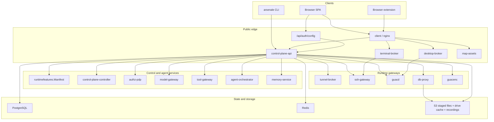
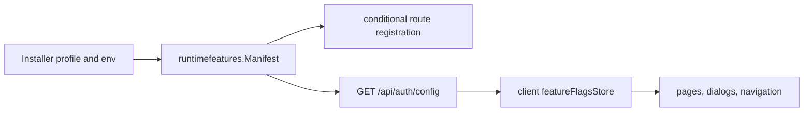
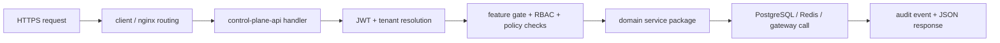
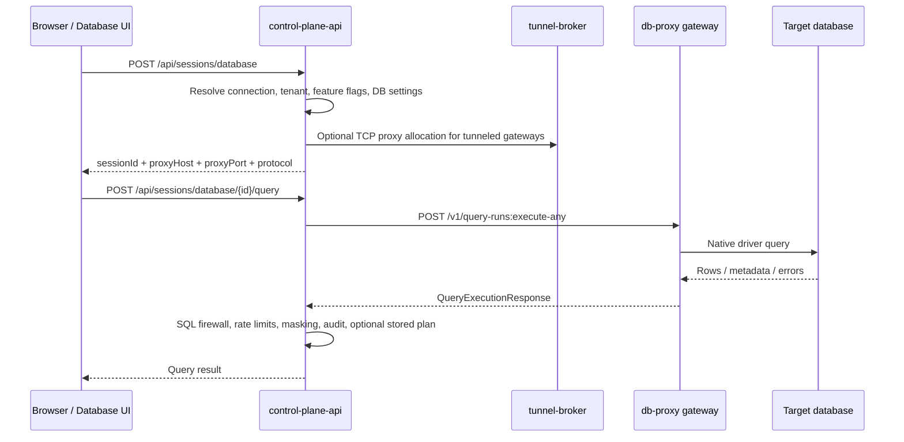
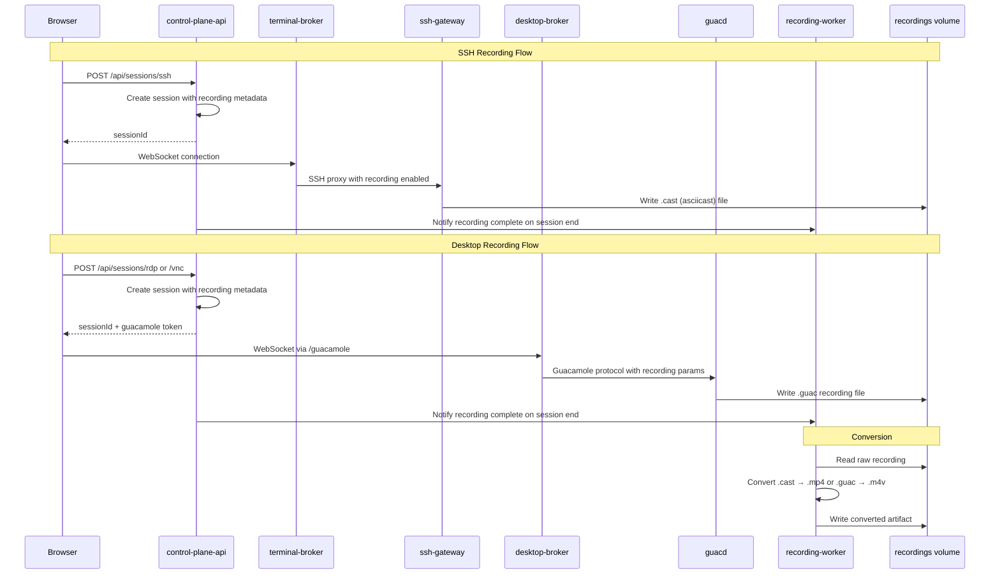

## 🎯 Why This Architecture Exists

Arsenale is structured around a strict split between control, runtime, gateway, and operator concerns. The control plane owns identity, tenancy, policy, audit, routing, and orchestration. Runtime brokers own browser session transport. Gateways own target-network access. The installer owns deployment intent and encrypted rerun state.

The database rule remains deliberate: the control plane is an orchestrator and policy boundary, not the database client of record. Interactive database queries run through `db-proxy` gateways in the same way SSH and desktop traffic flow through dedicated runtime services.

## 🧭 Service Planes

| Plane | Service | Default Port | Role |
|------|---------|--------------|------|
| Control | `control-plane-api` | `8080` | Public tenant API, auth, routing, policy, audit |
| Control | `control-plane-controller` | `8081` | Placement and reconciliation |
| Control | `authz-pdp` | `8082` | Central policy decision point |
| Agent | `model-gateway` | `8083` | LLM and embedding provider gateway |
| Agent | `tool-gateway` | `8084` | Typed capability gateway |
| Agent | `agent-orchestrator` | `8085` | Agent run lifecycle |
| Agent | `memory-service` | `8086` | Working and semantic memory service |
| Runtime | `terminal-broker` | `8090` | Browser SSH terminal WebSocket runtime |
| Runtime | `desktop-broker` | `8091` | Browser RDP and VNC runtime |
| Runtime | `tunnel-broker` | `8092` | Tunnel registration and TCP proxying |
| Runtime | `query-runner` | `8093` | Shared query execution service |
| Runtime | `map-assets` | `8096` | OpenStreetMap tile proxy and authoritative on-disk tile cache for GeoIP-enabled UIs |
| Runtime | `recording-worker` | `8094` | Recording conversion and retention |
| Execution | `runtime-agent` | `8095` | Host-local workload validation |
| Runtime gateway | `db-proxy` | `5432` | Database middleware for connectivity, query, schema, plan, introspection, and tunneled database access |

Every Go service uses the same wrapper in `backend/internal/app/app.go`, so these endpoints are stable across the fleet:

- `GET /healthz`
- `GET /readyz`
- `GET /v1/meta/service`
- `GET /v1/meta/architecture`

## 🏗 High-Level Component Diagram

Remote file transfer now uses a managed temporary sandbox instead of raw remote filesystem browsing:

- SSH file browsing and upload/download operate only on sandbox-relative paths inside `workspace/current/`.
- Retained uploads, when enabled, live under `history/uploads/` and surface through a separate history view.
- RDP shared-drive content mirrors the same `workspace/current/` sandbox, then materializes into the per-user, per-connection Guacamole drive cache under `DRIVE_BASE_PATH`.
- `terminal-broker` carries terminal I/O only and no longer owns SSH file-transfer events.

## 🧩 Runtime Capability Model

Feature availability is not hard-coded in the SPA or the control plane separately. The installer and runtime env produce one shared manifest in `backend/internal/runtimefeatures/manifest.go`, and that manifest drives both route registration and UI visibility.

Important architectural consequences:

- `backend/cmd/control-plane-api/routes.go` only registers secrets routes when `KeychainEnabled` is true.
- Session routes are only registered when `AnyConnectionFeature()` is true.
- Database session and DB audit surfaces depend on `DatabaseProxyEnabled`.
- GeoIP lookups and audit-map views depend on `IPGeolocationEnabled`.
- Gateway and tunnel surfaces depend on `ZeroTrustEnabled`.
- The client starts fail-open with enabled defaults, then narrows to the server-provided manifest after `GET /api/auth/config` succeeds.

## 🔐 Public Request Pipeline

That split is intentional:

- the client is only a reverse proxy and static asset host,
- the control plane terminates auth, tenancy, feature gating, and audit,
- runtime services only handle transport after the control plane has issued a grant or session.

## 🗄 Database Session Architecture

Database querying follows the same gateway pattern as other remote access types.

Important design details:

- The session record is created by `backend/internal/dbsessions/create.go`.
- The control plane locates a `DB_PROXY` gateway, optionally resolves a managed instance, and optionally opens a tunnel-broker TCP proxy in `backend/internal/dbsessions/dbproxy_client.go`.
- Query, schema, explain, and introspection all call the DB proxy's shared `queryrunnerapi` surface:
  - `POST /v1/connectivity:validate`
  - `POST /v1/query-runs:execute-any`
  - `POST /v1/schema:fetch`
  - `POST /v1/query-plans:explain`
  - `POST /v1/introspection:run`
- The control plane applies masking, firewall, rate-limit, and audit logic after the DB proxy returns data, and each connection can now both enable or disable those controls and supply full connection-scoped policy objects through `dbSettings.firewall*`, `dbSettings.masking*`, and `dbSettings.rateLimit*`.
- Persisted execution plans are opt-in per connection via `dbSettings.persistExecutionPlan`.
- AI query generation and AI query optimization resolve from tenant-scoped named backends, then apply any per-connection overrides from `dbSettings.aiQueryGeneration*` and `dbSettings.aiQueryOptimizer*`.

Supported interactive query protocols come from `backend/internal/queryrunner/protocols.go`:

- PostgreSQL
- MySQL / MariaDB
- SQL Server
- Oracle
- MongoDB

`client/src/api/connections.api.ts` still includes DB2 connection metadata fields, but DB2 is not part of the active query protocol switch.

## 🎬 Session Recording Architecture

Session recording captures SSH terminal sessions as asciicast files and desktop (RDP/VNC) sessions as Guacamole `.guac` files. Recording is orchestrated across multiple services.

Key design decisions:

- SSH recordings use the asciicast format (`.cast` files), compatible with `asciinema` playback.
- Desktop recordings use the Guacamole native format (`.guac` files), converted to `.m4v` by the `guacenc` sidecar.
- The recording worker (`recording-worker` at port `8094`) handles conversion and retention lifecycle.
- Recording metadata is stored in PostgreSQL; raw and converted files live in the `arsenale_recordings` volume.
- The control plane does not record sessions itself — recording happens at the transport layer (SSH gateway or guacd).
- `RECORDING_ENABLED`, `RECORDING_PATH`, `RECORDING_VOLUME`, and `RECORDING_RETENTION_DAYS` control the recording subsystem.

## 🤖 Agent and AI Architecture

The agent plane provides LLM-powered capabilities for database query assistance and future agent orchestration.

| Service | Port | Role |
|---------|------|------|
| `model-gateway` | `8083` | LLM and embedding provider gateway supporting Anthropic, OpenAI, Ollama, and OpenAI-compatible APIs |
| `tool-gateway` | `8084` | Typed capability gateway for structured agent actions |
| `agent-orchestrator` | `8085` | Agent run lifecycle and step scheduling |
| `memory-service` | `8086` | Working, episodic, semantic, procedural, and artifact memory |

The capability catalog in `backend/internal/catalog/catalog.go` defines risk-rated capabilities:

| Capability | Risk | Description |
|------------|------|-------------|
| `connection.read` | Low | Read connection metadata |
| `connection.connect.ssh` | Medium | Create SSH session grants |
| `connection.connect.rdp` | Medium | Create RDP/VNC session grants |
| `db.schema.read` | Low | Inspect database schema |
| `db.query.execute.readonly` | Medium | Execute read-only queries |
| `db.query.execute.write` | High | Execute write queries (requires approval) |
| `gateway.read` | Low | Read gateway inventory |
| `gateway.scale` | High | Scale gateway workloads (requires approval) |
| `workload.deploy` | Critical | Deploy workloads (requires approval) |
| `memory.read` | Low | Read agent memory |
| `memory.write` | Medium | Write to agent memory |
| `audit.search` | Low | Search audit activity |

Memory types supported: `working`, `episodic`, `semantic`, `procedural`, `artifact`.
Memory scopes supported: `tenant`, `principal`, `agent`, `run`, `workflow`.
Execution principal kinds: `user`, `service-account`, `agent-def`, `agent-instance`, `agent-run`, `system`.

### Future: Agent Orchestration Gateway

A detailed specification for the planned agent orchestration system is available in [agent-orchestration-gateway.md](agent-orchestration-gateway.md). Key planned capabilities include:

- Agents as first-class security principals with full audit trail
- Per-agent LLM provider configuration (Anthropic, OpenAI, Azure, Ollama)
- Agent definition, instance, permission, schedule, and action log models
- Five-phase implementation plan (Foundation, Core, Integration, Scheduling, Advanced)
- Platform readiness assessment: approximately 80% of required infrastructure is already in place

## 🌉 Gateways and Development Bootstrap

Arsenale supports both directly managed gateway containers and tunneled gateway instances.

- `ssh-gateway` exposes SSH transport and gRPC key management.
- `guacd` handles RDP and VNC protocol termination.
- `db-proxy` hosts the query middleware and database drivers.
- `tunnel-agent` can be embedded into `ssh-gateway`, `guacd`, and `db-proxy` images.
- `tunnel-broker` allocates and multiplexes TCP proxies for tunneled instances.

Development mode now bootstraps all three runtime gateway types automatically through `service dev-bootstrap`:

- `Dev Tunnel Managed SSH`
- `Dev Tunnel GUACD`
- `Dev Tunnel DB Proxy`

The bootstrap flow also ensures tenant vault state, tenant SSH key pairs, an orchestrator connection, demo database connections, and a managed SSH key push to all managed gateways.

## 💾 Data, State, and Persistence

| Component | Purpose |
|-----------|---------|
| PostgreSQL | Durable truth for users, tenants, connections, sessions, policies, audit, and memory metadata |
| Redis | Coordination, rate limits, grants, leases, and stream fan-out |
| `arsenale_drive` volume | Managed transfer sandbox workspace staging |
| `arsenale_recordings` volume | Session recordings and exported artifacts |
| S3 / object storage | Recordings, exported artifacts, and agent outputs |
| Podman secrets | Runtime delivery for JWT, database URL, guacamole secret, encryption key, and provider credentials |
| `$ARSENALE_DEV_HOME/dev-certs/` | Shared CA plus service, gateway, and tunnel certificates for local development |
| `/opt/arsenale/install/*.enc` | Encrypted installer profile, state, status, log, and rendered artifacts |

## 🔐 Security Architecture

### Encryption Model

Arsenale uses defense-in-depth encryption:

- **Vault encryption**: AES-256-GCM with keys derived via Argon2id (65,536 KiB memory, 3 iterations, 1 parallelism). Each user's master key is derived from their vault password at unlock time and held in memory only during the session.
- **Server encryption**: A separate `SERVER_ENCRYPTION_KEY` (32-byte hex) encrypts tenant SSH key pairs and other server-held sensitive material at rest.
- **Guacamole token encryption**: AES-256-GCM using `GUACAMOLE_SECRET` protects desktop session grant tokens in transit.
- **Connection credentials**: Field-level AES-GCM encryption for stored passwords, private keys, and domain credentials.
- **Sharing re-encryption**: When a secret is shared, it is decrypted with the sharer's vault key and re-encrypted with the recipient's public key. External shares use HKDF-SHA256 token derivation with optional PIN protection.

Recovery keys are generated at vault creation and can be used if the vault password is lost.

### Policy Enforcement

- **ABAC policies**: Attribute-based access control evaluated at Folder > Team > Tenant specificity. Policies support time windows, trusted-device requirements, MFA step-up, and additive semantics.
- **DLP policies**: Tenant-level floor policies with per-connection overrides. Enforced server-side for SSH (keystroke inspection) and via Guacamole parameters plus client-side hardening for RDP/VNC.
- **IP allowlist**: Supports flag and block modes, checked at token issuance. Configurable per tenant.
- **SQL firewall**: Regex-based query pattern matching in `db-proxy` with block/allow rules.
- **Data masking**: Column-level masking policies applied after query execution in the control plane.
- **Rate limiting**: Per-connection query rate limits enforced by the DB audit subsystem.
- **Impossible travel detection**: Haversine-based distance calculation between consecutive login locations, flagged when exceeding `IMPOSSIBLE_TRAVEL_SPEED_KMH` (default 900 km/h).

For detailed field-level encryption specs, see [security/encryption.md](security/encryption.md). For full policy evaluation rules, see [security/policies.md](security/policies.md).

## 🗃 Database Schema

PostgreSQL 16 is the sole relational store. The schema is managed through versioned SQL migrations in `backend/migrations/` and applied by `backend/cmd/migrate`.

Core entity groups:

| Group | Models |
|-------|--------|
| Identity | User, Tenant, TenantMember, Team, TeamMember |
| Access | Connection, SharedConnection, Folder, AccessPolicy |
| Sessions | ActiveSession, SessionRecording |
| Vault | VaultSecret, VaultSecretVersion, SharedSecret, ExternalSecretShare, ExternalVaultProvider |
| Gateway | Gateway, GatewayTemplate, SshKeyPair, ManagedGatewayInstance |
| Auth | RefreshToken, OAuthAccount, WebAuthnCredential |
| Audit | AuditLog (100+ action types), DbAuditLog |
| Policy | AccessPolicy, KeystrokePolicy, FirewallRule, MaskingPolicy, RateLimitPolicy |
| DB Audit | DbAuditLog |
| Collaboration | Notification, OpenTab, SyncProfile, Checkout |

Key enum types: `ConnectionType` (SSH, RDP, VNC, DATABASE), `GatewayType` (MANAGED_SSH, GUACD, DB_PROXY), `TenantRole` (OWNER, ADMIN, OPERATOR, MEMBER, CONSULTANT, AUDITOR, GUEST), `SecretType` (LOGIN, SSH_KEY, CERTIFICATE, API_KEY, SECURE_NOTE), `SessionStatus`, `AuditAction` (100+ values).

For detailed field-level schema documentation, see the [database/](database/) directory.

## 🧪 Shared Service Patterns

The Go services deliberately use a narrow common shape:

- `main.go` wires dependencies and registers routes.
- `app.StaticService` declares metadata and a route registration function.
- `app.Run` handles listen address, logging, `/healthz`, `/readyz`, and graceful shutdown.
- Public route registration is consolidated in `backend/cmd/control-plane-api/routes*.go`.
- Public readiness at `GET /api/ready` checks PostgreSQL and, when connection features are enabled, `desktop-broker` reachability.

That uniformity matters for operators and LLMs because it makes new services easy to discover, reason about, and validate mechanically.
