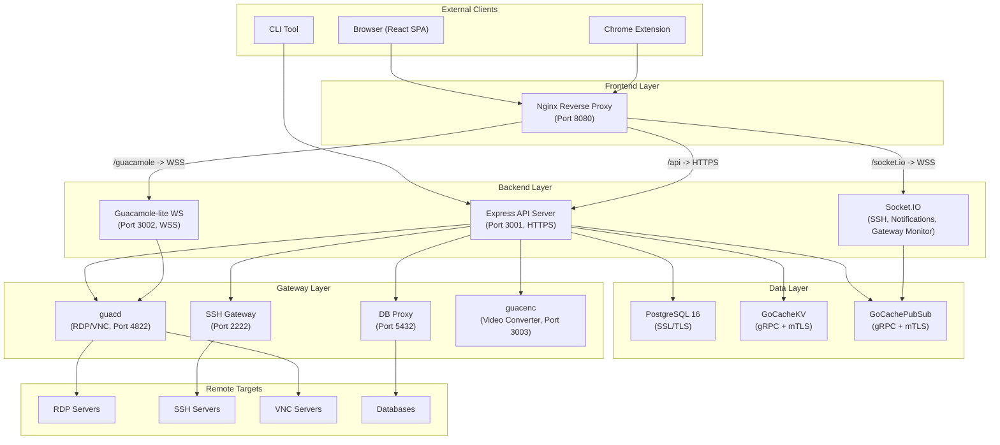
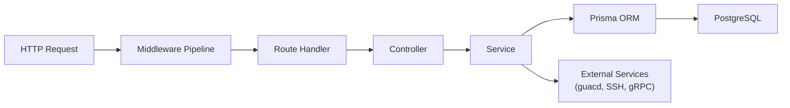
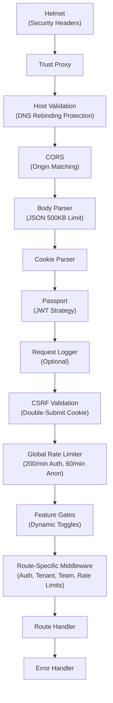
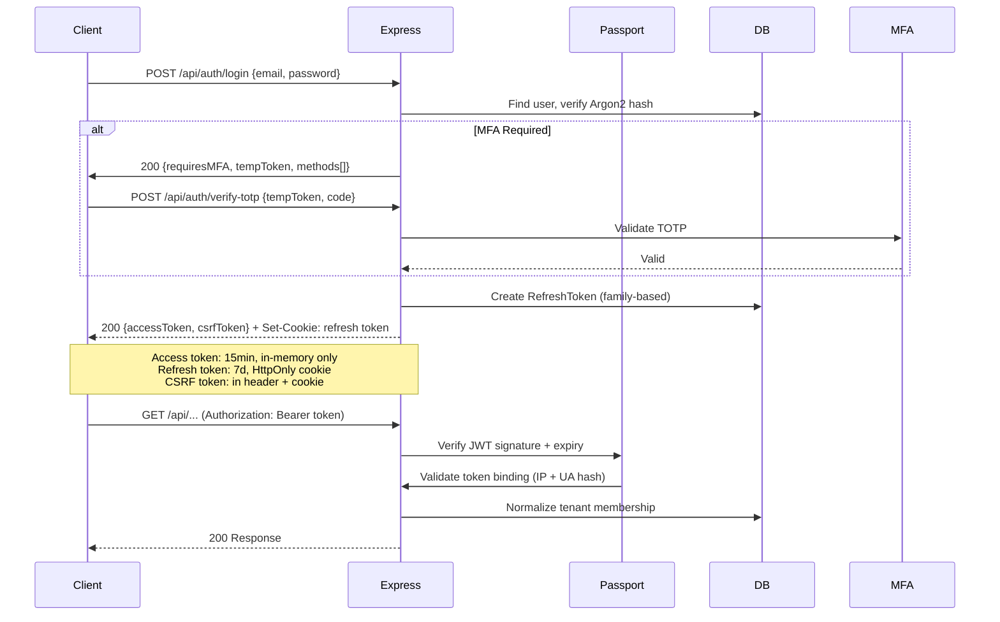
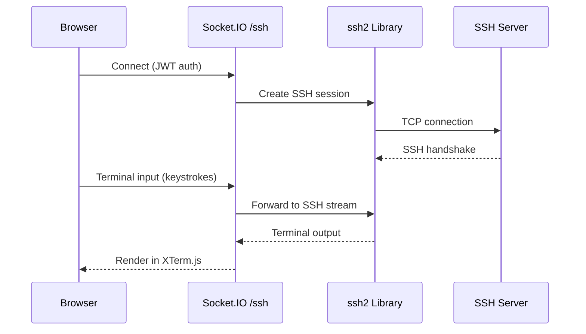
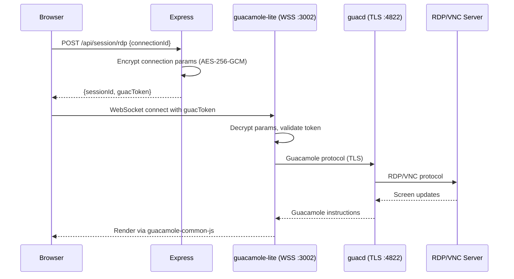
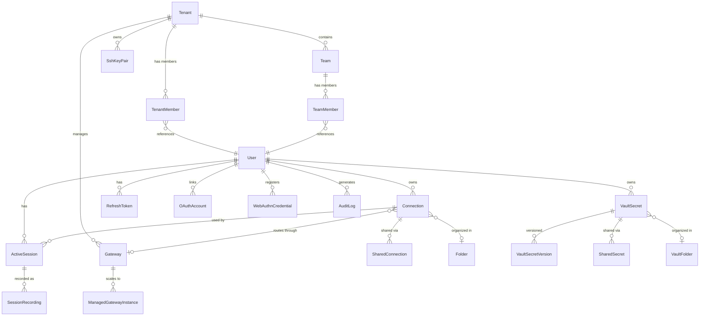
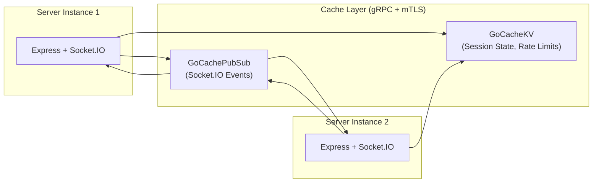
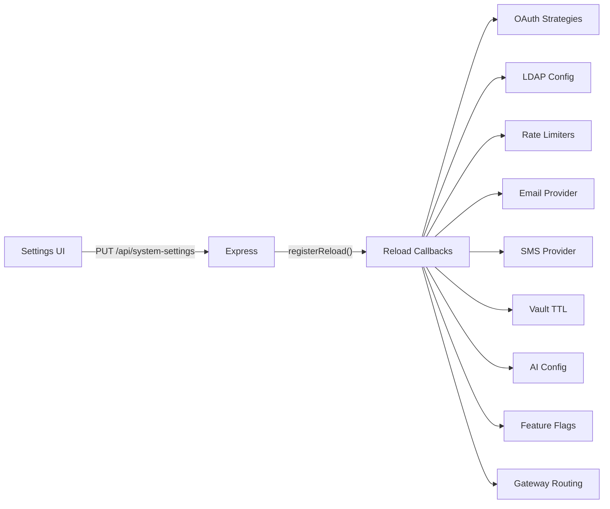
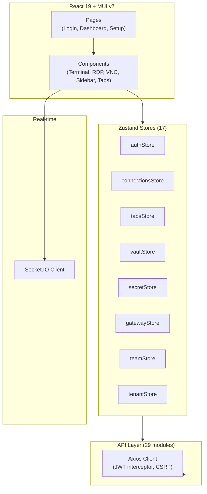

## 🏗 Overview

Arsenale is a secure remote access platform built as a monorepo with npm workspaces. It provides SSH, RDP, VNC, and database proxy access through a unified web interface with enterprise-grade security, multi-tenancy, and session recording.

**Why this architecture:** Arsenale consolidates fragmented remote access tools (PuTTY, RDP clients, VPN tunnels, database GUIs) into a single zero-trust platform where every connection is authenticated, encrypted, audited, and optionally recorded.

## 🧩 High-Level Architecture

## 📦 Workspace Structure

| Workspace | Path | Technology | Purpose |
|-----------|------|-----------|---------|
| Server | `server/` | Express 5 + TypeScript | API, auth, sessions, WebSocket |
| Client | `client/` | React 19 + Vite + MUI v7 | Web UI (SPA) |
| Tunnel Agent | `gateways/tunnel-agent/` | Node.js + TypeScript | Zero-trust tunnel client |
| Browser Extension | `extra-clients/browser-extensions/` | Chrome MV3 + React | Autofill, keychain |

## 🔀 Server Layered Architecture

The server follows a strict layered architecture: **Routes -> Controllers -> Services -> Prisma ORM**.

**Why layered:** Each layer has a single responsibility. Routes handle HTTP binding, controllers handle request/response transformation, services contain business logic, and Prisma handles data access. This separation enables unit testing at each layer and prevents cross-cutting concerns from bleeding through.

## 🛡 Middleware Pipeline

The Express middleware pipeline processes every request in strict order. Security-critical middleware runs first; route handlers run last.

**Key design decisions:**

- **CSRF uses double-submit cookies**, not server-side tokens, enabling stateless JWT auth without session storage
- **Rate limiting is three-tiered**: whitelisted IPs bypass entirely, authenticated users get 200 req/min keyed by userId, anonymous users get 60 req/min keyed by IP
- **Feature gates evaluate dynamically** on each request, allowing runtime toggles without restarts via the Settings UI
- **Host validation** prevents DNS rebinding attacks by checking the Host header against allowed values

## 🔐 Authentication Flow

**Security properties:**
- Access tokens are short-lived (15 min) and held in-memory only (never in localStorage)
- Refresh tokens use family-based rotation to detect token replay attacks
- Token binding ties JWTs to the originating IP + User-Agent hash (configurable)
- Account lockout after 10 failed attempts for 30 minutes

## 🌐 Real-Time Connections

### SSH Terminal

### RDP/VNC via Guacamole

## 🗄 Database Schema

The Prisma schema defines 32+ models across these domains:

**Key design decisions:**

- **Multi-tenancy** is enforced at the data model level -- every resource belongs to a Tenant, and queries are scoped by tenantId
- **Vault encryption** uses per-user keys derived from passwords via Argon2, with AES-256-GCM at rest
- **Role hierarchy** provides 7 levels: GUEST < AUDITOR < CONSULTANT < MEMBER < OPERATOR < ADMIN < OWNER
- **Team roles** are separate: TEAM_VIEWER < TEAM_EDITOR < TEAM_ADMIN
- **Audit logging** captures 70+ distinct action types for compliance

## 📡 Distributed Architecture

When running multiple server instances, Arsenale uses the GoCacheAdapter for cross-instance coordination:

**What the cache layer provides:**
- **KV Store**: Distributed rate limit counters, session state, leader election
- **PubSub**: Socket.IO event broadcasting across instances (notifications, SSH streams, gateway events)
- **Leader Election**: Ensures singleton cron jobs (key rotation, LDAP sync, cleanup) run on exactly one instance

## 🔄 Scheduled Jobs

The server runs background jobs via `node-cron`:

| Job | Default Schedule | Purpose |
|-----|-----------------|---------|
| Key Rotation | `0 2 * * *` (2 AM daily) | Rotate JWT signing keys |
| LDAP Sync | `0 */6 * * *` (every 6h) | Sync users/groups from LDAP |
| Membership Expiry | Hourly | Auto-remove expired tenant/team members |
| Secret Rotation | Configurable | Rotate passwords per policy |
| Session Cleanup | Hourly | Close idle sessions, purge 30-day old closed sessions |
| Recording Cleanup | Daily | Remove recordings past retention (default 90 days) |
| Token Cleanup | Hourly | Purge expired refresh tokens |
| Gateway Health | 30s interval | Health check managed gateways |
| Auto-scaling | 30s interval | Evaluate gateway replica counts |
| System Secret Rotation | Configurable | Roll over JWT + Guacamole keys |
| Device Auth Cleanup | 5-min interval | Purge expired device auth codes |

## ⚙ Live Reload

Configuration changes from the Settings UI take effect immediately via the live reload system:

No server restart required for configuration changes.

## 🔒 Security Architecture

### Encryption at Rest

- **Vault secrets**: AES-256-GCM with per-user master key (Argon2-derived from password)
- **Connection credentials**: AES-256-GCM with server encryption key
- **SSH key pairs**: AES-256-GCM with tenant-scoped key
- **Refresh tokens**: SHA-256 hashed before DB storage

### Network Security

All service-to-service communication uses TLS or mTLS:

| Connection | Protocol | Authentication |
|-----------|----------|---------------|
| Client -> Nginx | HTTPS | - |
| Nginx -> Express | HTTPS | Server cert verify |
| Express -> PostgreSQL | SSL | Certificate |
| Express -> guacd | TLS | CA verify |
| Express -> GoCacheKV | gRPC + mTLS | Client + server certs |
| Express -> GoCachePubSub | gRPC + mTLS | Client + server certs |
| Express -> guacenc | HTTPS + mTLS | Client + server certs |
| SSH Gateway -> Express | gRPC + mTLS | Client + server certs |

### Logging Security

The logger (`server/src/utils/logger.ts`) provides defense-in-depth sanitization:

1. **Sensitive key redaction**: Detects password, secret, token, apikey, etc. in log arguments
2. **Value pattern matching**: Redacts JWT tokens (`eyJ...`), Bearer tokens, key-value patterns
3. **Newline stripping**: Prevents log injection attacks
4. **Error sanitization**: Scrubs stack traces before logging

## 🧱 Client Architecture

**Key patterns:**
- **Access tokens in-memory only** -- never persisted to localStorage
- **Axios interceptor** auto-refreshes tokens on 401 responses
- **UI preferences** persisted via Zustand + localStorage (`uiPreferencesStore`)
- **Full-screen dialogs** overlay the workspace without destroying active SSH/RDP sessions
