# Architecture

Arsenale is a web-based remote access management platform for SSH, RDP, and VNC connections. It provides encrypted credential storage, multi-tenant RBAC, session recording, gateway orchestration, and a zero-trust tunnel system.

## System Overview

```mermaid
flowchart TD
    subgraph Client["Client (React 19 + Vite)"]
        UI["Browser UI<br/>MUI v7 + Zustand"]
        XTerm["XTerm.js<br/>SSH Terminal"]
        Guac["guacamole-common-js<br/>RDP/VNC Viewer"]
        PWA["PWA + Service Worker"]
    end

    subgraph Server["Server (Express + TypeScript)"]
        API["REST API<br/>Port 3001"]
        SIO["Socket.IO<br/>SSH + Notifications"]
        GuacWS["Guacamole WS<br/>Port 3002"]
        TunnelBroker["Tunnel Broker<br/>WebSocket /api/tunnel/connect"]
    end

    subgraph Data["Data Layer"]
        DB[(PostgreSQL 16)]
        Prisma["Prisma ORM"]
        GoCache["gocache Sidecar<br/>gRPC :6380"]
    end

    subgraph Gateways["Gateway Infrastructure"]
        GuacD["guacd<br/>Port 4822"]
        SSHGw["SSH Gateway<br/>Port 2222"]
        GuacEnc["guacenc<br/>Recording Processor"]
        TunnelAgent["Tunnel Agent"]
        DBProxy["DB Proxy Gateway<br/>Oracle/MSSQL/DB2"]
        RDGateway["RD Gateway<br/>MS-TSGU Protocol"]
    end

    subgraph Tools["Tools"]
        CLI["Arsenale Connect CLI<br/>Native Client Orchestration"]
    end

    subgraph External["External Integrations"]
        OAuth["OAuth/SAML/LDAP"]
        HCVault["HashiCorp Vault"]
        NetBox["NetBox Sync"]
        Email["Email (SMTP/SES/SendGrid)"]
        SMS["SMS (Twilio/SNS/Vonage)"]
    end

    UI -->|HTTP/REST| API
    XTerm -->|Socket.IO /ssh| SIO
    Guac -->|WebSocket| GuacWS
    API --> Prisma --> DB
    Server -->|gRPC| GoCache
    SIO -->|SSH2| SSHGw
    GuacWS --> GuacD
    GuacD -->|RDP/VNC Protocol| SSHGw
    TunnelAgent -->|WSS Multiplexed| TunnelBroker
    TunnelBroker -->|TCP Forwarding| SIO
    API --> OAuth
    API --> HCVault
    API --> NetBox
    API --> Email
    API --> SMS
    GuacEnc -->|Convert Recordings| GuacD
    API --> DBProxy
    API --> RDGateway
    CLI -->|Device Auth + REST| API
```

## Monorepo Structure

The project uses npm workspaces with four packages:

| Workspace | Path | Purpose |
|-----------|------|---------|
| **server** | `server/` | Express API, Socket.IO, Guacamole WS, Tunnel Broker |
| **client** | `client/` | React 19 SPA with MUI v7, XTerm.js, Guacamole client |
| **tunnel-agent** | `gateways/tunnel-agent/` | Outbound tunnel agent for zero-trust gateway connections |
| **browser-extensions** | `extra-clients/browser-extensions/` | Chrome extension for credential autofill and keychain access |

Additional gateway components (not npm workspaces):
- `gateways/guacd/` — Custom guacd image with embedded tunnel agent
- `gateways/guacenc/` — Recording processor (Guacamole → MP4, asciicast → GIF)
- `gateways/ssh-gateway/` — SSH bastion with embedded tunnel agent

Infrastructure components:
- `infrastructure/gocache/` — Go-based in-memory cache sidecar (KV, pub/sub, locks, queues over gRPC)

## Server Architecture

### Layered Design

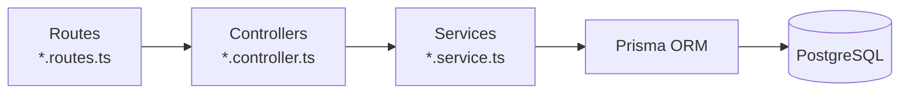

**Routes** define endpoints and apply middleware (auth, validation, rate limiting). **Controllers** parse requests and delegate to services. **Services** contain business logic and database operations.

### Entry Point (`server/src/index.ts`)

On startup, the server:

1. Runs `prisma migrate deploy` (automatic database migrations)
2. Runs startup migrations (email verification, vault setup)
3. Applies system settings from the database
4. Recovers orphaned sessions from previous server instances
5. Initializes GeoIP database
6. Initializes Passport strategies (OAuth, SAML, OIDC discovery)
7. Creates HTTP server with Express app
8. Attaches Socket.IO server (SSH terminal + notifications)
9. Attaches raw WebSocket server for zero-trust tunnel on `/api/tunnel/connect`
10. Starts SSH protocol proxy server (if enabled)
11. Initializes Guacamole-Lite on port 3002 (RDP/VNC)
12. Starts background jobs (key rotation, LDAP sync, health monitors, cleanup tasks)
13. Registers live-reload callbacks for runtime system settings (OAuth, LDAP, SSH proxy, email, SMS, rate limiting, AI, feature toggles)
14. Registers graceful shutdown on SIGTERM/SIGINT

### Express App (`server/src/app.ts`)

Middleware stack (in order):

1. **Helmet** — Security headers (CSP, HSTS, X-Frame-Options, Permissions-Policy)
2. **CORS** — Origin restricted to `config.clientUrl`
3. **Express JSON** — 500KB body limit
4. **Cookie Parser** — For refresh token cookies
5. **Passport** — OAuth/SAML initialization
6. **Request Logger** — Optional HTTP logging
7. **CSRF Validation** — Double-submit cookie pattern (exempts login, register, OAuth code exchange, extension clients)
8. **Peek Auth** — Lightweight JWT extraction from `Authorization` header for rate-limit keying (does not enforce auth)
9. **Global Rate Limit** — IP-based rate limiting with authenticated user keying (skips whitelisted CIDRs)

### Route Mounting

44 route files mounted under `/api` (feature-gated routes require their feature toggle to be enabled):

| Path | Purpose |
|------|---------|
| `/api/setup` | First-time platform setup wizard (public, rate-limited) |
| `/api/auth` | Authentication (password, OAuth, SAML, MFA, token refresh) |
| `/api/vault` | Vault unlock/lock/status, MFA vault unlock |
| `/api/connections` | Connection CRUD, sharing, import/export |
| `/api/folders` | Folder hierarchy |
| `/api/sessions` | RDP/VNC/SSH session lifecycle, monitoring |
| `/api/secrets` | Vault secret CRUD, versioning, sharing, external links |
| `/api/vault-folders` | Secret organization |
| `/api/user` | Profile, settings, 2FA, WebAuthn, domain credentials |
| `/api/tenants` | Multi-tenant CRUD, member management, IP allowlist |
| `/api/teams` | Team CRUD, member roles |
| `/api/gateways` | Gateway CRUD, deploy, scale, tunnel, SSH keys |
| `/api/admin` | Admin settings, email config, app config |
| `/api/audit` | Audit logs (user, tenant, connection) |
| `/api/recordings` | Session recording playback and export |
| `/api/notifications` | Notification management |
| `/api/share` | Public link sharing (unauthenticated) |
| `/api/files` | File upload/download (SFTP drive) |
| `/api/ldap` | LDAP sync configuration |
| `/api/sync-profiles` | NetBox connection sync |
| `/api/vault-providers` | External vault (HashiCorp Vault) integration |
| `/api/access-policies` | ABAC policy management |
| `/api/health` | Readiness/liveness probes |
| `/api/geoip` | IP geolocation lookup |
| `/api/tabs` | Persisted open tabs |
| `/api/checkouts` | Credential checkout/check-in (PAM) |
| `/api/sessions/ssh-proxy` | SSH proxy token issuance for native clients |
| `/api/rdgw` | RD Gateway (MS-TSGU) configuration and .rdp file generation |
| `/api/cli` | CLI device authorization (RFC 8628) |
| `/api/sessions/database` | Database proxy sessions and query execution |
| `/api/sessions/db-tunnel` | SSH-tunneled database connections |
| `/api/db-audit` | Database query audit logs, SQL firewall rules, masking policies |
| `/api/secrets` (rotation) | Password rotation enable/disable/trigger/status |
| `/api/keystroke-policies` | SSH keystroke inspection policy CRUD |
| `/api/ai` | AI-assisted SQL query generation and optimization (feature-gated) |
| `/api/admin/system-settings` | Runtime system settings management |

### Middleware

| Middleware | File | Purpose |
|-----------|------|---------|
| JWT Auth | `auth.middleware.ts` | Token verification, IP/User-Agent binding, hijack detection |
| Error Handler | `error.middleware.ts` | Custom `AppError` class, 500 fallback |
| CSRF | `csrf.middleware.ts` | Double-submit cookies, timing-safe comparison |
| Peek Auth | `peekAuth.middleware.ts` | Lightweight JWT extraction for rate-limit keying (non-blocking) |
| Global Rate Limit | `globalRateLimit.middleware.ts` | IP/user-based rate limiting with CIDR whitelist |
| Async Handler | `asyncHandler.ts` | Promise rejection wrapper |
| Tenant | `tenant.middleware.ts` | Tenant extraction and role enforcement |
| Team | `team.middleware.ts` | Team context middleware |
| Validation | `validate.middleware.ts` | Zod schema validation |
| Rate Limiters | `*RateLimit*.middleware.ts` | Per-endpoint rate limiting (login, vault, SMS, session, registration, OAuth) |
| Feature Gate | `featureGate.middleware.ts` | Runtime feature toggles (connections, database proxy, keychain) |
| Request Logger | `requestLogger.middleware.ts` | HTTP request logging |

### Socket.IO Handlers

| Namespace | Handler | Purpose |
|-----------|---------|---------|
| `/ssh` | `ssh.handler.ts` | SSH terminal sessions via ssh2, SFTP file browser, session recording (asciicast), DLP enforcement |
| `/notifications` | `notification.handler.ts` | Real-time events (share, secret, recording, impossible travel, checkout approval, lateral movement, keystroke violations) |
| `/gateways` | `gatewayMonitor.handler.ts` | Gateway health, instance state, scaling updates |

### WebSocket Tunnel

`tunnel.handler.ts` attaches a raw `ws` WebSocket server on `/api/tunnel/connect`. Gateway agents authenticate with tunnel token and gateway ID, then multiplex TCP streams using a binary frame protocol.

### Background Jobs

| Job | Interval | Purpose |
|-----|----------|---------|
| Key Rotation | Cron-based | SSH key pair rotation |
| LDAP Sync | Every 6 hours | LDAP user provisioning |
| Gateway Health | 30 seconds | Connectivity checks |
| Managed Gateway Reconciliation | 5 minutes | Container state sync |
| Auto-Scaling Evaluation | 30 seconds | Scale based on session count |
| Expired Share Cleanup | 1 hour | Remove expired shares |
| Expired Token Cleanup | 1 hour | Remove expired refresh tokens |
| Idle Session Marking | 1 minute | Flag idle sessions |
| Inactive Session Closure | 1 minute | Close timed-out sessions |
| Session Recording Cleanup | Daily | Remove old recordings |
| Closed Session Cleanup | Daily | Clean up closed session records |
| Expiring Secrets Check | 6 hours | Notify about expiring secrets |
| Membership Expiry Check | Periodic | Check and enforce membership expiry |
| Checkout Expiry | 5 minutes | Auto-expire approved checkouts past TTL |
| Password Rotation | Cron-based | Rotate credentials on target systems |
| Token Family Cleanup | 5 minutes | Remove token families past absolute session timeout |
| RD Gateway Tunnel Cleanup | 1 minute | Close idle RD Gateway tunnels |
| Device Auth Code Cleanup | 5 minutes | Remove expired device authorization codes |

## Database Schema

45+ Prisma models across 7 domains:

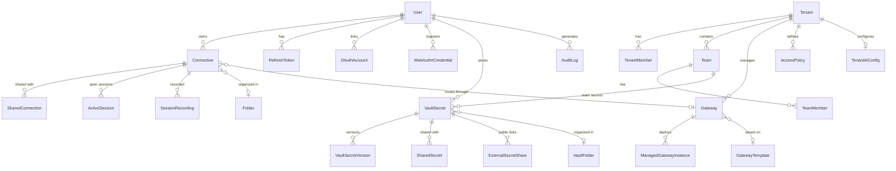

### Key Models

| Model | Fields | Purpose |
|-------|--------|---------|
| **User** | 100+ fields | Core user with vault encryption, TOTP, domain creds, recovery keys |
| **Tenant** | DLP, IP allowlist, tunnel config, session limits | Multi-tenant workspace |
| **Connection** | SSH/RDP/VNC with encrypted credentials, DLP, gateway | Remote connection definition |
| **VaultSecret** | LOGIN, SSH_KEY, CERTIFICATE, API_KEY, SECURE_NOTE | Encrypted secret storage with versioning |
| **Gateway** | SSH/RDP/VNC gateway with health, auto-scaling, tunnel | Gateway infrastructure |
| **ActiveSession** | Socket ID, last activity, protocol | Open session tracking |
| **AuditLog** | 100+ action types, IP, GeoIP, flags | Comprehensive audit trail |
| **AccessPolicy** | Time windows, trusted device, MFA step-up | ABAC policy enforcement |
| **TenantAiConfig** | Provider, model, daily limits, encrypted API key | Per-tenant AI/LLM configuration |
| **DbRateLimitPolicy** | Token bucket, query type scope, burst capacity | SQL query rate limiting |

### Enums

| Enum | Values |
|------|--------|
| TenantRole | OWNER, ADMIN, OPERATOR, MEMBER, CONSULTANT, AUDITOR, GUEST |
| TeamRole | TEAM_ADMIN, TEAM_EDITOR, TEAM_VIEWER |
| ConnectionType | RDP, SSH, VNC, DATABASE, DB_TUNNEL |
| SecretType | LOGIN, SSH_KEY, CERTIFICATE, API_KEY, SECURE_NOTE |
| SecretScope | PERSONAL, TEAM, TENANT |
| GatewayType | GUACD, SSH_BASTION, MANAGED_SSH, DB_PROXY |
| SessionProtocol | SSH, RDP, VNC, SSH_PROXY, DATABASE, DB_TUNNEL |
| SessionStatus | ACTIVE, IDLE, CLOSED |
| ManagedInstanceStatus | PROVISIONING, RUNNING, STOPPED, ERROR, REMOVING |
| CheckoutStatus | PENDING, APPROVED, REJECTED, EXPIRED, CHECKED_IN |
| KeystrokePolicyAction | BLOCK_AND_TERMINATE, ALERT_ONLY |
| FirewallAction | BLOCK, ALERT, LOG |
| MaskingStrategy | REDACT, HASH, PARTIAL |
| RateLimitAction | REJECT, LOG_ONLY |

## Client Architecture

### Technology Stack

- **React 19** with Vite build
- **Material-UI v7** for components
- **Zustand** for state management (15 stores)
- **XTerm.js** for SSH terminal rendering
- **guacamole-common-js** for RDP/VNC rendering
- **Socket.IO** for real-time communication
- **Axios** with automatic JWT refresh

### Route Structure

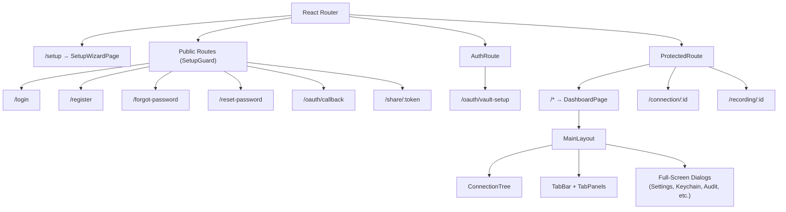

### State Management (15 Zustand Stores)

| Store | Persistence | Purpose |
|-------|-------------|---------|
| `authStore` | localStorage (excludes accessToken) | Authentication state, user profile |
| `connectionsStore` | None (fetch-driven) | Connections, folders |
| `tabsStore` | Server-side (debounced sync) | Open tabs |
| `vaultStore` | None (polling) | Vault lock status |
| `secretStore` | None (fetch-driven) | Vault secrets, versions, sharing |
| `themeStore` | localStorage | Theme name and dark/light mode |
| `teamStore` | None | Teams and members |
| `tenantStore` | None | Tenant context and settings |
| `gatewayStore` | None (WebSocket updates) | Gateways, instances, scaling, tunnel |
| `notificationStore` | None (transient) | Toast notifications |
| `notificationListStore` | None | Notification history |
| `accessPolicyStore` | None | ABAC policies |
| `uiPreferencesStore` | localStorage (per-user) | 50+ layout preferences |
| `rdpSettingsStore` | Server-side | RDP viewer defaults |
| `terminalSettingsStore` | Server-side | Terminal appearance defaults |

### Theme System

6 themes × 2 modes (dark/light):

| Theme | Accent | Inspiration |
|-------|--------|-------------|
| Editorial | Emerald | Serif headings, classic |
| Primer | Blue | GitHub |
| Tanuki | Purple/Orange | GitLab |
| Monokai | Neon multi-color | Code editor |
| Solarized | Cyan | Solarized palette |
| OneDark | Blue | Atom One Dark |

### Build Optimization

Vite splits code into manual chunks for optimal loading:

| Chunk | Contents |
|-------|----------|
| `vendor-react` | React, React-DOM, React-Router |
| `vendor-mui` | Material-UI, Emotion |
| `vendor-mui-icons` | MUI Icons |
| `vendor-terminal` | XTerm.js + addons |
| `vendor-guacamole` | Guacamole client |
| `vendor-network` | Axios, Socket.IO |

PWA support with Workbox: offline-first navigation, stale-while-revalidate for assets, cache-first for fonts.

## Real-Time Connection Architecture

### SSH Terminal Flow

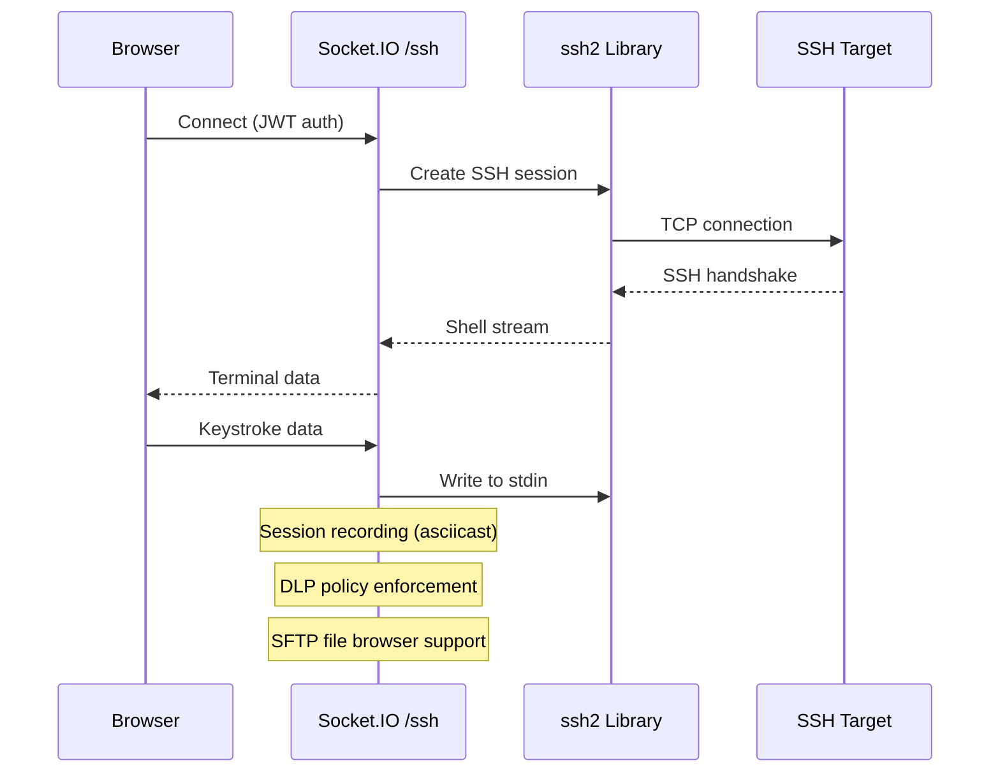

### RDP/VNC Flow

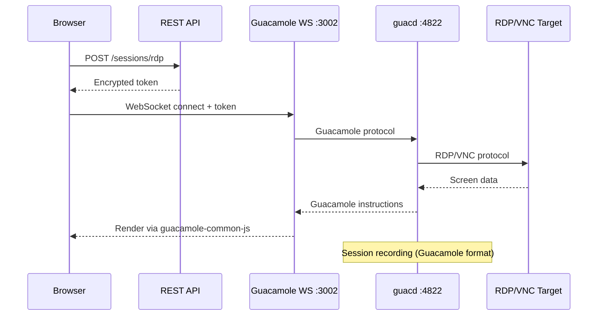

### Zero-Trust Tunnel

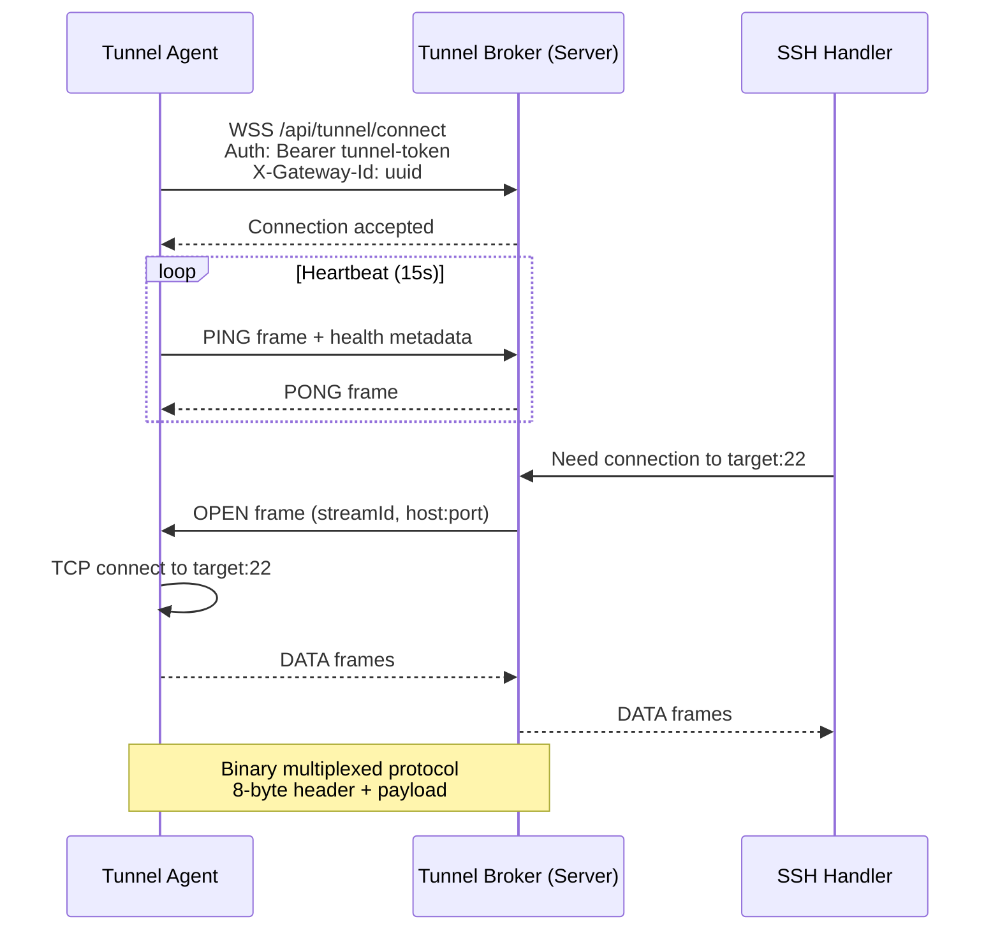

**Binary Frame Protocol:**
- Frame type (1 byte): OPEN, DATA, CLOSE, PING, PONG
- Stream ID (4 bytes): Multiplexed stream identifier
- Payload length (3 bytes)
- Payload (variable)

## Distributed State (Go Cache Sidecar)

The `gocache` sidecar (`infrastructure/gocache/`) is a Go-based in-memory cache server that enables multi-instance Arsenale deployments by providing distributed KV storage, pub/sub, distributed locks, and named queues over gRPC.

### Integration Architecture

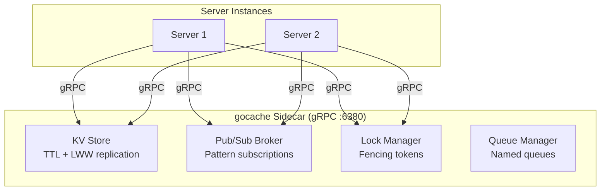

### Subsystems Using the Sidecar

| Subsystem | Primitive | Key Pattern | Fallback |
|-----------|-----------|-------------|----------|
| Socket.IO adapter | Pub/sub | `sio:<namespace>`, `sio:server:<namespace>` | In-memory adapter |
| Auth codes | KV (GetDel) | `auth:code:<hex>` | Local Map |
| Link codes | KV (GetDel) | `link:code:<hex>` | Local Map |
| Relay state | KV (GetDel) | `relay:code:<hex>` | Local Map |
| Leader election | Distributed locks | Lock name per job | Every instance runs |
| Vault session index | KV | JSON index arrays | Local Map cleanup |

### Leader Election

Background jobs use `runIfLeader()` or `startLeaderHeartbeat()` from `server/src/utils/leaderElection.ts` to ensure only one instance executes scheduled work. Locks use configurable TTLs with periodic renewal. If the leader crashes, the lock expires and another instance acquires it.

### Graceful Degradation

All sidecar operations return `null`/`false` on failure rather than throwing. Each store maintains a local in-memory fallback. Setting `CACHE_SIDECAR_ENABLED=false` disables all distributed features, making the sidecar fully optional for single-instance deployments.

## Security Architecture

### Encryption at Rest

All sensitive data is encrypted using **AES-256-GCM**:

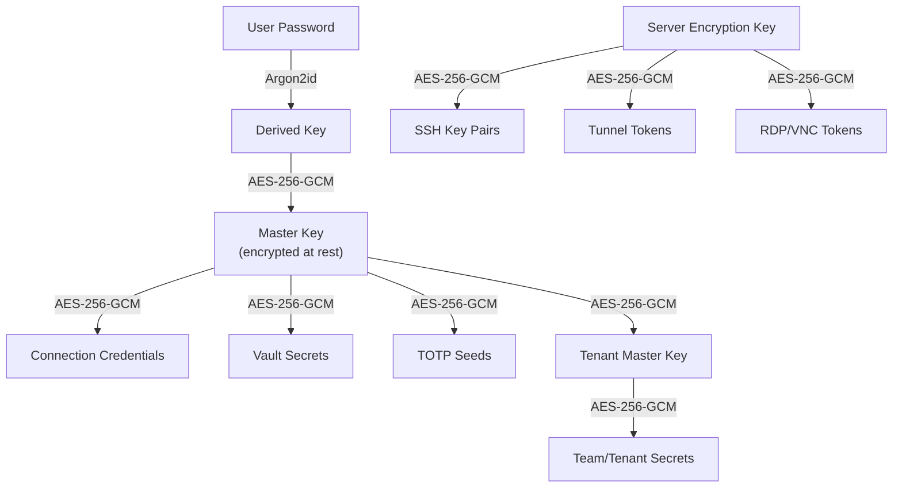

### Authentication Flow

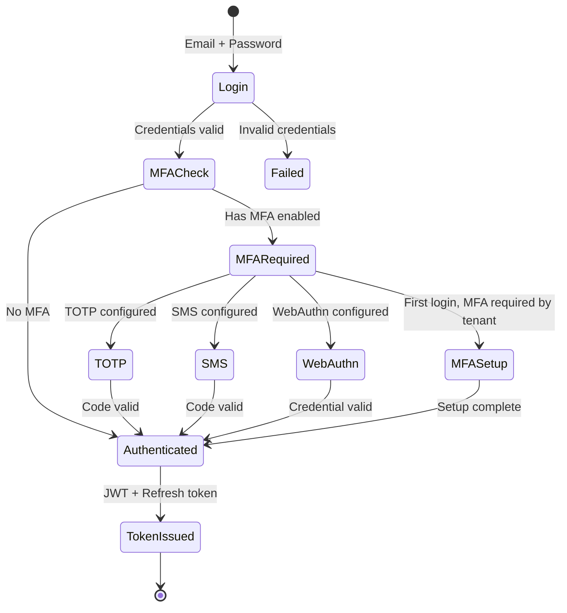

**Token Security:**
- Short-lived access tokens (15 min default)
- Refresh tokens stored in DB with family tracking (rotation detection)
- Token binding: IP + User-Agent hash prevents token theft
- Automatic refresh via Axios interceptor on 401

**OAuth Provider Configuration:**
- Google: optional `hd` parameter restricts login to a specific hosted domain (e.g. corporate Google Workspace)
- Microsoft: configurable `tenant` parameter (defaults to `common`, can be set to a specific Azure AD tenant ID)
- GitHub: standard OAuth2 with `user:email` scope
- Generic OIDC: discovery-based with PKCE (S256), supports any OpenID Connect provider
- SAML: supports IdP metadata, attribute mapping, and session index tracking

### Role-Based Access Control

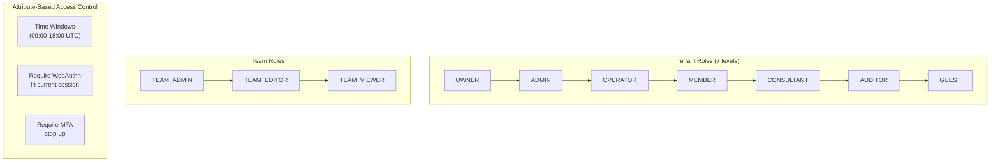

### Audit & Anomaly Detection

- 100+ tracked action types
- GeoIP enrichment (country, city, coordinates)
- Impossible travel detection (speed > 900 km/h between logins)
- IP allowlist (flag or block mode per tenant)
- DLP policies (disable copy/paste/upload/download per tenant or connection)

### SSH Keystroke Inspection

Real-time keystroke inspection monitors SSH sessions for policy-violating commands:

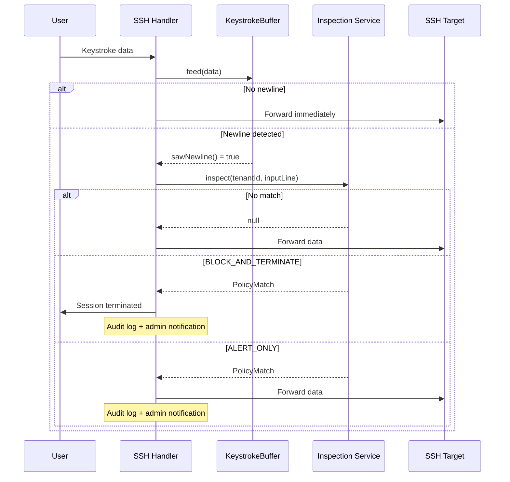

### Credential Checkout (PAM)

Temporary credential check-out/check-in with approval workflow:
- Request -> Approve/Reject -> Use -> Check-in/Expire
- Atomic status transitions (TOCTOU-safe)
- Batch resource name resolution (N+1 safe)
- Configurable duration (1-1440 minutes)
- Auto-expiry via scheduled job (every 5 min)
- Notifications to approvers and requesters

### Lateral Movement Detection

MITRE T1021 detection: monitors concurrent session patterns across targets. If a user connects to more distinct targets than the threshold within a time window, the account is temporarily suspended and admins are alerted.

## Browser Extension Architecture

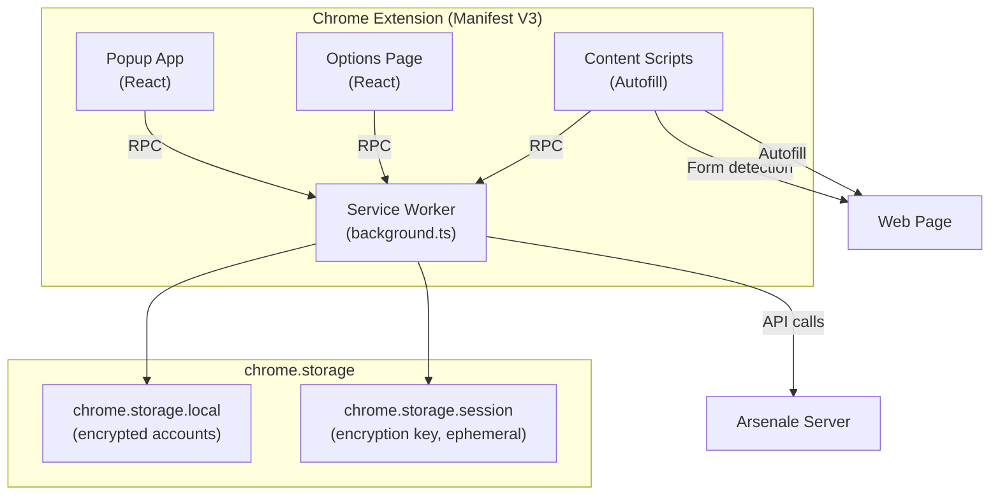

**Key Features:**
- Multi-account support (multiple Arsenale servers)
- Credential autofill on login forms
- Keychain browsing and search
- Token refresh via chrome.alarms (every 10 min)
- AES-GCM encrypted token storage
- Credential index for domain matching

## Key Design Patterns

### Full-Screen Dialog Pattern

Features that overlay the workspace (settings, keychain, audit log) are implemented as full-screen MUI `Dialog` components, not page routes. This preserves active RDP/SSH sessions.

### UI Preferences Persistence

All layout state persists via `uiPreferencesStore` (Zustand + localStorage, per-user namespacing). 50+ keys for sidebar states, filter selections, panel positions.

### Error Handling

- **Server:** Custom `AppError(message, statusCode)`, async handler wrapper, global error middleware
- **Client:** `extractApiError(err, fallback)` utility, `useAsyncAction` hook for dialog forms

### Native Client Integration (CLI)

Arsenale Connect CLI (`tools/arsenale-cli/`) enables native SSH/RDP clients (PuTTY, mstsc, etc.) to connect through Arsenale's vault and gateway infrastructure. Uses RFC 8628 device authorization for CLI-to-web authentication. The CLI orchestrates credential injection, SSH proxy tokens, and .rdp file generation.

### Validation

Zod schemas validate all request bodies on the server via `validate()` middleware. Client mirrors schemas for form validation.
