## 🏗 Overview

Arsenale is a secure remote access platform built as a monorepo with npm workspaces. It provides SSH, RDP, VNC, and database proxy access through a unified web interface with enterprise-grade security, multi-tenancy, and session recording.

**Why this architecture:** Arsenale consolidates fragmented remote access tools (PuTTY, RDP clients, VPN tunnels, database GUIs) into a single zero-trust platform where every connection is authenticated, encrypted, audited, and optionally recorded.

> Runtime note: the active application edge runs through the Go split services in `backend/`; there is no local legacy `server/` implementation in-tree.

## 🧩 High-Level Architecture

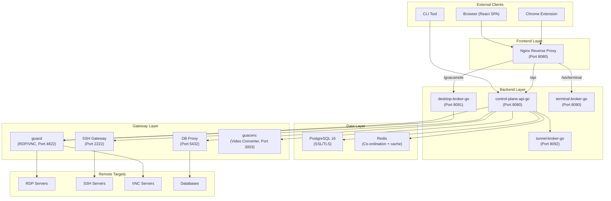

## 📦 Workspace Structure

| Workspace | Path | Technology | Purpose |
|-----------|------|-----------|---------|
| Backend | `backend/` | Go 1.25 | Control plane, brokers, orchestration, AI, runtime |
| Client | `client/` | React 19 + Vite + MUI v7 | Web UI (SPA) |
| Tunnel Agent | `gateways/tunnel-agent/` | Node.js + TypeScript | Zero-trust tunnel client |
| Browser Extension | `extra-clients/browser-extensions/` | Chrome MV3 + React | Autofill, keychain |

## 🔀 Active Service Architecture

The live request path follows a Go service architecture centered on explicit handlers and stores: **Routers -> Handlers -> Services -> SQL/Redis/Downstream brokers**.

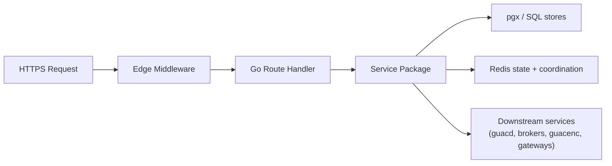

**Why this shape:** handlers stay close to the public wire contract, service packages own business rules, stores keep SQL explicit, and Redis-backed coordination remains isolated from request serialization.

## 🛡 Edge Request Pipeline

The public Go edge applies security and tenancy checks before dispatching to a feature package.

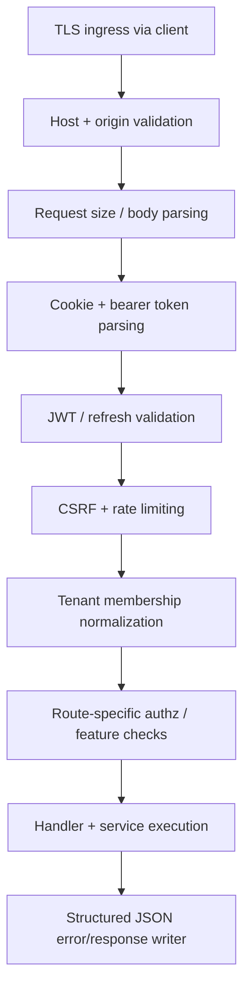

**Key design decisions:**

- **CSRF uses double-submit cookies**, not server-side tokens, enabling stateless JWT auth without session storage
- **Rate limiting is Redis-backed** so repeated login/session attempts are enforced across instances
- **Feature gates evaluate dynamically** on each request, allowing runtime toggles without restarts via the Settings UI
- **Host validation** prevents DNS rebinding attacks by checking the Host header against allowed values

## 🔐 Authentication Flow

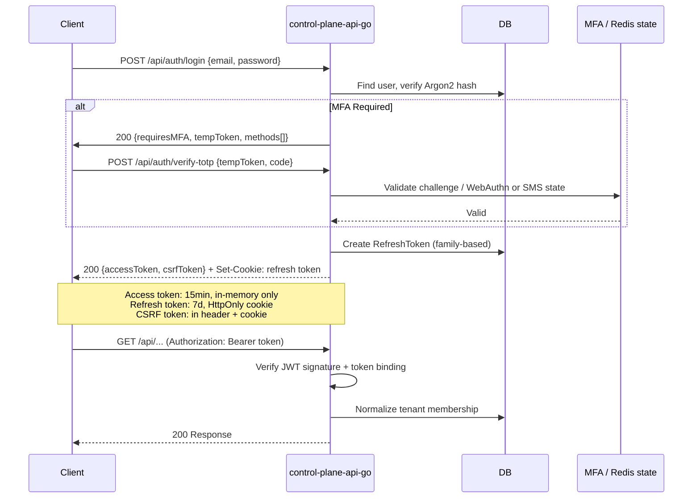

**Security properties:**
- Access tokens are short-lived (15 min) and held in-memory only (never in localStorage)
- Refresh tokens use family-based rotation to detect token replay attacks
- Token binding ties JWTs to the originating IP + User-Agent hash (configurable)
- Account lockout after repeated failures remains centrally enforced on the Go auth path

## 🌐 Interactive Session Flows

### SSH Terminal

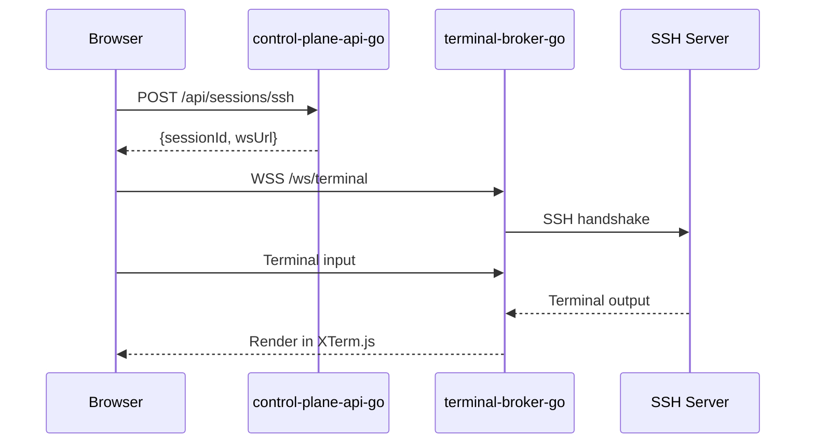

### RDP/VNC via Guacamole

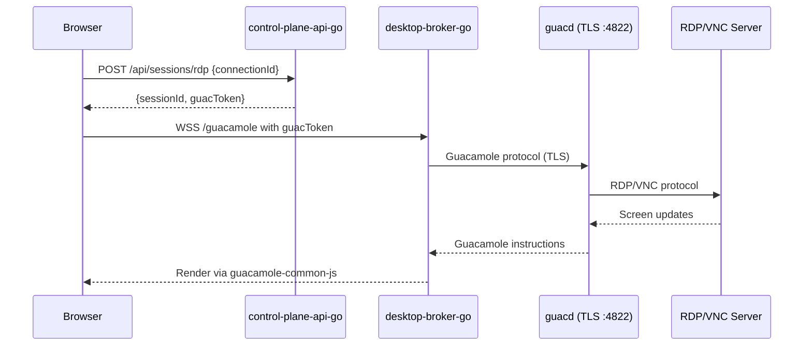

### Database Sessions

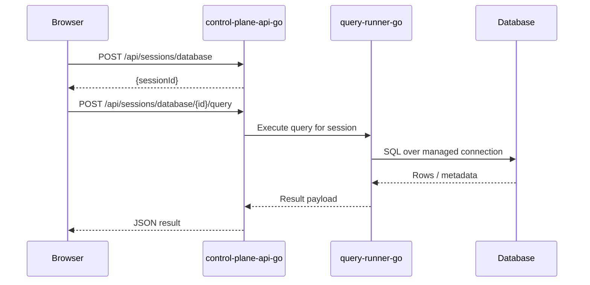

## 🗄 Database Schema

The SQL bootstrap schema and Go stores define the core entities across these domains:

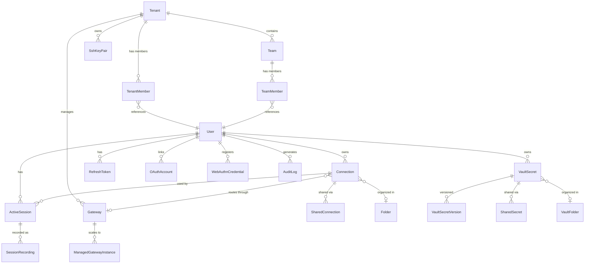

**Key design decisions:**

- **Multi-tenancy** is enforced at the data model level -- every resource belongs to a Tenant, and queries are scoped by tenantId
- **Vault encryption** uses per-user keys derived from passwords via Argon2, with AES-256-GCM at rest
- **Role hierarchy** provides 7 levels: GUEST < AUDITOR < CONSULTANT < MEMBER < OPERATOR < ADMIN < OWNER
- **Team roles** are separate: TEAM_VIEWER < TEAM_EDITOR < TEAM_ADMIN
- **Audit logging** captures 70+ distinct action types for compliance

## 📡 Distributed Coordination

When running multiple API or broker instances, Arsenale uses Redis for shared ephemeral state and coordination:

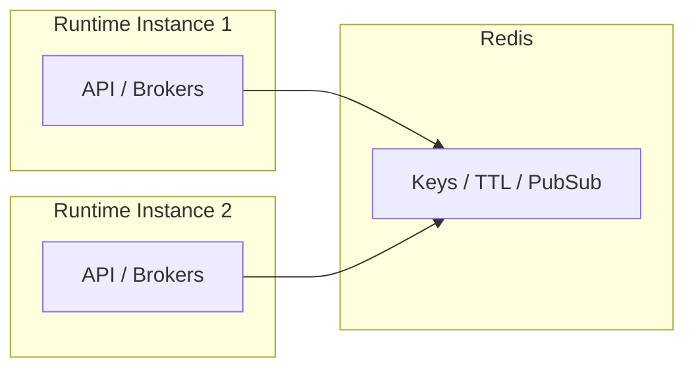

**What Redis provides:**
- **KV + TTL**: Distributed rate limit counters, auth challenge state, vault status, and short-lived coordination data
- **Pub/Sub**: Cross-instance fanout for status notifications and broker coordination where needed
- **Shared coordination**: Ensures horizontally scaled services observe consistent ephemeral state

## 🔄 Scheduled Jobs

The Go control plane and controller services run background jobs and reconciliation loops:

| Job | Default Schedule | Purpose |
|-----|-----------------|---------|
| Key Rotation | `0 2 * * *` (2 AM daily) | Rotate JWT signing keys |
| LDAP Sync | `0 */6 * * *` (every 6h) | Sync users/groups from LDAP |
| Membership Expiry | Hourly | Auto-remove expired tenant/team members |
| Secret Rotation | Configurable | Rotate passwords per policy |
| Session Cleanup | Hourly | Close idle sessions, purge 30-day old closed sessions |
| Recording Cleanup | Daily | Remove recordings past retention (default 90 days) |
| Token Cleanup | Hourly | Purge expired refresh tokens |
| Gateway Health | 30s interval | Health check managed gateways |
| Auto-scaling | 30s interval | Evaluate gateway replica counts |
| System Secret Rotation | Configurable | Roll over JWT + Guacamole keys |
| Device Auth Cleanup | 5-min interval | Purge expired device auth codes |

## ⚙ Live Reload

Configuration changes from the Settings UI take effect immediately via the live reload system:

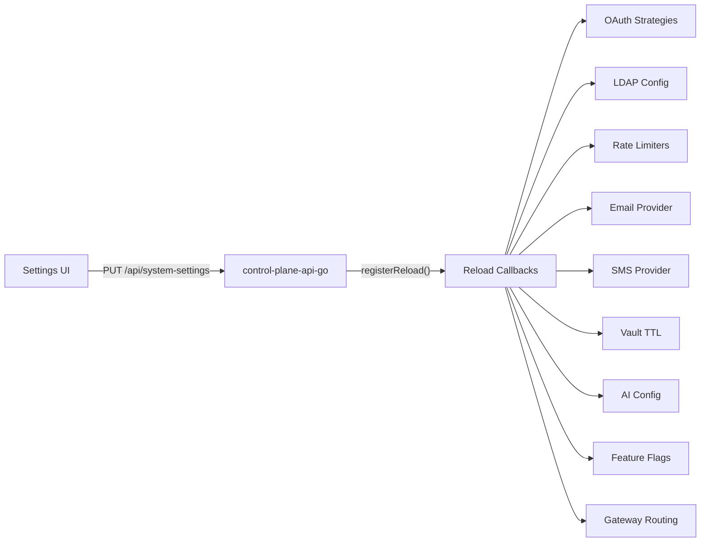

No service restart is required for supported configuration changes.

## 🔒 Security Architecture

### Encryption at Rest

- **Vault secrets**: AES-256-GCM with per-user master key (Argon2-derived from password)
- **Connection credentials**: AES-256-GCM with server encryption key
- **SSH key pairs**: AES-256-GCM with tenant-scoped key
- **Refresh tokens**: SHA-256 hashed before DB storage

### Network Security

All service-to-service communication uses TLS or mTLS:

| Connection | Protocol | Authentication |
|-----------|----------|---------------|
| Client -> Nginx | HTTPS | - |
| Nginx -> control-plane-api-go | HTTP/HTTPS | Internal network or service cert verify |
| Nginx -> desktop-broker-go / terminal-broker-go | HTTP+WS | Internal network |
| control-plane-api-go -> PostgreSQL | SSL | Certificate |
| control-plane-api-go -> Redis | TCP/TLS | Internal network / deployment policy |
| control-plane-api-go -> guacd | TLS | CA verify |
| control-plane-api-go -> guacenc | HTTPS + mTLS | Client + server certs |
| SSH Gateway -> control-plane-api-go | gRPC + mTLS | Client + server certs |

### Logging Security

The active Go services emit structured logs with explicit field redaction and bounded request metadata. Archived `server/src` logging code remains reference-only.

## 🧱 Client Architecture

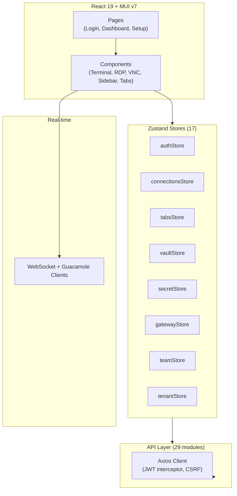

**Key patterns:**
- **Access tokens in-memory only** -- never persisted to localStorage
- **Axios interceptor** auto-refreshes tokens on 401 responses
- **UI preferences** persisted via Zustand + localStorage (`uiPreferencesStore`)
- **Full-screen dialogs** overlay the workspace without destroying active SSH/RDP sessions
