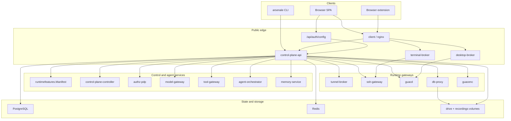
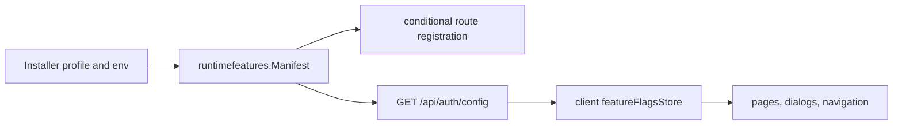
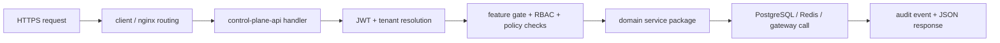
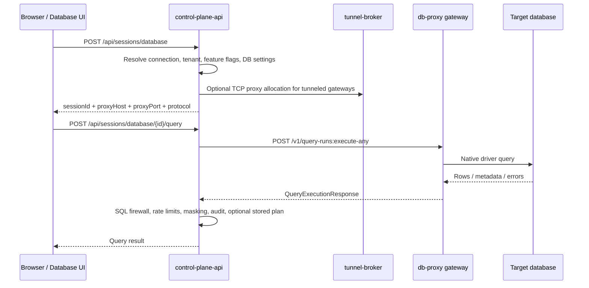

## 🎯 Why This Architecture Exists

Arsenale is structured around a strict split between control, runtime, gateway, and operator concerns. The control plane owns identity, tenancy, policy, audit, routing, and orchestration. Runtime brokers own browser session transport. Gateways own target-network access. The installer owns deployment intent and encrypted rerun state.

The database rule remains deliberate: the control plane is an orchestrator and policy boundary, not the database client of record. Interactive database queries run through `db-proxy` gateways in the same way SSH and desktop traffic flow through dedicated runtime services.

## 🧭 Service Planes

| Plane | Service | Default Port | Role |
|------|---------|--------------|------|
| Control | `control-plane-api` | `8080` | Public tenant API, auth, routing, policy, audit |
| Control | `control-plane-controller` | `8081` | Placement and reconciliation |
| Control | `authz-pdp` | `8082` | Central policy decision point |
| Agent | `model-gateway` | `8083` | LLM and embedding provider gateway |
| Agent | `tool-gateway` | `8084` | Typed capability gateway |
| Agent | `agent-orchestrator` | `8085` | Agent run lifecycle |
| Agent | `memory-service` | `8086` | Working and semantic memory service |
| Runtime | `terminal-broker` | `8090` | Browser SSH and WebSocket runtime |
| Runtime | `desktop-broker` | `8091` | Browser RDP and VNC runtime |
| Runtime | `tunnel-broker` | `8092` | Tunnel registration and TCP proxying |
| Runtime | `query-runner` | `8093` | Shared query execution service |
| Runtime | `recording-worker` | `8094` | Recording conversion and retention |
| Execution | `runtime-agent` | `8095` | Host-local workload validation |
| Runtime gateway | `db-proxy` | `5432` | Database middleware for connectivity, query, schema, plan, and introspection |

Every Go service uses the same wrapper in `backend/internal/app/app.go`, so these endpoints are stable across the fleet:

- `GET /healthz`
- `GET /readyz`
- `GET /v1/meta/service`
- `GET /v1/meta/architecture`

## 🏗 High-Level Component Diagram

## 🧩 Runtime Capability Model

Feature availability is not hard-coded in the SPA or the control plane separately. The installer and runtime env produce one shared manifest in `backend/internal/runtimefeatures/manifest.go`, and that manifest drives both route registration and UI visibility.

Important architectural consequences:

- `backend/cmd/control-plane-api/routes.go` only registers secrets routes when `KeychainEnabled` is true.
- Session routes are only registered when `AnyConnectionFeature()` is true.
- Database session and DB audit surfaces depend on `DatabaseProxyEnabled`.
- Gateway and tunnel surfaces depend on `ZeroTrustEnabled`.
- The client starts fail-open with enabled defaults, then narrows to the server-provided manifest after `GET /api/auth/config` succeeds.

## 🔐 Public Request Pipeline

That split is intentional:

- the client is only a reverse proxy and static asset host,
- the control plane terminates auth, tenancy, feature gating, and audit,
- runtime services only handle transport after the control plane has issued a grant or session.

## 🗄 Database Session Architecture

Database querying follows the same gateway pattern as other remote access types.

Important design details:

- The session record is created by `backend/internal/dbsessions/create.go`.
- The control plane locates a `DB_PROXY` gateway, optionally resolves a managed instance, and optionally opens a tunnel-broker TCP proxy in `backend/internal/dbsessions/dbproxy_client.go`.
- Query, schema, explain, and introspection all call the DB proxy's shared `queryrunnerapi` surface:
  - `POST /v1/connectivity:validate`
  - `POST /v1/query-runs:execute-any`
  - `POST /v1/schema:fetch`
  - `POST /v1/query-plans:explain`
  - `POST /v1/introspection:run`
- The control plane applies masking, firewall, rate-limit, and audit logic after the DB proxy returns data.
- Persisted execution plans are opt-in per connection via `dbSettings.persistExecutionPlan`.

Supported interactive query protocols come from `backend/internal/queryrunner/protocols.go`:

- PostgreSQL
- MySQL / MariaDB
- SQL Server
- Oracle
- MongoDB

`client/src/api/connections.api.ts` still includes DB2 connection metadata fields, but DB2 is not part of the active query protocol switch.

## 🌉 Gateways and Development Bootstrap

Arsenale supports both directly managed gateway containers and tunneled gateway instances.

- `ssh-gateway` exposes SSH transport and gRPC key management.
- `guacd` handles RDP and VNC protocol termination.
- `db-proxy` hosts the query middleware and database drivers.
- `tunnel-agent` can be embedded into `ssh-gateway`, `guacd`, and `db-proxy` images.
- `tunnel-broker` allocates and multiplexes TCP proxies for tunneled instances.

Development mode now bootstraps all three runtime gateway types automatically through `service dev-bootstrap`:

- `Dev Tunnel Managed SSH`
- `Dev Tunnel GUACD`
- `Dev Tunnel DB Proxy`

The bootstrap flow also ensures tenant vault state, tenant SSH key pairs, an orchestrator connection, demo database connections, and a managed SSH key push to all managed gateways.

## 💾 Data, State, and Persistence

| Component | Purpose |
|-----------|---------|
| PostgreSQL | Durable truth for users, tenants, connections, sessions, policies, audit, and memory metadata |
| Redis | Coordination, rate limits, grants, leases, and stream fan-out |
| `arsenale_drive` volume | Browser file transfer staging |
| `arsenale_recordings` volume | Session recordings and exported artifacts |
| Podman secrets | Runtime delivery for JWT, database URL, guacamole secret, encryption key, and provider credentials |
| `dev-certs/` | Shared CA plus service, gateway, and tunnel certificates |
| `/opt/arsenale/install/*.enc` | Encrypted installer profile, state, status, log, and rendered artifacts |

## 🧪 Shared Service Patterns

The Go services deliberately use a narrow common shape:

- `main.go` wires dependencies and registers routes.
- `app.StaticService` declares metadata and a route registration function.
- `app.Run` handles listen address, logging, `/healthz`, `/readyz`, and graceful shutdown.
- Public route registration is consolidated in `backend/cmd/control-plane-api/routes*.go`.
- Public readiness at `GET /api/ready` checks PostgreSQL and, when connection features are enabled, `desktop-broker` reachability.

That uniformity matters for operators and LLMs because it makes new services easy to discover, reason about, and validate mechanically.
