# Architecture

Arsenale is a monorepo with npm workspaces: `server/`, `client/`, `gateways/tunnel-agent/`, and `extra-clients/browser-extensions/`.

## System Overview

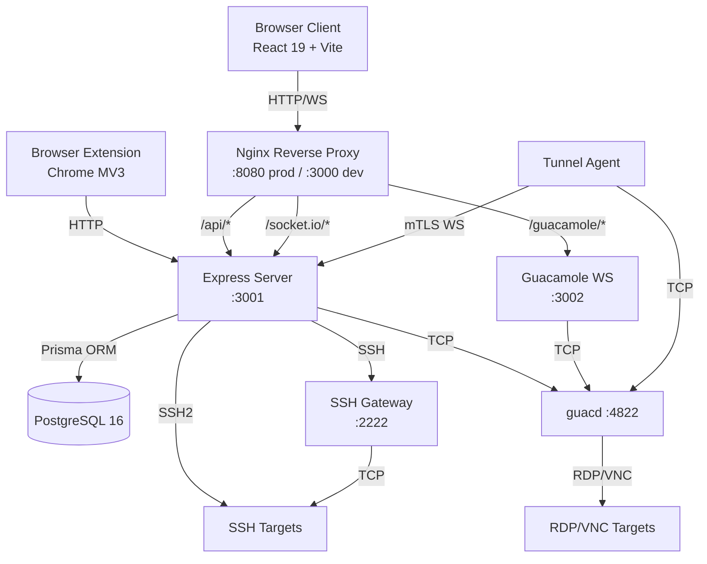

## Server Architecture

### Layered Design

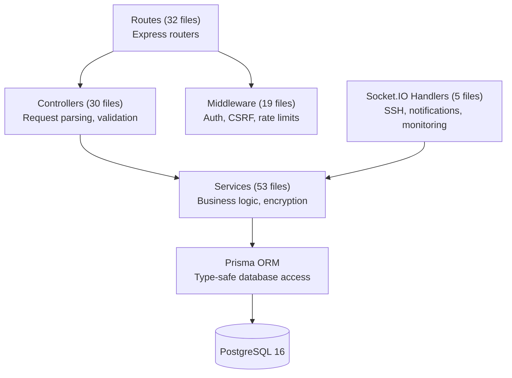

**Entry point** (`server/src/index.ts`):
1. Runs `prisma migrate deploy` (auto-migration on startup)
2. Executes startup data migrations (email verification, vault setup marking)
3. Recovers orphaned sessions from previous server instances
4. Initializes Passport authentication and GeoIP services
5. Creates HTTP server, attaches Socket.IO and Guacamole WebSocket server
6. Sets up zero-trust tunnel WebSocket endpoint
7. Launches scheduled jobs (key rotation, LDAP sync, cleanup, monitoring)

**App setup** (`server/src/app.ts`):
1. Helmet security headers (CSP, HSTS, X-Frame-Options, Referrer-Policy)
2. Custom Permissions-Policy header
3. Trust proxy configuration
4. CORS (origin restricted to `CLIENT_URL`, credentials enabled)
5. JSON parser (500KB limit)
6. Cookie parser + Passport initialization
7. Optional HTTP request logger
8. Global CSRF validation (exempts specific auth and share endpoints)
9. Mounts 32 route files under `/api`
10. Custom 404 handler + centralized error middleware

### Route Domains

| Domain | Prefix | Files | Purpose |
|--------|--------|-------|---------|
| Authentication | `/api/auth` | auth, oauth, saml | Login, register, OAuth, SAML, MFA |
| Vault | `/api/vault` | vault | Unlock/lock, password reveal, MFA unlock |
| Connections | `/api/connections` | connections | CRUD, sharing, import/export |
| Folders | `/api/folders` | folders | Connection folder management |
| Sessions | `/api/sessions` | sessions | SSH/RDP/VNC session lifecycle, monitoring |
| Users | `/api/user` | user, 2fa, sms, webauthn | Profile, password, email, MFA setup |
| Secrets | `/api/secrets` | secrets | Vault secret CRUD, versioning, sharing |
| Vault Folders | `/api/vault-folders` | vault-folders | Secret folder organization |
| Public Share | `/api/share` | share | External secret access (unauthenticated) |
| Audit | `/api/audit` | audit | Log queries, geo analysis |
| Notifications | `/api/notifications` | notifications | In-app notification management |
| Tenants | `/api/tenants` | tenants | Multi-tenant management, user admin |
| Teams | `/api/teams` | teams | Team CRUD, member management |
| Gateways | `/api/gateways` | gateways | Gateway CRUD, orchestration, tunnels |
| Admin | `/api/admin` | admin | Email config, app config, providers |
| Files | `/api/files` | files | Upload/download with quota enforcement |
| Tabs | `/api/tabs` | tabs | Tab state sync |
| Recordings | `/api/recordings` | recordings | Session recording playback |
| GeoIP | `/api/geoip` | geoip | IP geolocation lookup |
| LDAP | `/api/ldap` | ldap | LDAP status, test, sync |
| Sync | `/api/sync-profiles` | sync | Connection sync (NetBox) |
| Vault Providers | `/api/vault-providers` | vault-providers | External vault integration |
| Access Policies | `/api/access-policies` | access-policies | ABAC policy management |
| Health | `/api/health`, `/api/ready` | — | Health and readiness probes |

### Middleware Stack

| Middleware | Purpose |
|-----------|---------|
| `auth.middleware.ts` | JWT verification, token binding (IP+UA hash), IP/UA validation |
| `csrf.middleware.ts` | CSRF token validation for state-changing requests |
| `tenant.middleware.ts` | Tenant context binding, role enforcement (7 roles) |
| `team.middleware.ts` | Team membership checks, role enforcement |
| `validate.middleware.ts` | Request schema validation |
| `error.middleware.ts` | Centralized error handler with logging |
| `requestLogger.middleware.ts` | Optional HTTP request logging |
| Rate limiters (7 files) | Login, registration, SMS, OAuth, session, vault, identity, reset |

### Scheduled Jobs

Started at server boot (`server/src/index.ts`):

| Job | Purpose |
|-----|---------|
| Key rotation | SSH keypair auto-rotation |
| LDAP sync | Periodic LDAP directory synchronization |
| Membership expiry | Cleanup expired tenant/team memberships |
| Gateway health monitoring | 30-second health check intervals |
| Gateway reconciliation | 5-minute instance state reconciliation |
| Auto-scaling | Dynamic gateway instance scaling |
| Cleanup: expired shares | Remove expired connection/secret shares |
| Cleanup: expired tokens | Purge expired refresh tokens |
| Cleanup: recordings | Remove recordings past retention period |
| Cleanup: idle sessions | Mark and close idle sessions |
| Secret expiry checks | Notify on approaching secret expiration |

## Client Architecture

### Application Structure

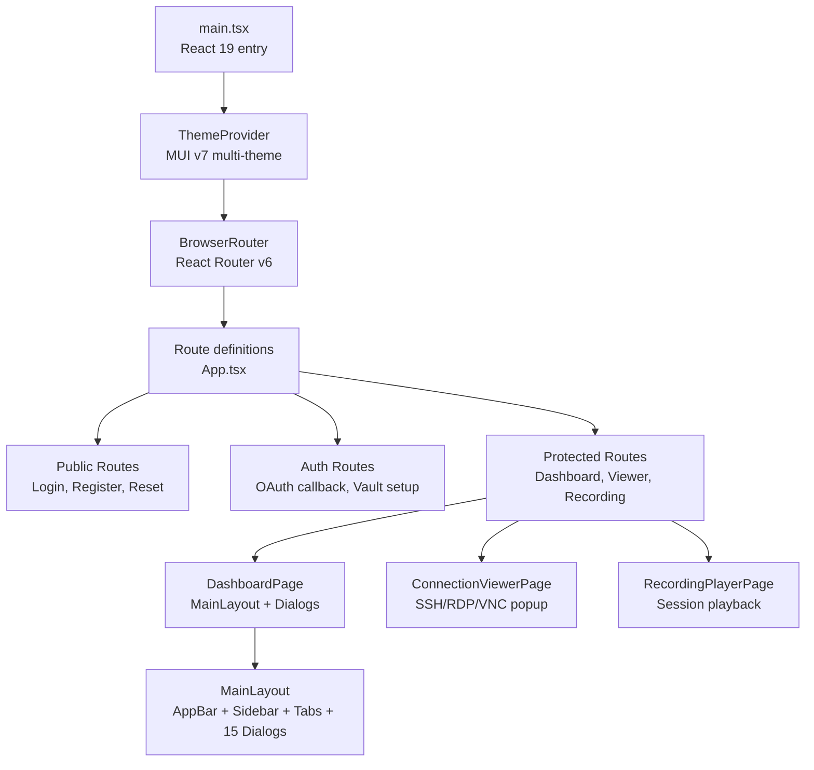

### State Management (Zustand)

| Store | File | Purpose |
|-------|------|---------|
| `authStore` | `authStore.ts` | JWT tokens (in-memory), CSRF token, user profile |
| `connectionsStore` | `connectionsStore.ts` | Own, shared, and team connections + folders |
| `tabsStore` | `tabsStore.ts` | Open tabs, active tab, server sync (debounced 1s) |
| `vaultStore` | `vaultStore.ts` | Vault lock status, MFA unlock methods, polling (60s) |
| `secretStore` | `secretStore.ts` | Vault secrets, filters, versions, folders, tenant vault |
| `teamStore` | `teamStore.ts` | Teams, members, CRUD operations |
| `tenantStore` | `tenantStore.ts` | Tenant details, users, memberships, switching |
| `gatewayStore` | `gatewayStore.ts` | Gateways, SSH keys, orchestration, templates, tunnels |
| `accessPolicyStore` | `accessPolicyStore.ts` | ABAC policies CRUD |
| `themeStore` | `themeStore.ts` | Theme name, light/dark mode |
| `uiPreferencesStore` | `uiPreferencesStore.ts` | 50+ persisted UI layout preferences |
| `notificationStore` | `notificationStore.ts` | Snackbar notification (single) |
| `notificationListStore` | `notificationListStore.ts` | In-app notification list, unread count |
| `terminalSettingsStore` | `terminalSettingsStore.ts` | User SSH terminal defaults |
| `rdpSettingsStore` | `rdpSettingsStore.ts` | User RDP defaults |

### Custom Hooks

| Hook | Purpose |
|------|---------|
| `useAuth` | Auth bootstrap, auto-refresh on mount |
| `useSocket(namespace)` | Socket.IO connection with JWT auth |
| `useAsyncAction` | Loading/error state for dialog form submissions |
| `useLazyMount(trigger)` | Defer Suspense mounting until first needed |
| `useKeyboardCapture` | Focus, fullscreen, keyboard lock, browser key suppression |
| `useAutoReconnect` | Exponential backoff with jitter for reconnection |
| `useSftpTransfers(socket)` | Chunked SFTP upload/download with progress tracking |
| `useShareSync` | Notification-driven data refresh (debounced 500ms) |
| `useDlpBrowserHardening` | Block DevTools, view-source, save, print shortcuts |
| `useGatewayMonitor` | Real-time gateway health via Socket.IO |
| `useFullscreen(ref)` | Container-scoped fullscreen toggle |
| `useCopyToClipboard` | Clipboard copy with 2-second feedback |

### Dialog Pattern

All features overlaying the main workspace use full-screen MUI `Dialog` components rendered from `MainLayout`, not separate page routes. This preserves active RDP/SSH sessions.

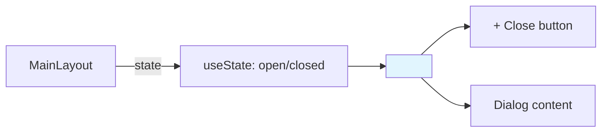

15 dialogs: Connection, Folder, Share, ShareFolder, ConnectAs, Settings, AuditLog, ConnectionAuditLog, Keychain, UserProfile, Recordings, Export, Import, CreateUser, Invite.

## Real-Time Communication

### SSH Terminal Sessions

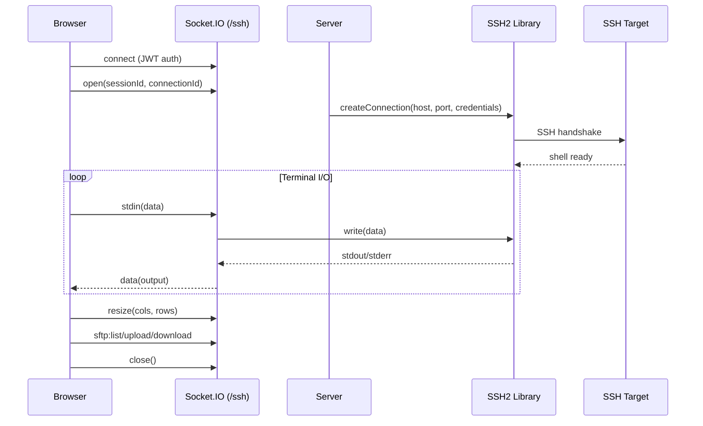

SFTP file transfers use 64KB chunked streaming over the same Socket.IO connection.

### RDP/VNC Sessions

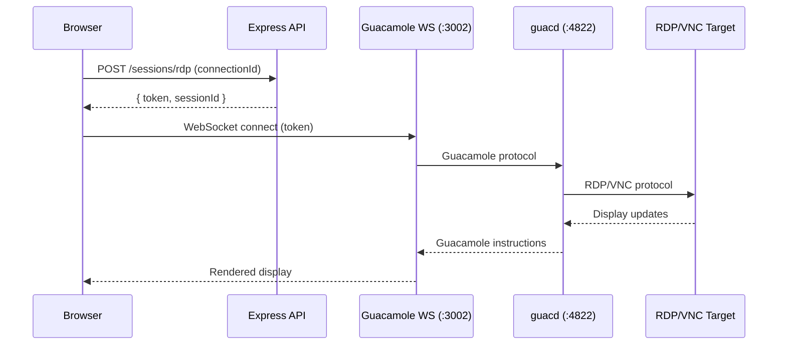

Guacamole tokens are AES-256-GCM encrypted, containing connection parameters that `guacd` uses to establish the remote session.

## Data Model Overview

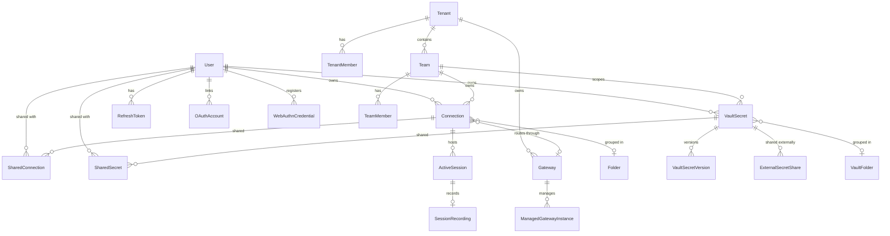

### Key Enums

| Enum | Values |
|------|--------|
| `TenantRole` | OWNER, ADMIN, OPERATOR, MEMBER, CONSULTANT, AUDITOR, GUEST |
| `TeamRole` | TEAM_ADMIN, TEAM_EDITOR, TEAM_VIEWER |
| `ConnectionType` | RDP, SSH, VNC |
| `SecretType` | LOGIN, SSH_KEY, CERTIFICATE, API_KEY, SECURE_NOTE |
| `SecretScope` | PERSONAL, TEAM, TENANT |
| `SessionProtocol` | SSH, RDP, VNC |
| `GatewayType` | GUACD, SSH_BASTION, MANAGED_SSH |
| `Permission` | READ_ONLY, FULL_ACCESS |

## Security Architecture

### Encryption at Rest

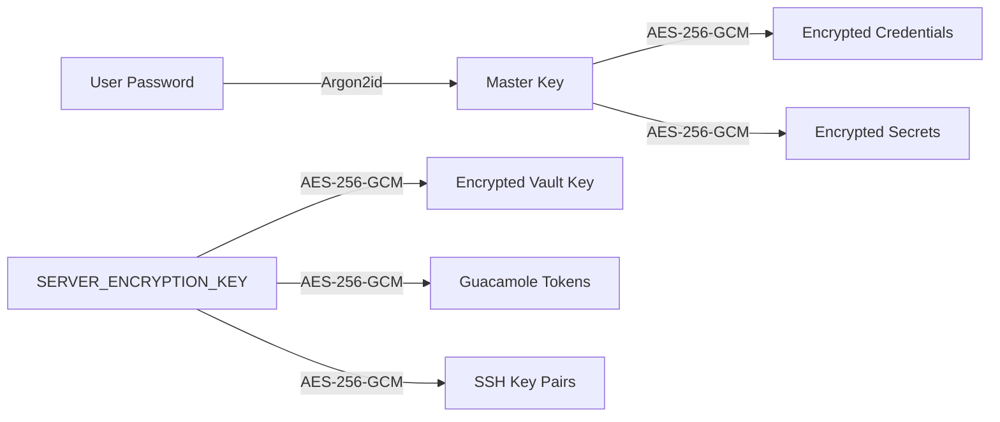

- **Per-user master key**: Derived from password via Argon2id, held in-memory with configurable TTL
- **Vault key**: Each user's vault key encrypted with server encryption key, decrypted only when vault is unlocked
- **Team vault keys**: Shared decryption keys distributed to team members
- **Tenant vault keys**: For tenant-scoped secrets

### Authentication Flow

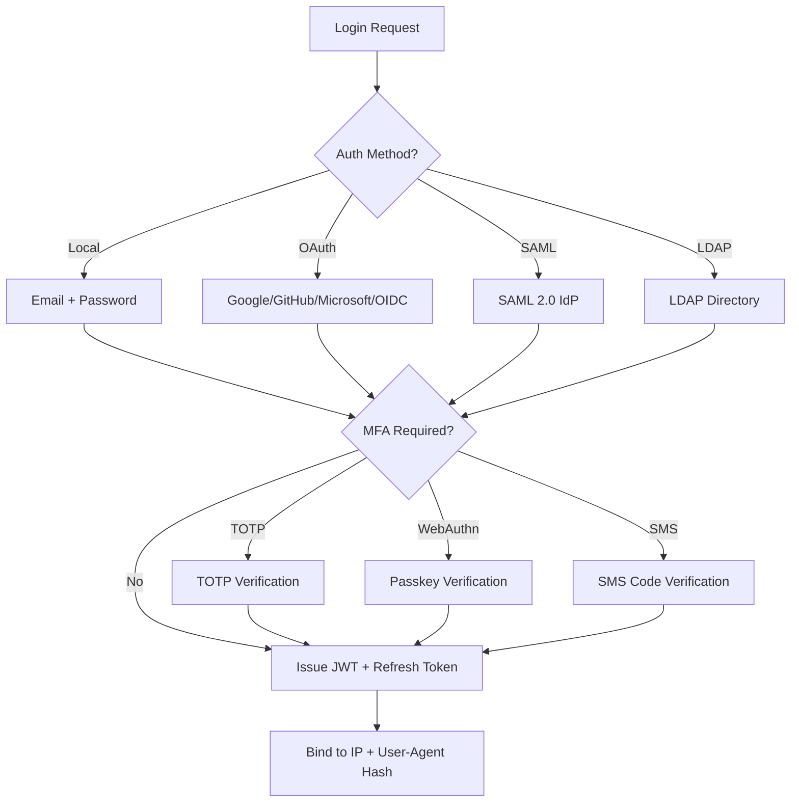

### Defense Layers

| Layer | Mechanism |
|-------|-----------|
| Transport | HTTPS, HSTS, CSP headers |
| Authentication | JWT with token binding, refresh token rotation |
| Authorization | RBAC (7 tenant roles, 3 team roles), ABAC policies |
| Rate Limiting | Per-endpoint limits (login, registration, SMS, OAuth, vault, session) |
| Data Protection | AES-256-GCM encryption, Argon2id key derivation |
| DLP | Clipboard, download, upload, print restrictions |
| Audit | 120+ action types, geo-IP enrichment, impossible travel detection |
| Network | IP allowlist (tenant-level), CSRF protection |
| Session | Absolute timeout (12h default), inactivity timeout (1h default), concurrent session limits |

## Browser Extension Architecture

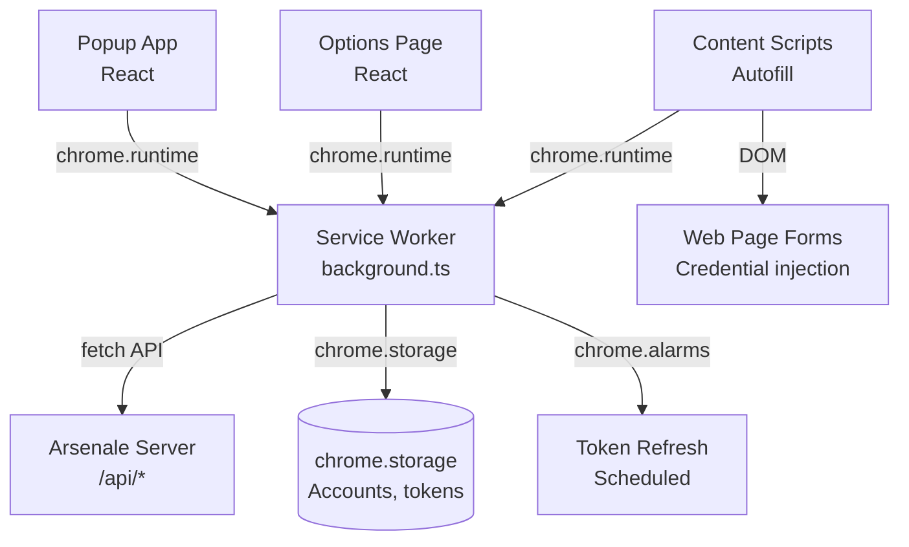

- Multi-account support with encrypted token storage (AES-GCM in `chrome.storage.session`)
- Service worker handles all API calls (bypasses CORS)
- Content scripts detect login forms and inject credentials from vault
- Token refresh via `chrome.alarms` (persistent scheduling)

## Gateway Orchestration

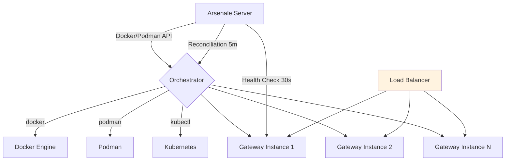

- **Auto-scaling**: Min/max replicas, sessions-per-instance threshold
- **Health monitoring**: 30-second intervals, consecutive failure tracking
- **Load balancing**: Round-robin or least-connections strategy
- **Templates**: Reusable gateway configurations for one-click deployment
