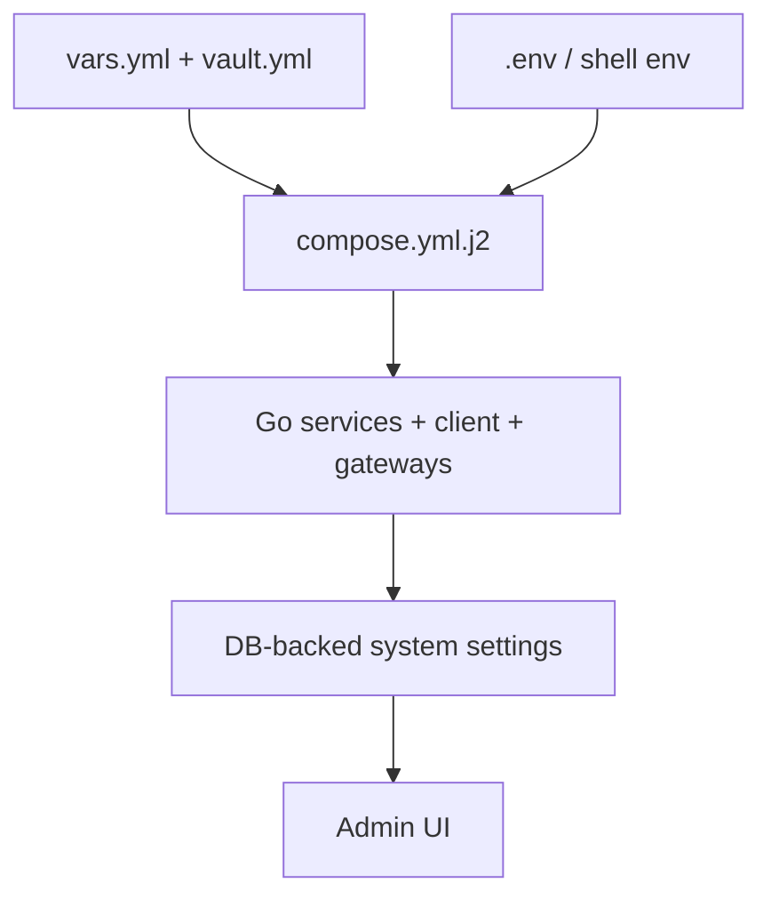

## 🎯 Configuration Model

Arsenale uses three layers of configuration:

1. **Deployment-time inputs** from Ansible vars and vault secrets.
2. **Runtime environment variables and secret files** mounted into containers.
3. **Database-backed system settings** for values that remain editable from the UI.

The practical rule is:

- if a value is set via environment or secret file, the service uses that value directly,
- otherwise the control plane can fall back to persisted system settings.

## 📁 Authoritative Files

| File | Role |
|------|------|
| `.env.example` | Root environment template and compatibility superset |
| `deployment/ansible/inventory/group_vars/all/vars.yml` | Non-secret deployment defaults |
| `deployment/ansible/inventory/group_vars/all/vault.yml` | Secret deployment values |
| `deployment/ansible/roles/deploy/templates/compose.yml.j2` | Concrete container env, ports, volumes, and secrets |
| `backend/internal/app/app.go` | Shared `HOST` / `PORT` and service meta conventions |
| `backend/cmd/control-plane-api/runtime.go` | Control-plane dependency and env wiring |
| `client/vite.config.ts` | Local frontend proxy and TLS overrides |
| `client/nginx.dev.conf` | HTTPS reverse-proxy behavior in dev |

## 🔐 Secret Delivery

Production and local containers prefer secret files over inline env values. Common examples:

| Secret | Runtime variable |
|--------|------------------|
| Database URL | `DATABASE_URL_FILE` |
| JWT signing key | `JWT_SECRET_FILE` |
| Guacamole secret | `GUACAMOLE_SECRET_FILE` |
| Server encryption key | `SERVER_ENCRYPTION_KEY_FILE` |
| Guacenc auth token | `GUACENC_AUTH_TOKEN_FILE` |

This keeps credentials out of plain-text process listings and makes the Compose template the authoritative binding point for secret mounts.

## 🌐 Core Runtime Variables

| Variable | Typical value | Why it matters |
|----------|---------------|----------------|
| `HOST` | `0.0.0.0` | Listen host for Go services via `app.Run` |
| `PORT` | Service-specific | Listen port for each Go service |
| `ARSENALE_VERSION` | `latest` or release tag | Reported by service meta endpoints |
| `CLIENT_URL` | `https://localhost:3000` in dev | Used for CORS, redirects, cookies, and links |
| `DATABASE_URL` / `DATABASE_URL_FILE` | PostgreSQL DSN | Control-plane and service persistence |
| `DATABASE_SSL_ROOT_CERT` | `/certs/postgres/ca.pem` | PostgreSQL TLS verification |
| `REDIS_URL` | `redis://redis:6379/0` | Coordination, locks, rate limits, streams |
| `RECORDING_PATH` | `/recordings` | Session artifact location |

## 🛡 Authentication and Security Variables

| Variable | Purpose |
|----------|---------|
| `JWT_SECRET` / `JWT_SECRET_FILE` | Access token signing key |
| `JWT_EXPIRES_IN` | Access token TTL |
| `JWT_REFRESH_EXPIRES_IN` | Refresh token TTL |
| `SERVER_ENCRYPTION_KEY` / `SERVER_ENCRYPTION_KEY_FILE` | Encrypt tenant SSH keys and other server-held sensitive material |
| `VAULT_TTL_MINUTES` | Personal vault lock timeout |
| `TOKEN_BINDING_ENABLED` | Bind tokens to client IP and User-Agent |
| `HOST_VALIDATION_ENABLED` | Reject invalid Host headers |
| `COOKIE_SECURE` | Force secure cookies in HTTPS deployments |
| `SELF_SIGNUP_ENABLED` | Public registration toggle |
| `EMAIL_VERIFY_REQUIRED` | Require email verification before login |
| `WEBAUTHN_RP_ID` | WebAuthn relying-party ID |
| `WEBAUTHN_RP_ORIGIN` | WebAuthn relying-party origin |
| `SPIFFE_TRUST_DOMAIN` | mTLS identity namespace for gateways and tunnel flows |

## 🌉 Broker, Gateway, and Orchestration Variables

| Variable | Purpose |
|----------|---------|
| `GUACD_HOST` / `GUACD_PORT` | Desktop broker target for Guacamole protocol |
| `GUACD_SSL` / `GUACD_CA_CERT` | TLS to `guacd` |
| `GUACAMOLE_SECRET_FILE` | Encrypt/decrypt desktop grants |
| `GUACENC_SERVICE_URL` | Recording conversion sidecar URL |
| `GUACENC_USE_TLS` / `GUACENC_TLS_CA` | TLS to `guacenc` |
| `TERMINAL_BROKER_URL` | Control-plane to terminal broker URL |
| `GO_TUNNEL_BROKER_URL` | Control-plane to tunnel broker URL |
| `GATEWAY_GRPC_TLS_CA` | Trust root for SSH gateway gRPC |
| `GATEWAY_GRPC_TLS_CERT` / `GATEWAY_GRPC_TLS_KEY` | Control-plane mTLS client cert for gateway calls |
| `ORCHESTRATOR_TYPE` | `podman`, `docker`, `kubernetes`, or auto-detect |
| `ORCHESTRATOR_*_IMAGE` | Container images used for managed gateway deployment |
| `ORCHESTRATOR_*_NETWORK` | Network placement for managed workloads |

## 🧪 Development Bootstrap Variables

The development playbook injects a set of convenience values that should not be treated as production defaults.

| Variable group | Purpose |
|----------------|---------|
| `DEV_BOOTSTRAP_ADMIN_*` | Seeded admin account and tenant |
| `DEV_BOOTSTRAP_TENANT_NAME` | Initial tenant name |
| `DEV_SAMPLE_POSTGRES_*` | Demo PostgreSQL connection bootstrap |
| `DEV_SAMPLE_MYSQL_*` | Demo MySQL / MariaDB connection bootstrap |
| `DEV_SAMPLE_MONGODB_*` | Demo MongoDB connection bootstrap |
| `DEV_SAMPLE_ORACLE_*` | Demo Oracle connection bootstrap |
| `DEV_SAMPLE_MSSQL_*` | Demo SQL Server connection bootstrap |
| `DEV_TUNNEL_CERT_DIR` | Location of development tunnel certs inside the control-plane container |

These values feed both the initial connection catalog and the seeded demo datasets.

## 🖥 Frontend and Local Dev Overrides

`client/vite.config.ts` is the authoritative source for frontend development defaults.

| Variable | Default | Effect |
|----------|---------|--------|
| `VITE_API_TARGET` | `http://localhost:18080` | Proxy target for `/api` |
| `VITE_GUAC_TARGET` | `http://localhost:18091` | Proxy target for `/guacamole` |
| `VITE_TERMINAL_TARGET` | `http://localhost:18090` | Proxy target for `/ws/terminal` |
| `VITE_DEV_PORT` | `3005` | Local Vite port |
| `VITE_TLS_CERT` / `VITE_TLS_KEY` | Generated cert fallback | Local HTTPS cert override |
| `NGINX_RESOLVER` | Injected at runtime | Name resolution inside the client container |

## 📌 Precedence and Gotchas

- The repo uses a single root `.env`; do not create service-local `.env` files.
- `.env.example` is broader than the active runtime and still carries compatibility examples. The real deploy-time truth is the Ansible Compose template and mounted secrets.
- Public health endpoints are `GET /api/health` and `GET /api/ready`; service-local health endpoints are `GET /healthz` and `GET /readyz`.
- For database access, the application PostgreSQL DSN is unrelated to the demo `DATABASE` connections created for UI testing.
- Vite and the containerized client do not share the same proxy path implementation; `client/vite.config.ts` governs local HMR, while `client/nginx.dev.conf` governs the containerized HTTPS entrypoint.
