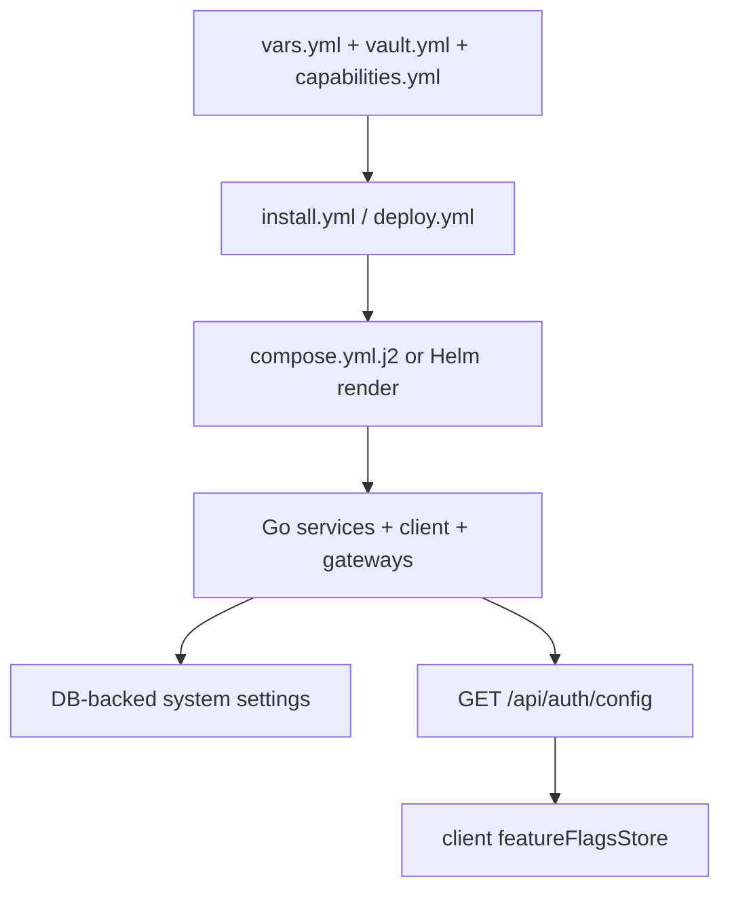

## 🎯 Configuration Model

Arsenale uses four practical configuration layers:

1. Installer-time inputs from Ansible vars, vault secrets, and capability selection.
2. Runtime environment variables and secret files mounted into containers.
3. Database-backed system settings for values that remain editable from the UI.
4. Public runtime config exposed to the SPA through `GET /api/auth/config`.

The practical rule is:

- installer-selected capabilities decide which feature env vars are emitted,
- secret files override inline env values where supported,
- database-backed system settings refine behavior inside the enabled runtime surface,
- the client trusts the server-provided public config once it loads.

## 📁 Authoritative Files

| File | Role |
|------|------|
| `.env.example` | Root environment template and compatibility superset |
| `deployment/ansible/inventory/group_vars/all/vars.yml` | Non-secret deployment defaults |
| `deployment/ansible/inventory/group_vars/all/vault.yml` | Secret deployment values |
| `deployment/ansible/install/capabilities.yml` | Installer-owned capability catalog and legacy env mapping |
| `deployment/ansible/roles/deploy/templates/compose.yml.j2` | Concrete container env, ports, volumes, and secrets |
| `backend/internal/runtimefeatures/manifest.go` | Feature flag, backend, mode, and routing manifest |
| `backend/internal/publicconfig/service.go` | Public config response for auth and feature discovery |
| `backend/cmd/control-plane-api/runtime.go` | Control-plane dependency and env wiring |
| `client/vite.config.ts` | Local frontend proxy, HTTPS, and PWA config |
| `client/nginx.dev.conf` | Containerized HTTPS reverse-proxy behavior in dev |

## 🧭 Installer Profile And Capability Flags

The installer now passes install profile context directly into the runtime.

| Variable | Purpose |
|----------|---------|
| `ARSENALE_INSTALL_MODE` | `development` or `production` |
| `ARSENALE_INSTALL_BACKEND` | `podman` or `kubernetes` |
| `ARSENALE_INSTALL_CAPABILITIES` | Comma-separated enabled capability set |
| `FEATURE_CONNECTIONS_ENABLED` | Enables SSH, RDP, VNC connections and folders |
| `FEATURE_DATABASE_PROXY_ENABLED` | Enables database sessions and DB audit |
| `FEATURE_KEYCHAIN_ENABLED` | Enables vault, secrets, files, and external vault providers |
| `FEATURE_RECORDINGS_ENABLED` | Enables recording APIs and UI |
| `FEATURE_ZERO_TRUST_ENABLED` | Enables gateways, tunnel broker, and managed zero-trust routing |
| `FEATURE_AGENTIC_AI_ENABLED` | Enables AI-assisted database tooling |
| `FEATURE_ENTERPRISE_AUTH_ENABLED` | Enables SAML, OAuth, OIDC, LDAP, and auth-provider admin APIs |
| `FEATURE_SHARING_APPROVALS_ENABLED` | Enables public sharing, approvals, and checkouts |
| `CLI_ENABLED` | Enables CLI device auth and CLI-specific APIs |
| `GATEWAY_ROUTING_MODE` | Direct vs gateway-mandatory routing behavior |

`backend/internal/runtimefeatures/manifest.go` converts those env vars into a single manifest containing:

- `mode`
- `backend`
- `databaseProxyEnabled`
- `connectionsEnabled`
- `keychainEnabled`
- `recordingsEnabled`
- `zeroTrustEnabled`
- `agenticAIEnabled`
- `enterpriseAuthEnabled`
- `sharingApprovalsEnabled`
- `cliEnabled`
- `routing.directGateway`
- `routing.zeroTrust`

That same manifest is returned from `GET /api/auth/config`, together with `selfSignupEnabled`.

## 🔐 Secret Delivery

Production and local containers prefer secret files over inline env values. Common examples:

| Secret | Runtime variable |
|--------|------------------|
| Database URL | `DATABASE_URL_FILE` |
| JWT signing key | `JWT_SECRET_FILE` |
| Guacamole secret | `GUACAMOLE_SECRET_FILE` |
| Server encryption key | `SERVER_ENCRYPTION_KEY_FILE` |
| Guacenc auth token | `GUACENC_AUTH_TOKEN_FILE` |

`backend/internal/storage/postgres.go` reads `DATABASE_URL` first, then `DATABASE_URL_FILE`, and automatically appends `sslrootcert=` when `DATABASE_SSL_ROOT_CERT` is set.

## 🌐 Core Runtime Variables

| Variable | Typical value | Why it matters |
|----------|---------------|----------------|
| `HOST` | `0.0.0.0` | Listen host for Go services via `app.Run` |
| `PORT` | Service-specific | Listen port for each Go service |
| `ARSENALE_VERSION` | `latest`, release tag, or local value | Reported by service meta endpoints |
| `CLIENT_URL` | `https://localhost:3000` or installer public URL | Used for CORS, redirects, cookies, and links |
| `DATABASE_URL` / `DATABASE_URL_FILE` | PostgreSQL DSN | Control-plane and service persistence |
| `DATABASE_SSL_ROOT_CERT` | `/certs/postgres/ca.pem` | PostgreSQL TLS verification |
| `REDIS_URL` | `redis://redis:6379/0` | Coordination, locks, rate limits, streams |
| `RECORDING_PATH` | `/recordings` | Session artifact location |
| `DESKTOP_BROKER_HEALTH_URL` | `http://desktop-broker:8091/healthz` | Included in `/api/ready` when connection features are enabled |

## 🛡 Authentication, Security, And Public Config

| Variable | Purpose |
|----------|---------|
| `JWT_SECRET` / `JWT_SECRET_FILE` | Access token signing key |
| `JWT_EXPIRES_IN` | Access token TTL |
| `JWT_REFRESH_EXPIRES_IN` | Refresh token TTL |
| `SERVER_ENCRYPTION_KEY` / `SERVER_ENCRYPTION_KEY_FILE` | Encrypt tenant SSH keys and other server-held sensitive material |
| `VAULT_TTL_MINUTES` | Personal vault lock timeout |
| `TOKEN_BINDING_ENABLED` | Bind tokens to client IP and User-Agent |
| `HOST_VALIDATION_ENABLED` | Reject invalid Host headers |
| `COOKIE_SECURE` | Force secure cookies in HTTPS deployments |
| `SELF_SIGNUP_ENABLED` | Public registration toggle |
| `EMAIL_VERIFY_REQUIRED` | Require email verification before login |
| `WEBAUTHN_RP_ID` | WebAuthn relying-party ID |
| `WEBAUTHN_RP_ORIGIN` | WebAuthn relying-party origin |
| `SPIFFE_TRUST_DOMAIN` | mTLS identity namespace for gateways and tunnel flows |

`GET /api/auth/config` is the current public truth for auth bootstrap. The client reads:

- `selfSignupEnabled`
- the full runtime feature manifest

The SPA starts fail-open with enabled defaults in `client/src/store/featureFlagsStore.ts`, then replaces them with the server response once it loads.

## 🌉 Broker, Gateway, And Orchestrator Variables

| Variable | Purpose |
|----------|---------|
| `GUACD_HOST` / `GUACD_PORT` | Desktop broker target for Guacamole protocol |
| `GUACD_SSL` / `GUACD_CA_CERT` | TLS to `guacd` |
| `GUACAMOLE_SECRET_FILE` | Encrypt and decrypt desktop grants |
| `GUACENC_SERVICE_URL` | Recording conversion sidecar URL |
| `GUACENC_USE_TLS` / `GUACENC_TLS_CA` | TLS to `guacenc` |
| `TERMINAL_BROKER_URL` | Control-plane to terminal broker URL |
| `GO_TUNNEL_BROKER_URL` | Control-plane to tunnel broker URL |
| `GATEWAY_GRPC_TLS_CA` | Trust root for SSH gateway gRPC |
| `GATEWAY_GRPC_TLS_CERT` / `GATEWAY_GRPC_TLS_KEY` | Control-plane mTLS client cert for gateway calls |
| `ORCHESTRATOR_TYPE` | `podman` or `kubernetes` |
| `ORCHESTRATOR_*_IMAGE` | Images used for managed gateway deployment |
| `ORCHESTRATOR_*_NETWORK` | Network placement for managed workloads |
| `ORCHESTRATOR_DNS_SERVERS` | Comma-separated upstream DNS servers for managed containers |
| `ORCHESTRATOR_RESOLV_CONF_PATH` | Resolver file mounted into managed workloads |
| `ORCHESTRATOR_GUACD_TLS_CERT` / `ORCHESTRATOR_GUACD_TLS_KEY` | TLS assets for managed `guacd` |

## 🧪 Development Bootstrap Variables

The development installer flow injects a large set of convenience values that should not be treated as production defaults.

| Variable group | Purpose |
|----------------|---------|
| `DEV_BOOTSTRAP_ADMIN_*` | Seeded admin account and tenant |
| `DEV_BOOTSTRAP_ORCHESTRATOR_*` | Seeded orchestrator connection |
| `DEV_SAMPLE_POSTGRES_*` | Demo PostgreSQL connection bootstrap |
| `DEV_SAMPLE_MYSQL_*` | Demo MySQL / MariaDB connection bootstrap |
| `DEV_SAMPLE_MONGODB_*` | Demo MongoDB connection bootstrap |
| `DEV_SAMPLE_ORACLE_*` | Demo Oracle connection bootstrap |
| `DEV_SAMPLE_MSSQL_*` | Demo SQL Server connection bootstrap |
| `DEV_TUNNEL_*` | Tunneling fixture IDs, tokens, and cert directories |
| `DEV_TUNNEL_CERT_DIR` | Location of development tunnel certs inside the control-plane container |

These values feed both the initial connection catalog and the seeded demo datasets.

## 🖥 Frontend, Nginx, And Local Dev Overrides

`client/vite.config.ts` is the authoritative source for local frontend development defaults.

| Variable | Default | Effect |
|----------|---------|--------|
| `VITE_API_TARGET` | `http://localhost:18080` | Proxy target for `/api` |
| `VITE_GUAC_TARGET` | `http://localhost:18091` | Proxy target for `/guacamole` |
| `VITE_TERMINAL_TARGET` | `http://localhost:18090` | Proxy target for `/ws/terminal` |
| `VITE_DEV_PORT` | `3005` | Local Vite port |
| `VITE_TLS_CERT` / `VITE_TLS_KEY` | Generated cert fallback | Local HTTPS cert override |

The containerized client relies on `client/nginx.dev.conf` plus injected env such as:

- `API_UPSTREAM_HOST`
- `DESKTOP_UPSTREAM_HOST`
- `TERMINAL_UPSTREAM_HOST`
- `NGINX_RESOLVER`

That nginx config accepts both `localhost` and `arsenale.home.arpa.viti`. For WebAuthn, OAuth, and cookie-sensitive flows, the hostname you use in the browser should match the configured public URL and RP values.

## 📌 Precedence And Gotchas

- The repo uses a single root `.env`; do not create service-local `.env` files.
- `.env.example` is broader than the active runtime and still carries compatibility examples. The real deploy-time truth is the installer-selected compose or Helm render plus mounted secrets.
- Public health endpoints are `GET /api/health` and `GET /api/ready`; service-local health endpoints are `GET /healthz` and `GET /readyz`.
- The client route surface is not static. Missing screens or APIs often mean the current install profile disabled the corresponding feature family.
- For database access, the application PostgreSQL DSN is unrelated to the demo `DATABASE` connections created for UI testing.
- Vite and the containerized client do not share the same proxy path implementation; `client/vite.config.ts` governs local HMR, while `client/nginx.dev.conf` governs the containerized HTTPS entrypoint.
