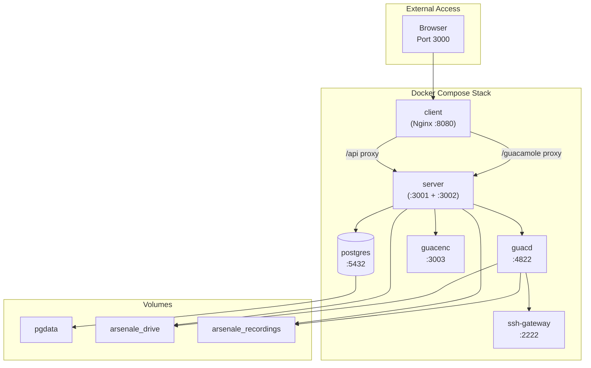
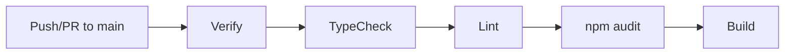
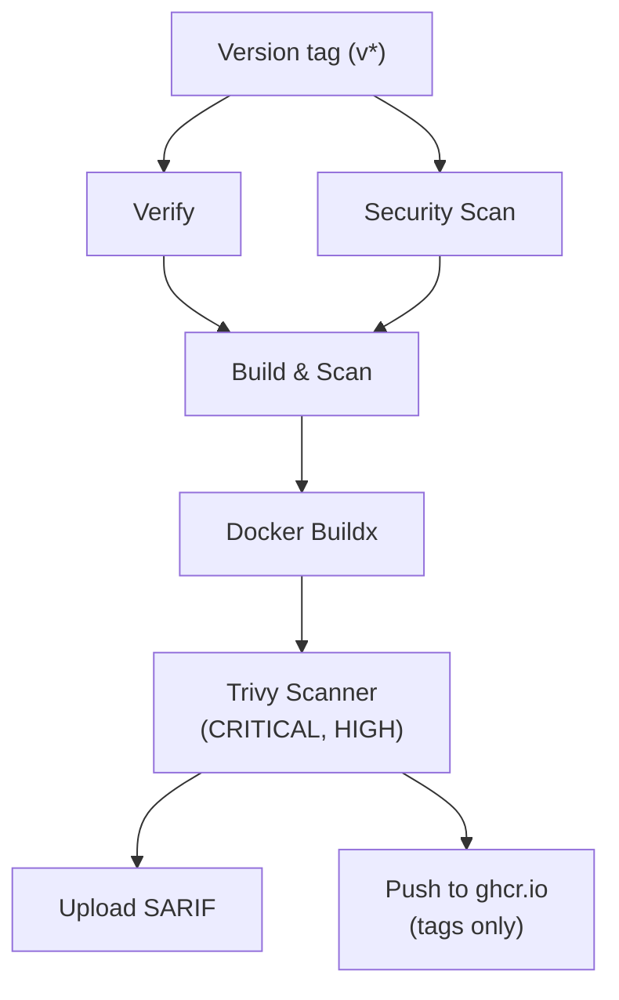

# Deployment

## Production Docker Compose

The production stack is defined in `compose.yml`:



### Services

| Service | Image | Ports | Purpose |
|---------|-------|-------|---------|
| **postgres** | `postgres:16` | Internal | Database with health check |
| **guacd** | `${ORCHESTRATOR_GUACD_IMAGE}` | 4822 | RDP/VNC protocol handler |
| **guacenc** | `./gateways/guacenc` | Internal | Recording → video conversion |
| **server** | `./server/Dockerfile` | 3001, 3002 | Express API + Guacamole WS |
| **client** | `./client/Dockerfile` | 8080 → 3000 | Nginx reverse proxy + SPA |
| **ssh-gateway** | `./gateways/ssh-gateway` | 2222 | SSH bastion (optional) |

### Volumes

| Volume | Mount | Purpose |
|--------|-------|---------|
| `pgdata` | PostgreSQL data | Database persistence |
| `arsenale_drive` | `/guacd-drive` | RDP file drive redirection |
| `arsenale_recordings` | `/recordings` | Session recordings |

### Security Hardening

All containers run with:
- `cap_drop: ALL` + `cap_add: NET_BIND_SERVICE`
- `security_opt: no-new-privileges:true`
- `security_opt: label:disable` (Podman/SELinux compatibility)
- Non-root users where possible

### Starting Production

```bash
# Create production env file
cp .env.example .env.production
# Edit .env.production with production values

# Start full stack
npm run docker:prod
```

## Container Images

### Server (`server/Dockerfile`)

Multi-stage build on `node:22-alpine`:

1. Install dependencies from `package-lock.json`
2. Generate Prisma client from schema
3. Compile TypeScript to `dist/`
4. Prune to production dependencies
5. Install `arsenale` CLI shim at `/usr/local/bin/arsenale`
6. Create non-root `appuser`
7. Create `/guacd-drive` and `/recordings` directories

**Exposed ports:** 3001 (API), 3002 (Guacamole WS)
**Health check:** `GET /api/health` (10s interval, 5 retries, 30s start period)
**Entry:** `node dist/index.js`

### Client (`client/Dockerfile`)

Multi-stage build: Node 22-alpine (build) → Nginx 1.28-alpine (runtime):

1. Install dependencies and build with Vite
2. Copy built assets to Nginx html directory
3. Apply custom Nginx configuration

**Exposed port:** 8080
**Health check:** `GET /health` (10s interval)
**Entry:** `nginx -g 'daemon off;'`

### Guacd Gateway (`gateways/guacd/Dockerfile`)

Multi-stage: tunnel-agent builder → guacamole/guacd:1.6.0 runtime:

1. Build tunnel-agent from TypeScript
2. Install Node.js in guacd base image
3. Copy pre-built tunnel agent
4. Custom entrypoint starts both guacd and tunnel agent

**Exposed port:** 4822
**User:** daemon (non-root)

### SSH Gateway (`gateways/ssh-gateway/Dockerfile`)

Multi-stage: tunnel-agent builder → Alpine 3.21 runtime:

1. Build tunnel-agent
2. Install OpenSSH server
3. Configure SSH with host keys
4. Copy tunnel agent + key API script

**Exposed ports:** 2222 (SSH), 8022 (key API)
**User:** tunnel (non-root)

### Database Proxy Gateway (`gateways/db-proxy/`)

Go-based protocol proxy supporting Oracle (TNS), MSSQL (TDS), and IBM DB2 protocols. Runs as a managed gateway container with API port for management and multiple protocol ports for database connections.

### RD Gateway (`gateways/rdgw/`)

Go-based implementation of the MS-TSGU (Terminal Services Gateway) protocol. Enables native Windows RDP clients (mstsc.exe) to connect through Arsenale with vault credential injection and audit logging.

### Arsenale Connect CLI (`tools/arsenale-cli/`)

Go CLI tool for native client orchestration. Authenticates via RFC 8628 device authorization, retrieves credentials from the vault, generates SSH proxy tokens or .rdp files, and launches native SSH/RDP clients.

### Guacenc (`gateways/guacenc/Dockerfile`)

Multi-stage: guacamole-server builder → agg builder → Alpine runtime:

1. Compile guacamole-server 1.6.0 with guacenc support
2. Build agg (asciicast-to-GIF converter, multi-arch)
3. Runtime with Python 3, ffmpeg, guacenc binary, agg binary

**Exposed port:** 3003
**User:** guacenc (non-root)
**Entry:** `python3 /opt/guacenc/server.py`

### Tunnel Agent (`gateways/tunnel-agent/Dockerfile`)

Multi-stage: Node 22-alpine builder → Node 22-alpine runtime:

**Required env:** `TUNNEL_SERVER_URL`, `TUNNEL_TOKEN`, `TUNNEL_GATEWAY_ID`
**User:** agent (non-root)
**Entry:** `node dist/index.js`

## Nginx Configuration

### Reverse Proxy Routes

| Location | Target | Features |
|----------|--------|----------|
| `/api` | `http://server:3001` | WebSocket upgrade headers |
| `/socket.io` | `http://server:3001` | WebSocket upgrade |
| `/guacamole` | `http://server:3002/` | 86400s timeouts (long sessions) |
| `/health` | 200 JSON | No logging |
| `/assets/` | Static files | Cache 1 year (immutable, Vite hashes) |
| `/index.html` | Static file | no-cache, no-store |
| `/*` | Static files | SPA fallback to index.html |

### Security Headers

- `X-Frame-Options: DENY`
- `X-Content-Type-Options: nosniff`
- `Strict-Transport-Security: max-age=31536000`
- `Referrer-Policy: strict-origin-when-cross-origin`
- `Permissions-Policy: camera=(), microphone=(), geolocation=()`
- `Content-Security-Policy`: Restrictive (self, unsafe-inline for styles, ws/wss for connect)

## CI/CD Pipelines

### Verification Workflow



**verify.yml:** Reusable workflow accepting a `workspace` input (`server` or `client`). Steps: checkout → Node 22 → npm ci → db:generate (server only) → typecheck → lint → audit → build. Called by `docker-build.yml` for both workspaces. Cancels in-progress jobs on new pushes.

### Docker Build Workflows



**docker-build.yml:** Consolidated workflow for server and client images using a matrix strategy. Triggers on pushes to `main` and version tags, or PRs to `main`/`staging` touching `server/` or `client/` paths:
1. Call `verify.yml` for both server and client workspaces
2. Call `security.yml` (CodeQL for server, Trivy filesystem for both)
3. Build Docker images with Buildx (matrix: server, client)
4. Scan with Trivy (CRITICAL + HIGH severity)
5. Upload SARIF results to GitHub Security
6. Push to `ghcr.io/dnviti/arsenale/server` and `ghcr.io/dnviti/arsenale/client` (version tags only)

**gateways-build.yml:** Consolidated gateway workflow using a matrix strategy (guacd, guacenc, ssh-gateway, tunnel-agent). Triggers on `gateways/` path changes. Same build-scan-push pipeline with multi-arch support (linux/amd64, linux/arm64).

### Release Workflow

**release.yml:** Triggers on version tag pushes (`v*`). Creates a draft GitHub Release with auto-generated release notes. Tags containing `-beta` are marked as pre-releases.

### Registry

All images are pushed to **GitHub Container Registry** (`ghcr.io/dnviti/arsenale/`):

| Image | Path |
|-------|------|
| Server | `ghcr.io/dnviti/arsenale/server` |
| Client | `ghcr.io/dnviti/arsenale/client` |
| Guacd | `ghcr.io/dnviti/arsenale/guacd` |
| SSH Gateway | `ghcr.io/dnviti/arsenale/ssh-gateway` |
| Guacenc | `ghcr.io/dnviti/arsenale/guacenc` |
| Tunnel Agent | `ghcr.io/dnviti/arsenale/tunnel-agent` |

## Development Docker Compose

`compose.dev.yml` provides lightweight containers for local development:

| Service | Port | Purpose |
|---------|------|---------|
| postgres | 127.0.0.1:5432 | Local database |
| guacenc | 3003 | Recording processor (optional) |

Server and client run natively via `npm run dev`.

## Health Checks

| Service | Probe | Interval | Start Period |
|---------|-------|----------|--------------|
| PostgreSQL | `pg_isready -U $POSTGRES_USER` | 5s | — |
| guacd | `nc -z localhost 4822` | 10s | — |
| Server | `wget /api/health` | 10s | 30s |
| Client | Nginx `/health` | 10s | 5s |
| SSH Gateway | `nc -z localhost $SSH_PORT` | 10s | — |
| DB Proxy | `/proc/1/status` | 30s | 10s |

## Production Checklist

1. Set all required secrets (`JWT_SECRET`, `GUACAMOLE_SECRET`, `SERVER_ENCRYPTION_KEY`)
2. Use strong PostgreSQL credentials
3. Configure `CLIENT_URL` to match your domain
4. Set `TRUST_PROXY` if behind a reverse proxy
5. Configure email provider for verification and notifications
6. Set `WEBAUTHN_RP_ID` and `WEBAUTHN_RP_ORIGIN` to match your domain
7. Optionally configure GeoIP database for impossible travel detection
8. Review rate limiting defaults
9. Set `RECORDING_ENABLED=true` if session recording is needed
10. Configure container orchestration for managed gateways
