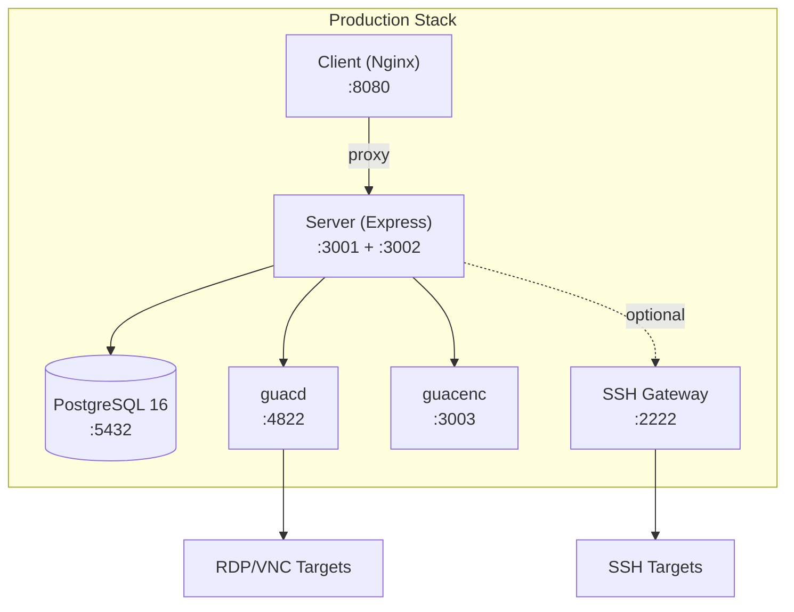
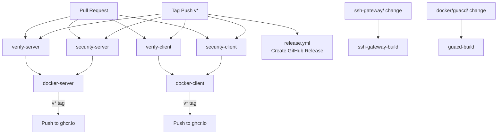

# Deployment

## Container Architecture



## Docker Images

### Server (`server/Dockerfile`)

Multi-stage Alpine-based build (Node 22-Alpine):
1. **Build stage**: Install dependencies, generate Prisma client, compile TypeScript
2. **Production stage**: Copy compiled code + pruned node_modules, run as non-root `appuser`

- **Ports**: 3001 (API), 3002 (Guacamole WebSocket)
- **Healthcheck**: `wget -qO- http://localhost:3001/api/health`
- **Security**: Non-root user, minimal Alpine image

### Client (`client/Dockerfile`)

Multi-stage build (Node build + Nginx runtime):
1. **Build stage**: Compile React/Vite application
2. **Runtime stage**: Nginx 1.28-Alpine serving static files with reverse proxy

- **Port**: 8080
- **Healthcheck**: `wget -qO- http://127.0.0.1:8080/health`
- **Security**: Non-root Nginx user

### SSH Gateway (`ssh-gateway/Dockerfile`)

Alpine-based with OpenSSH and embedded tunnel agent:
- **Ports**: 2222 (SSH), 8022 (API)
- **Features**: Multi-stage build, tunnel agent dormant unless configured
- **Healthcheck**: `nc -z localhost 2222`

### guacd (`docker/guacd/Dockerfile`)

Custom Guacamole daemon based on `guacamole/guacd:1.6.0`:
- Adds Node.js + embedded tunnel agent (dormant by default)
- **Port**: 4822
- **Healthcheck**: `nc -z localhost 4822`

### Tunnel Agent (`tunnel-agent/Dockerfile`)

Lightweight zero-trust agent (Node 22-Alpine):
- Activated by environment variables: `TUNNEL_SERVER_URL`, `TUNNEL_TOKEN`, `TUNNEL_GATEWAY_ID`
- Dormant mode when env vars absent

## Docker Compose

### Development Stack (`compose.dev.yml`)

```bash
npm run docker:dev       # Start
npm run docker:dev:down  # Stop
```

Services:
- **PostgreSQL 16**: Port 5432, credentials `arsenale/arsenale`, volume `pgdata_dev`
- **guacenc**: Port 3003, recording conversion service

Server and client run locally via `npm run dev` (not containerized in dev).

### Production Stack (`compose.yml`)

```bash
npm run docker:prod      # Start (requires .env.production)
```

| Service | Image | Port | Notes |
|---------|-------|------|-------|
| PostgreSQL | `postgres:16` | 5432 | Persistent volume `pgdata` |
| guacd | `guacamole/guacd:1.6.0` | 4822 | Override via `ORCHESTRATOR_GUACD_IMAGE` |
| guacenc | Custom build | 3003 | Recording conversion |
| Server | `server/Dockerfile` | 3001, 3002 | Auto-migrates DB on start |
| Client | `client/Dockerfile` | 8080 | Nginx reverse proxy |
| SSH Gateway | `ssh-gateway/Dockerfile` | 2222 | Optional |

**Security hardening** in production:
- `security_opt: [label:disable, no-new-privileges:true]`
- `cap_drop: [ALL]`, `cap_add: [NET_BIND_SERVICE]` (server only)
- Docker socket mounted read-only for orchestration
- Named volumes for persistent data (drive, recordings, database)
- Internal network `arsenale_net`

### Production Setup Steps

1. Copy environment files:
   ```bash
   cp .env.production.example .env.production
   ```

2. Set production secrets:
   ```bash
   # Required secrets (generate strong random values)
   JWT_SECRET=...
   GUACAMOLE_SECRET=...
   SERVER_ENCRYPTION_KEY=...    # 32-byte hex
   POSTGRES_PASSWORD=...
   ```

3. Configure external access:
   ```bash
   CLIENT_URL=https://arsenale.example.com
   TRUST_PROXY=true              # If behind reverse proxy
   ```

4. Start the stack:
   ```bash
   npm run docker:prod
   ```

5. Database migrations run automatically on server start.

## CI/CD Pipeline

### GitHub Actions Workflow Overview



### Verification Workflows

**`verify-server.yml`** — Triggered on server/ changes (main/PR):
1. Checkout → Setup Node 22 → `npm ci`
2. `db:generate` → typecheck → lint → audit → build
3. Concurrency: cancels duplicate runs

**`verify-client.yml`** — Triggered on client/ changes (main/PR):
1. Checkout → Setup Node 22 → `npm ci`
2. typecheck → lint → audit → build

### Security Workflows

**`security-server.yml`** / **`security-client.yml`**:
1. **CodeQL Analysis**: JavaScript/TypeScript with security-extended queries
2. **Trivy Filesystem Scan**: Vulnerabilities, misconfigurations, secrets
3. Results uploaded as SARIF to GitHub Security tab

### Docker Build & Push

**`docker-server.yml`** / **`docker-client.yml`**:
- **Depends on**: verify + security workflows passing
- **Registry**: `ghcr.io/dnviti/arsenale/server` / `ghcr.io/dnviti/arsenale/client`
- **Tags**: branch name, PR number, semver, `latest`
- **Trivy image scan**: Critical/High severity check
- **Push**: Only on version tags (v*)

### Infrastructure Builds

| Workflow | Trigger | Image | Platforms |
|----------|---------|-------|-----------|
| `ssh-gateway-build.yml` | ssh-gateway/ or tunnel-agent/ changes | `ghcr.io/dnviti/arsenale/ssh-gateway` | amd64, arm64 |
| `guacd-build.yml` | docker/guacd/ or tunnel-agent/ changes | `ghcr.io/dnviti/arsenale/guacd` | amd64, arm64 |
| `guacenc-build.yml` | docker/guacenc/ changes | `ghcr.io/dnviti/arsenale/guacenc` | amd64 |

### Release Workflow

**`release.yml`** — Triggered on tag push (v*):
- Creates GitHub Release with auto-generated release notes
- Draft by default (manual publish)
- Prerelease flag for `-beta` tags

## Security Scanning

| Tool | Scope | Trigger |
|------|-------|---------|
| **CodeQL** | Source code analysis (JS/TS, security-extended) | PR, main push |
| **Trivy** | Filesystem + Docker image scan (vuln, misconfig, secret) | PR, main push |
| **npm audit** | Dependency vulnerabilities (critical level) | Every verify run |
| **ESLint security plugin** | OWASP vulnerability detection | Every lint run |

### Local Security Scan

```bash
npm run security          # Full scan (npm audit + ESLint + Trivy FS)
npm run security --quick  # Quick scan (npm audit + ESLint only)
npm run security --docker # Full scan + Docker image builds/scans
```

## Container Registry

All images published to GitHub Container Registry (ghcr.io):

| Image | Purpose |
|-------|---------|
| `ghcr.io/dnviti/arsenale/server` | Express API server |
| `ghcr.io/dnviti/arsenale/client` | Nginx + React SPA |
| `ghcr.io/dnviti/arsenale/ssh-gateway` | SSH bastion gateway |
| `ghcr.io/dnviti/arsenale/guacd` | Custom guacd with tunnel agent |
| `ghcr.io/dnviti/arsenale/guacenc` | Recording conversion sidecar |

## Ports Reference

| Port | Service | Dev | Prod |
|------|---------|-----|------|
| 3000 | Client (Vite) | Yes | No |
| 8080 | Client (Nginx) | No | Yes |
| 3001 | Server API | Yes | Yes |
| 3002 | Guacamole WebSocket | Yes | Yes |
| 3003 | guacenc (recordings) | Yes | Yes |
| 4822 | guacd daemon | Yes | Yes |
| 2222 | SSH Gateway | Optional | Optional |
| 5432 | PostgreSQL | Yes | Yes |
