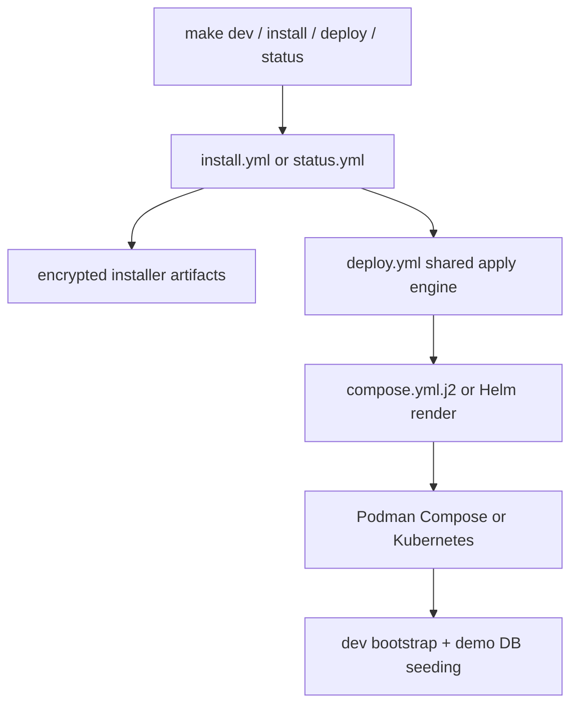

## Deployment Model

> **Detailed Ansible documentation**: For a comprehensive guide covering all installation modes, backends, Ansible roles, capabilities, configuration variables, and step-by-step walkthroughs, see [`deployment/ansible/README.md`](../deployment/ansible/README.md). For the installer artifact model and rerun/recovery behavior, see [`docs/installer.md`](installer.md).

Arsenale now has one installer-driven deployment story for both development and production:

- `Makefile` is the human entry point,
- `deployment/ansible/playbooks/install.yml` is the interactive installer entrypoint,
- `deployment/ansible/playbooks/dev_refresh.yml` is the targeted dev-service refresh entrypoint,
- `deployment/ansible/playbooks/status.yml` reads encrypted installer status,
- `deployment/ansible/playbooks/deploy.yml` is the shared apply engine under the installer,
- `deployment/ansible/roles/deploy/templates/compose.yml.j2` is the authoritative Podman Compose template.



The checked-in `docker-compose.yml` mirrors the current generated development stack, but the installer flow and Ansible templates remain the source of truth.

For local code iteration, the root `Makefile` now supports scoped refreshes such as `make dev client`, `make dev gateways`, and `make dev control-plane`. Those commands reuse the saved dev render state and rebuild/restart only the requested services; full `make dev` is still the correct path for installer/profile/cert/secret/compose changes.

RDP shared-drive staging and SSH browser-mediated file transfers now require S3-compatible object storage. The development installer provisions a local `shared-files-s3` MinIO service and injects the `SHARED_FILES_S3_*` runtime env vars automatically. Production and Kubernetes installs must point those env vars at external object storage before the control plane starts.

## 🔐 Installer Artifacts

The installer owns an encrypted artifact set in addition to the Ansible vault. The canonical production location is:

```text
/opt/arsenale/install/
```

Artifacts:

- `install-profile.enc`
- `install-state.enc`
- `install-status.enc`
- `install-log.enc`
- `rendered-artifacts.enc`

Operational consequences:

- `make status` reads `install-status.enc`, not the live app database.
- reruns and recovery do not depend on a healthy Arsenale instance,
- the technician password is requested again on every rerun and is never stored on disk.

## 🐳 And ☸ Supported Backends

Supported installer backends:

- Podman Compose
- Kubernetes via Helm

Docker is not a supported installer backend. Development installs also require Podman locally because `playbooks/install.yml` asserts that `podman` is available before it will apply the stack.

The capability catalog in `deployment/ansible/install/capabilities.yml` lets production profiles toggle:

- keychain
- connections
- IP geolocation
- databases
- recordings
- zero trust
- agentic AI
- enterprise auth
- sharing and approvals
- CLI

Installer-driven development uses the same capability and routing model as production, but always builds images locally and runs on Podman.

## 🐳 Image Build Matrix

| Image | Built from | Notes |
|-------|------------|-------|
| `control-plane-api` | `backend/Dockerfile` with `SERVICE=control-plane-api` | Generic Go service image pattern |
| `map-assets` | `backend/Dockerfile` with `SERVICE=map-assets` | Dedicated raster XYZ tile service for GeoIP-enabled deployments |
| `client` | `client/Dockerfile` | Multi-stage Node build then nginx runtime |
| `db-proxy` | `gateways/db-proxy/Dockerfile` | Go `db-proxy` binary plus bundled `tunnel-agent` |
| `ssh-gateway` | `gateways/ssh-gateway/Dockerfile` | Alpine runtime, SSHD, gRPC key server, tunnel agent |
| `guacd` | `gateways/guacd/Dockerfile` | Alpine runtime, Guacamole server packages, tunnel agent |
| `guacenc` | `gateways/guacenc/Dockerfile` | Custom build with `guacenc`, `agg`, and Go wrapper |
| `tunnel-agent` | `gateways/tunnel-agent/Dockerfile` | Standalone tunnel agent workspace |
| `recording-worker` | `backend/Dockerfile` with `SERVICE=recording-worker` | Recording conversion and retention worker |

Important implementation details:

- `backend/Dockerfile` is service-agnostic: it builds `/usr/local/bin/service` from `backend/cmd/${SERVICE}` and always also builds `/usr/local/bin/migrate`.
- `client/Dockerfile` serves the built SPA through nginx and exposes `/health`.
- `gateways/db-proxy/Dockerfile` bundles the Go database middleware plus the JS tunnel agent workspace.

## 🖧 Runtime Topology In Development

Key host-to-container mappings from `docker-compose.yml`:

| Host port | Service | Container port |
|-----------|---------|----------------|
| `3000` | `client` | `8080` |
| `18080` | `control-plane-api` | `8080` |
| `18081` | `control-plane-controller` | `8081` |
| `18082` | `authz-pdp` | `8082` |
| `18083` | `model-gateway` | `8083` |
| `18084` | `tool-gateway` | `8084` |
| `18085` | `agent-orchestrator` | `8085` |
| `18086` | `memory-service` | `8086` |
| `18090` | `terminal-broker` | `8090` |
| `18091` | `desktop-broker` | `8091` |
| `18092` | `tunnel-broker` | `8092` |
| `18093` | `query-runner` | `8093` |
| `18094` | `recording-worker` | `8094` |
| `18095` | `runtime-agent` | `8095` |
| `18096` | `map-assets` | `8096` |

Primary internal networks:

| Network | Use |
|---------|-----|
| `net-edge` | Public-facing services and internal service calls |
| `net-db` | PostgreSQL and database-adjacent services |
| `net-cache` | Redis-backed coordination |
| `net-guacd` | Desktop broker and `guacd` |
| `net-guacenc` | Recording conversion |
| `net-gateway` | SSH gateway and managed gateway workloads |
| `net-egress` | Outbound egress network for endpoint-facing services: SSH, RDP/VNC, direct database execution, AI provider calls from `control-plane-api`, and tunneled gateway fixtures |

## ⚙️ Runtime Env Emitted By The Installer

The compose template now emits more deployment intent into the running services:

- `ARSENALE_INSTALL_MODE`
- `ARSENALE_INSTALL_BACKEND`
- `ARSENALE_INSTALL_CAPABILITIES`
- `FEATURE_*`
- `CLI_ENABLED`
- `GATEWAY_ROUTING_MODE`
- `MAP_ASSETS_UPSTREAM_HOST`
- `ORCHESTRATOR_*`
- `DEV_BOOTSTRAP_*`
- `DEV_SAMPLE_*`

That matters because the control plane uses those env vars to register routes, expose public config, and pick routing behavior for gateways and database sessions.

File-transfer specific runtime env emitted by the installer:

- `FILE_THREAT_SCANNER_MODE`
- `SHARED_FILES_S3_BUCKET`
- `SHARED_FILES_S3_REGION`
- `SHARED_FILES_S3_ENDPOINT`
- `SHARED_FILES_S3_ACCESS_KEY_ID`
- `SHARED_FILES_S3_PREFIX`
- `SHARED_FILES_S3_FORCE_PATH_STYLE`
- `SHARED_FILES_S3_AUTO_CREATE_BUCKET`

## 🔐 TLS, Secrets, And Container Hardening

Arsenale deploys with TLS everywhere practical.

### Certificates

- Dev and production certificate generation are handled by the `certificates` role.
- Local development writes the generated CA and service certificates under `${XDG_STATE_HOME:-$HOME/.local/state}/arsenale-dev/dev-certs/` by default.
- Generated certs cover client HTTPS, PostgreSQL TLS, `guacd`, `guacenc`, SSH gateway gRPC, and tunnel identities.

### Secrets

Runtime secrets are delivered through secret mounts, not plain environment strings, for:

- database URL
- JWT secret
- guacamole secret
- server encryption key
- guacenc auth token
- provider credentials

### Hardening

Most services in the compose template use a consistent hardening profile:

- `read_only: true`
- `cap_drop: [ALL]`
- `security_opt: [no-new-privileges:true]`
- `tmpfs` for writable scratch paths
- health checks for service readiness

Some containers intentionally run as `0:0` during startup when they must prepare runtime directories before execing the service binary. That behavior is explicit in the template and should not be removed casually.

## 🧪 Development Fixtures And Demo Data

The development installer flow does more than boot the app. It also:

- runs `service dev-bootstrap` inside `arsenale-control-plane-api`,
- creates development gateway fixtures,
- provisions tunneled gateway fixtures,
- seeds five sample database containers with a deterministic ERP-style dataset (customers, products, inventory, sales, purchasing, invoices, and payments),
- pushes managed tenant SSH keys to all managed gateways after bootstrap.

Demo data containers:

| Container | Protocol |
|-----------|----------|
| `arsenale-dev-demo-postgres` | PostgreSQL |
| `arsenale-dev-demo-mysql` | MySQL / MariaDB |
| `arsenale-dev-demo-mongodb` | MongoDB |
| `arsenale-dev-demo-oracle` | Oracle |
| `arsenale-dev-demo-mssql` | SQL Server |

Tunneled gateway fixtures:

| Container | Purpose |
|-----------|---------|
| `arsenale-dev-tunnel-ssh-gateway` | Managed SSH via tunnel broker |
| `arsenale-dev-tunnel-guacd` | Desktop proxy via tunnel broker |
| `arsenale-dev-tunnel-db-proxy` | Database proxy via tunnel broker |

Each demo database now exposes the same richer baseline shape with `demo_customers`, `demo_products`, `demo_orders`, `demo_order_items`, `demo_purchase_orders`, `demo_invoices`, and related supporting tables/collections. The seeded counts are intentionally substantial enough for join-heavy SQL, AI query generation, and execution-plan testing.

This makes the dev stack suitable for full-stack session, gateway, and DB proxy testing without touching the application's own PostgreSQL data.

## 🚢 CI/CD Workflows

| Workflow | Purpose |
|----------|---------|
| `.github/workflows/verify.yml` | Typecheck, lint, audit, tests, and builds |
| `.github/workflows/security.yml` | CodeQL and Trivy filesystem scanning |
| `.github/workflows/docker-build.yml` | Backend and client verify, image build, scan, and push |
| `.github/workflows/gateways-build.yml` | Gateway Go tests, image build, scan, and push |
| `.github/workflows/release.yml` | Cross-platform CLI build, checksums, and GitHub release draft |

Notable facts from the workflow definitions:

- backend verification includes `go vet` and `go test -race`,
- gateway verification runs `go vet` and `go test -race` for the Go modules under `gateways/`,
- release artifacts currently center on the CLI, not full application bundles.

## 📦 Compose Project Helper

The `.compose-project/` directory contains standalone helpers for environments where the full Ansible installer is not needed:

| File | Purpose |
|------|---------|
| `install.sh` | Standalone installer script that renders and applies the compose stack |
| `manage.sh` | Management script for common operations (start, stop, status, logs, backup) |
| `docker-compose.yml` | Generated compose file for the current profile |
| `config/ssh-gateway/authorized_keys` | SSH gateway authorized keys |

These helpers provide a lighter-weight alternative to the full Ansible installer for simple deployments.

## 🛠 Common Deployment Operations

```bash
make setup
make install
make deploy
make configure
make recover
make status
make dev
make dev-down
make logs SVC=arsenale-control-plane-api
make certs
make backup
make rotate
```

Useful script-level entry points:

```bash
./scripts/db-migrate.sh status
./scripts/db-migrate.sh up
./scripts/security-scan.sh --quick
./scripts/go-test-all.sh
./scripts/go-build-all.sh
```

`./scripts/go-build-all.sh` writes local Go application binaries to `./build/go/` so source directories stay clean.

`scripts/db-migrate.sh` now auto-detects a container runtime, supports `ARSENALE_COMPOSE_FILE` and related overrides, and uses `deployment/ansible/scripts/run_compose_service.py` for Podman one-shot migration runs.

## 📌 Practical Notes

- Development and production now share the same installer capability graph; the development-specific difference is local source builds on Podman.
- `make status` is part of the deployment contract because installer state is encrypted and persistent outside the app database.
- Podman is mandatory for installer-aware local development, even though the migration helper can target Docker when used outside the installer flow.
- Legacy demo-database and tunnel-gateway fixtures are no longer force-enabled by `make dev`.
