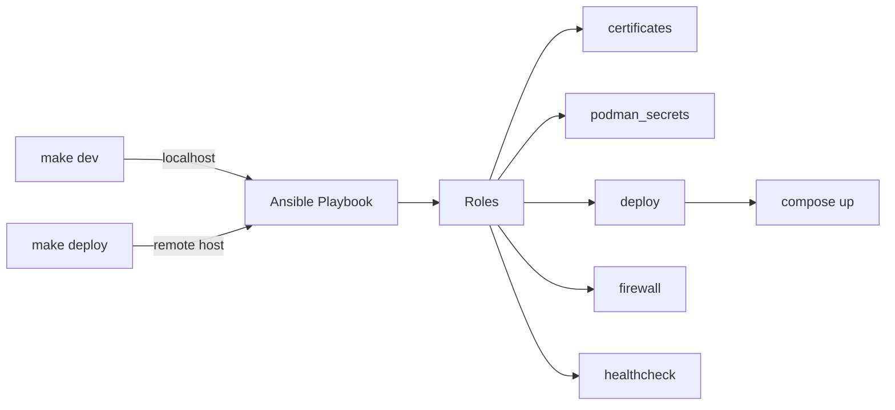
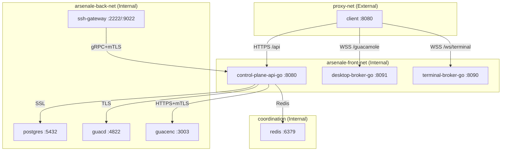
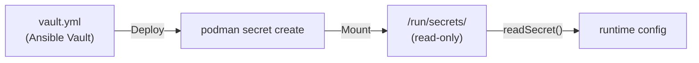
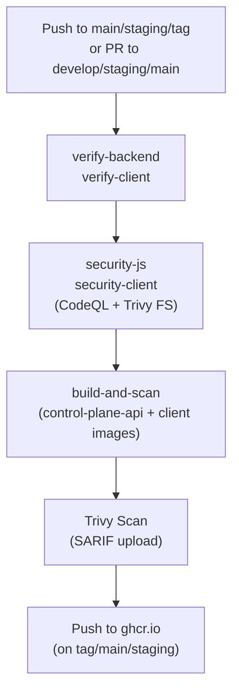

## 🎯 Overview

Arsenale uses **Ansible** for both development and production deployments. The same playbook handles both environments, with the target determined by environment variables.



## 🐳 Container Images

All containers are **rootless** and **Podman-compatible**. No process runs as root.

### Application Containers

| Image | Base | Ports | Purpose |
|-------|------|-------|---------|
| `control-plane-api-go` | Go 1.25-alpine | 8080 | Public API edge and auth/session control plane |
| `client` | Nginx 1.28-alpine | 8080 | React SPA reverse proxy |

**Backend Dockerfile** (multi-stage):
1. `build` -- Compile the selected Go service from `backend/cmd/*`
2. `final` -- Minimal runtime image containing the chosen service binary

**Client Dockerfile** (multi-stage):
1. `deps` -- Install Node.js dependencies
2. `build` -- Vite production build
3. `final` -- Nginx rootless on port 8080

### Gateway Containers

| Image | Base | Ports | Purpose |
|-------|------|-------|---------|
| `ssh-gateway` | Alpine 3.21 | 2222, 9022 | SSH bastion + gRPC key management |
| `guacd` | guacamole/guacd:1.6.0 | 4822 | RDP/VNC protocol proxy |
| `guacenc` | Alpine 3.18 | 3003 | Recording to video converter |
| `db-proxy` | Node.js 22-alpine | 5432 | Database protocol proxy |
| `tunnel-agent` | Node.js 22-alpine | - | Zero-trust tunnel client |

### Infrastructure Containers

| Image | Base | Ports | Purpose |
|-------|------|-------|---------|
| `redis` | Redis 7 / UBI | 6379 | Coordination cache and rate-limit state |
| `postgres` | PostgreSQL 16 | 5432 | Database |

All gateway containers embed the **tunnel agent** for zero-trust connectivity.

## 🌐 Network Architecture

Production deployment uses isolated front-end and back-end networks with Redis on the internal service network:



All internal networks are isolated -- no external routing.

## 🔐 TLS and mTLS

Every service-to-service connection uses TLS or mTLS. Certificates are generated per-service with ECC (secp256r1).

### Certificate Structure

```
certs/                        # Generated by Ansible or dev-certs/generate.sh
├── ca.pem, ca-key.pem       # Shared CA (10-year validity)
├── server/                   # historical client-edge cert name retained for compatibility
├── client/                   # Nginx
├── postgres/                 # PostgreSQL SSL
├── guacd/                    # Guacamole TLS
├── guacenc/                  # Video converter HTTPS
├── ssh-gateway/              # SSH gateway API
└── tunnel/                   # Tunnel mTLS
```

### Service-to-Service Connections

| Source | Target | Protocol | Verification |
|--------|--------|----------|-------------|
| Nginx | control-plane-api-go | HTTP (internal dev net) | Internal container network |
| Nginx | desktop-broker-go / terminal-broker-go | HTTP+WS | Internal container network |
| control-plane-api-go | PostgreSQL | SSL | Certificate mode |
| control-plane-api-go | guacd | TLS | CA verify |
| control-plane-api-go | Redis | TCP | Internal network |
| control-plane-api-go | guacenc | HTTPS | Mutual TLS |
| SSH Gateway | control-plane-api-go | gRPC | Mutual TLS |

## 🚀 Deployment Workflows

### Development

```bash
make setup     # First time: Ansible collections, vault, certs
make dev       # Start the full Go-based dev stack via Ansible (localhost)
npm run dev    # Start local Vite against the Go stack on :3005
```

### Production

```bash
make setup     # First time
make vault     # Configure secrets (Ansible Vault encrypted)
make deploy    # Full deployment to remote host
```

The Ansible playbook runs these roles in order:
1. **prerequisites** -- System packages (production only)
2. **certificates** -- Generate CA + service certs
3. **podman_secrets** -- Create external secrets via `podman secret create`
4. **deploy** -- Template compose.yml + .env, build/pull images, `compose up -d`, bootstrap the SQL schema when the DB is empty
5. **firewall** -- Open ports 22, 2222, 3000 (when enabled)
6. **healthcheck** -- Verify all services are running

### Makefile Targets

```bash
make setup      # First-time setup
make dev        # Start dev infrastructure
make dev-down   # Stop dev infrastructure
make deploy     # Full production deployment
make status     # Show service status
make logs       # Tail logs (SVC=arsenale-control-plane-api-go for specific)
make backup     # Database backup
make rotate     # Rotate system secrets
make vault      # Edit Ansible Vault
make certs      # Regenerate certificates
make clean      # Teardown everything
make help       # Show all targets
```

## 🔑 Secret Management

### Development (vault.yml)

Auto-generated by `make setup`. Contains:
- `vault_jwt_secret` -- JWT signing key
- `vault_guacamole_secret` -- RDP/VNC encryption
- `vault_server_encryption_key` -- SSH key encryption
- `vault_postgres_password` -- Database password
- `vault_database_url` -- Full PostgreSQL URL
- `vault_guacenc_auth_token` -- Video converter auth

### Production (Ansible Vault)

Same secrets, encrypted with `ansible-vault`. Decrypted at deploy-time.

### Runtime (Podman Secrets)

Secrets are injected via Podman external secrets:
- Mounted at `/run/secrets/` (read-only)
- Referenced in compose via `secrets:` section
- Never in environment variables or logs



## 📦 Nginx Configuration

### Production (`client/nginx.conf`)

- Listens on port 8080 (HTTP, behind reverse proxy)
- Strict security headers: CSP, HSTS (1 year), X-Frame-Options DENY
- Proxy routes:
  - `/api` -> `http://control-plane-api-go:8080`
  - `/guacamole` -> `http://desktop-broker-go:8091`
  - `/ws/terminal` -> `http://terminal-broker-go:8090`
- Static assets: 1-year immutable cache
- SPA fallback: all routes -> `index.html`

### Development (`client/nginx.dev.conf`)

- Same structure but with TLS enabled (`listen 8080 ssl`)
- Self-signed certs from `dev-certs/`

## 🔄 CI/CD Pipelines

### Application Build (`.github/workflows/docker-build.yml`)



- **Matrix build**: control-plane API and client in parallel
- **Multi-arch**: linux/amd64, linux/arm64
- **Cache**: GitHub Actions cache for Docker layers
- **Security**: CodeQL analysis + Trivy container scanning

### Gateway Build (`.github/workflows/gateways-build.yml`)

- Triggers on changes to `gateways/`
- Go tests: `go vet` + `go test -race` across every Go module under `gateways/`
- Matrix: guacd, guacenc, ssh-gateway, tunnel-agent
- Same scan/push pipeline as application

### Release (`.github/workflows/release.yml`)

- Triggers on `v*` tags
- Creates GitHub Release with auto-generated notes
- Draft release; pre-release if `-beta` tag

## 📊 Volumes and Data Persistence

| Volume | Mount Point | Purpose |
|--------|------------|---------|
| `pgdata` | `/var/lib/postgresql/data` | PostgreSQL data |
| `arsenale_drive` | `/guacd-drive` | SFTP file sharing |
| `arsenale_recordings` | `/recordings` | Session recordings |

## 🔧 Ansible Variables

Key production variables in `deployment/ansible/inventory/group_vars/all/vars.yml`:

| Variable | Default | Purpose |
|----------|---------|---------|
| `arsenale_domain` | `localhost` | Public domain |
| `arsenale_node_env` | `production` | Node environment |
| `arsenale_build_images` | `true` | Build locally vs pull from registry |
| `arsenale_registry` | `ghcr.io/dnviti/arsenale` | Container registry |
| `arsenale_server_replicas` | `1` | Historical variable name for control-plane API replica count |
| `arsenale_generate_certs` | `true` | Auto-generate TLS certs |
| `arsenale_firewall_enabled` | `true` | Enable firewall rules |
| `arsenale_backup_retention_days` | `30` | Backup retention |

## 🔄 Scaling

Arsenale supports horizontal scaling around Redis-backed coordination:

| Component | Scaling | Configuration |
|-----------|---------|--------------|
| control-plane API | Replicas | `arsenale_server_replicas` |
| PostgreSQL | Single (external HA recommended) | - |
| Redis | Single / managed external service | `REDIS_URL` |
| Managed Gateways | Auto-scaling | Per-gateway scaling config |

Redis keeps rate limits, auth challenge state, and other short-lived coordination data consistent across replicas.
