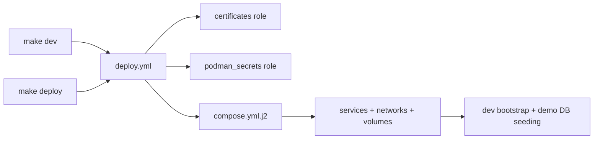

## 🎯 Deployment Model

Arsenale uses one deployment story for both development and production:

- `Makefile` is the human entry point,
- `deployment/ansible/playbooks/deploy.yml` is the orchestrator,
- `deployment/ansible/roles/deploy/templates/compose.yml.j2` is the authoritative container template.



The checked-in `docker-compose.yml` mirrors the current generated dev stack, but the Ansible template remains the source of truth.

## 🐳 Image Build Matrix

| Image | Built from | Notes |
|-------|------------|-------|
| `control-plane-api` | `backend/Dockerfile` with `SERVICE=control-plane-api` | Generic Go service image pattern |
| `client` | `client/Dockerfile` | Multi-stage Node build then nginx runtime |
| `db-proxy` | `gateways/db-proxy/Dockerfile` | Go `db-proxy` binary plus bundled `tunnel-agent` |
| `ssh-gateway` | `gateways/ssh-gateway/Dockerfile` | Alpine runtime, SSHD, gRPC key server, tunnel agent |
| `guacd` | `gateways/guacd/Dockerfile` | Alpine runtime, Guacamole server packages, tunnel agent |
| `guacenc` | `gateways/guacenc/Dockerfile` | Custom build with `guacenc`, `agg`, and Go wrapper |
| `tunnel-agent` | `gateways/tunnel-agent/Dockerfile` | Standalone tunnel agent workspace |

Important implementation details:

- `backend/Dockerfile` is service-agnostic: it builds `/usr/local/bin/service` from `backend/cmd/${SERVICE}` and always also builds `/usr/local/bin/migrate`.
- `client/Dockerfile` serves the built SPA through nginx and exposes `/health`.
- `gateways/db-proxy/Dockerfile` is not a pure Node proxy anymore. The runtime image is Node-based only because it bundles the JS tunnel agent; the actual DB middleware process is the Go binary from `backend/cmd/db-proxy`.

## 🖧 Runtime Topology In Development

Key host-to-container mappings from `docker-compose.yml`:

| Host port | Service | Container port |
|-----------|---------|----------------|
| `3000` | `client` | `8080` |
| `18080` | `control-plane-api` | `8080` |
| `18081` | `control-plane-controller` | `8081` |
| `18082` | `authz-pdp` | `8082` |
| `18083` | `model-gateway` | `8083` |
| `18084` | `tool-gateway` | `8084` |
| `18085` | `agent-orchestrator` | `8085` |
| `18086` | `memory-service` | `8086` |
| `18090` | `terminal-broker` | `8090` |
| `18091` | `desktop-broker` | `8091` |
| `18092` | `tunnel-broker` | `8092` |
| `18093` | `query-runner` | `8093` |
| `18095` | `runtime-agent` | `8095` |

Primary internal networks:

| Network | Use |
|---------|-----|
| `net-edge` | Public-facing services and internal service calls |
| `net-db` | PostgreSQL and database-adjacent services |
| `net-cache` | Redis-backed coordination |
| `net-guacd` | Desktop broker and `guacd` |
| `net-guacenc` | Recording conversion |
| `net-gateway` | SSH gateway and managed gateway workloads |
| `net-egress` | Tunneled gateway egress fixtures |

## 🔐 TLS, Secrets, and Container Hardening

Arsenale deploys with TLS everywhere practical.

### Certificates

- Dev and production certificate generation are handled by the `certificates` role.
- Local development also uses `dev-certs/generate.sh`.
- Generated certs cover client HTTPS, PostgreSQL TLS, `guacd`, `guacenc`, SSH gateway gRPC, and tunnel identities.

### Secrets

Runtime secrets are delivered through secret mounts, not plain environment strings, for:

- database URL
- JWT secret
- guacamole secret
- server encryption key
- guacenc auth token
- provider credentials

### Hardening

Most services in the Compose template use a consistent hardening profile:

- `read_only: true`
- `cap_drop: [ALL]`
- `security_opt: [no-new-privileges:true]`
- `tmpfs` for writable scratch paths
- health checks for service readiness

Some containers intentionally run as `0:0` during startup when they must prepare runtime directories before execing the service binary. That is visible in the Compose template and should not be “simplified away” without preserving the startup behavior.

## 🧪 Development Fixtures and Demo Data

The dev playbook does more than boot the app. It also:

- runs `service dev-bootstrap` inside `arsenale-control-plane-api`,
- creates development gateway fixtures,
- provisions tunneled gateway fixtures,
- seeds five sample database containers.

Demo data containers:

| Container | Protocol |
|-----------|----------|
| `arsenale-dev-demo-postgres` | PostgreSQL |
| `arsenale-dev-demo-mysql` | MySQL / MariaDB |
| `arsenale-dev-demo-mongodb` | MongoDB |
| `arsenale-dev-demo-oracle` | Oracle |
| `arsenale-dev-demo-mssql` | SQL Server |

Tunneled gateway fixtures:

| Container | Purpose |
|-----------|---------|
| `arsenale-dev-tunnel-ssh-gateway` | Managed SSH via tunnel broker |
| `arsenale-dev-tunnel-guacd` | Desktop proxy via tunnel broker |
| `arsenale-dev-tunnel-db-proxy` | Database proxy via tunnel broker |

This makes the dev stack suitable for full-stack session, gateway, and DB proxy testing without touching the application's own PostgreSQL data.

## 🚢 CI/CD Workflows

| Workflow | Purpose |
|----------|---------|
| `.github/workflows/verify.yml` | Typecheck, lint, audit, and build per JS workspace |
| `.github/workflows/security.yml` | CodeQL and Trivy filesystem scanning |
| `.github/workflows/docker-build.yml` | Backend/client verify, security, image build, scan, and push |
| `.github/workflows/gateways-build.yml` | Gateway Go tests, image build, scan, and push |
| `.github/workflows/release.yml` | Cross-platform CLI build, checksums, and GitHub release draft |

Notable facts from the workflow definitions:

- backend verification includes `go vet` and `go test -race`,
- gateway verification runs `go vet` and `go test -race` for each Go module under `gateways/`,
- release artifacts currently center on the CLI, not full application bundles.

## 🛠 Common Deployment Operations

```bash
make setup
make dev
make dev-down
make deploy
make status
make logs SVC=arsenale-control-plane-api
make certs
make backup
make rotate
```

Useful script-level entry points:

```bash
./scripts/db-migrate.sh up
./scripts/security-scan.sh --quick
./scripts/go-test-all.sh
./scripts/go-build-all.sh
```

## 📌 Practical Notes

- Production and development share one playbook; conditionals switch hosts, bind addresses, and bootstrap behavior.
- The deploy playbook validates vault secrets before bringing the stack up.
- Local development auto-detects `podman` first, then falls back to `docker`.
- The DB proxy and tunnel fixtures are part of the supported dev stack, not ad hoc extras.
