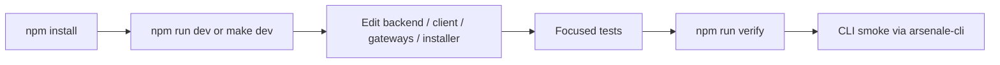

## 🧱 Monorepo Shape

Arsenale is a mixed Go and JavaScript monorepo.

| Area | Path | Stack |
|------|------|-------|
| Control and runtime services | `backend/` | Go 1.25 |
| Web client | `client/` | React 19, Vite 8, Vitest, Tailwind CSS 4, shadcn/ui, MUI 7 |
| Tunnel agent | `gateways/tunnel-agent/` | TypeScript workspace |
| Browser extension | `extra-clients/browser-extensions/` | Chrome MV3 workspace |
| CLI | `tools/arsenale-cli/` | Go |
| Installer and deploy | `deployment/ansible/`, `deployment/helm/` | Ansible, Helm, Python helpers |

One important correction to older contributor material: the active runtime is not a legacy Express `server/`. The live platform is Go-first and the route surface comes from `backend/cmd/control-plane-api`.

## 🔁 Daily Development Loop



Recommended day-to-day loop:

1. Use `npm run dev` when you want the repo root to deploy the stack and launch Vite for you.
2. Use `make dev` plus `npm run dev:client` when you want explicit control over deploy and frontend startup.
3. After the full stack exists, use `make dev client`, `make dev gateways`, or `make dev control-plane` to rebuild only the changed containers.
4. Run focused Go or Vitest commands while iterating.
5. Run `npm run verify` before declaring a change complete.
6. Use the CLI from `tools/arsenale-cli` as an acceptance client for auth, connection, gateway, and session flows.

Podman is required for installer-aware development deploys because `make dev` delegates to `deployment/ansible/playbooks/install.yml`.

Service-scoped `make dev <selector>` refreshes reuse the saved dev installer profile and rendered compose/env artifacts, so they are intended for code/image iteration. When you change capability flags, certificates, secrets, or deployment wiring, rerun full `make dev`.

For headless local reruns, put the technician password in `install/password.txt`.
The repo `Makefile` auto-detects that file and passes `-e install_password_file=...`
to installer-backed targets such as `make dev`, `make install`, `make deploy`,
and `make status`.

## ✅ Quality Gates

Top-level scripts from `package.json`:

| Command | What it does |
|---------|--------------|
| `npm run typecheck` | Typecheck active JS workspaces |
| `npm run lint` | Run ESLint across the repo |
| `npm run sast` | Run `npm audit --audit-level=critical` |
| `npm run security` | Run the repo security scan wrapper |
| `npm run backend:test` | `go test ./...` in `backend/` |
| `npm run go:test` | Go tests across backend, gateways, and CLI |
| `npm run go:build` | Go builds across backend, gateways, and CLI |
| `npm run verify` | Generate SQL, run Go tests, typecheck, lint, audit, JS tests, and build |

Supporting scripts:

| Script | Purpose |
|--------|---------|
| `scripts/go-test-all.sh` | Aggregate Go test runner |
| `scripts/go-build-all.sh` | Aggregate Go build runner |
| `scripts/security-scan.sh` | npm audit, ESLint security rules, Trivy filesystem scan, optional image scans |
| `scripts/dev-api-acceptance.sh` | Full API and runtime acceptance against the dev stack |
| `scripts/dev-managed-file-smoke.sh` | CLI-first managed SSH and RDP sandbox smoke path with discovery, history checks, deny checks, and audit verification |
| `scripts/db-migrate.sh` | Runtime-aware migration helper with compose overrides |

## 🧪 Testing Surfaces

### Frontend

- `client/package.json` uses `vitest run` for tests.
- `client/vitest.config.ts` defines the test runtime.
- `client/vite.config.ts` defines the local proxy behavior and HTTPS setup.

### Go services

The backend, gateway modules, and CLI are all first-class test targets. `scripts/go-test-all.sh` currently covers:

- `backend`
- `gateways/gateway-core`
- `gateways/db-proxy`
- `gateways/guacenc`
- `gateways/rdgw`
- `gateways/ssh-gateway/grpc-server`
- `tools/arsenale-cli`

### Database-specific tests

The backend includes focused test files for critical subsystems:

- `backend/cmd/control-plane-api/config_test.go` — control plane config parsing
- `backend/cmd/control-plane-api/dev_bootstrap_test.go` — dev bootstrap flow
- `backend/cmd/control-plane-api/routes_auth_test.go` — auth route registration
- `backend/cmd/control-plane-api/routes_feature_test.go` — feature flag routing
- `backend/internal/authservice/ip_allowlist_test.go` — IP allowlist logic
- `backend/internal/authservice/mfa_test.go` — MFA verification
- `backend/internal/authz/pdp_test.go` — policy decision point
- `backend/internal/connections/host_validation_test.go` — connection host validation
- `backend/internal/connections/list_response_test.go` — connection list response shaping

### End-to-end

`scripts/dev-api-acceptance.sh` is the highest-signal integration check in the repo. It touches:

- auth and tenant flows,
- sessions,
- gateways,
- secrets and vault,
- recordings,
- audit,
- database sessions and policies.

`scripts/dev-managed-file-smoke.sh` is the focused managed-file acceptance path. It uses `arsenale-cli` against the real dev stack to discover usable SSH and RDP connections, verify the managed sandbox banner, exercise sandbox-relative SSH and RDP file flows, confirm cleanup-after-success and retain-history behavior, run a real `file history list/download` proof against the retained-history connection, reject absolute-path attempts, and read back `FILE_*` audit entries.

## 🧩 Capability Alignment Rule

Runtime capabilities now span backend registration, public config, and client UI state. When you change feature availability or installer-owned product shape, update these together:

- `backend/internal/runtimefeatures/manifest.go`
- `backend/internal/publicconfig/service.go`
- `backend/cmd/control-plane-api/routes*.go`
- `client/src/api/auth.api.ts`
- `client/src/store/featureFlagsStore.ts`
- any client screens or dialogs gated on those flags

If one layer changes and the others do not, the change is incomplete.

## 🧰 CLI Alignment Rule

`AGENT.md` is explicit: use `tools/arsenale-cli` as the primary operator and smoke-test client whenever you need real end-to-end verification.

That rule has practical consequences:

- if API contracts change, the CLI must be updated in the same change set,
- CLI smoke tests are part of the acceptance bar,
- `arsenale health`, `login`, `whoami`, `connection`, `gateway`, `session`, `rdgw`, `vault`, and `connect` are the highest-value commands to keep aligned.

Typical smoke sequence:

```bash
mkdir -p ./build/go
go build -o ./build/go/arsenale-cli ./tools/arsenale-cli
./build/go/arsenale-cli --server https://localhost:3000 health
./build/go/arsenale-cli --server https://localhost:3000 login
./build/go/arsenale-cli --server https://localhost:3000 whoami
./build/go/arsenale-cli --server https://localhost:3000 connection list
./build/go/arsenale-cli --server https://localhost:3000 gateway list
```

For the local installer stack, the CLI automatically trusts `${XDG_STATE_HOME:-$HOME/.local/state}/arsenale-dev/dev-certs/client/ca.pem` when you target `https://localhost:3000`. Set `ARSENALE_CA_CERT` if you need to point the CLI at a different private CA bundle.

## 🖥 Frontend Architecture

The React SPA in `client/` follows a layered architecture:

| Layer | Location | Count |
|-------|----------|-------|
| Pages | `client/src/pages/` | 11 pages |
| Components | `client/src/components/` | 88+ components across 20+ directories |
| Stores | `client/src/store/` | 17 Zustand stores |
| Hooks | `client/src/hooks/` | 15 custom hooks |
| API modules | `client/src/api/` | 40 Axios-based modules |

Key stores and their purposes:

| Store | Purpose |
|-------|---------|
| `authStore` | Authentication state, user context, JWT tokens |
| `connectionsStore` | Connection list, filters, selection |
| `tabsStore` | Open session tabs, tab state sync |
| `vaultStore` | Vault lock/unlock state, auto-lock |
| `secretStore` | Keychain secrets state |
| `gatewayStore` | Gateway inventory, derived operational status, tunnel state, and orchestration health |
| `featureFlagsStore` | Runtime feature manifest from server |
| `tenantStore` | Current tenant context |
| `teamStore` | Team CRUD and membership |
| `accessPolicyStore` | ABAC access policy state |
| `checkoutStore` | Credential checkout/check-in workflow |
| `notificationStore` | Ephemeral toast notifications |
| `notificationListStore` | Server-persisted notifications |
| `uiPreferencesStore` | UI layout and theme (persisted to localStorage) |
| `themeStore` | Light/dark mode toggle |
| `terminalSettingsStore` | SSH terminal preferences |
| `rdpSettingsStore` | RDP-specific settings |

Notable custom hooks:

| Hook | Purpose |
|------|---------|
| `useAuth` | Authentication state and refresh |
| `useAutoReconnect` | Auto-reconnect on disconnect |
| `useGatewayMonitor` | Gateway health polling |
| `useSftpTransfers` | Managed SSH file-browser tracking |
| `useDlpBrowserHardening` | DLP policy enforcement in browser |
| `useVaultStatusStream` | Real-time vault status updates |
| `useDesktopNotifications` | Web Notifications API for push alerts |
| `useGuacToolbarActions` | RDP/VNC toolbar actions with DLP awareness |
| `useKeyboardCapture` | Keyboard capture for session viewers |
| `useFullscreen` | Fullscreen state tracking per container |

For detailed component inventory, see the [components/](components/) directory.

## 📝 Conventions That Matter

| Area | Convention |
|------|------------|
| Public routes | `backend/cmd/control-plane-api/routes*.go` |
| Service entrypoints | `backend/cmd/<service>/main.go` |
| Shared service wrapper | `backend/internal/app/app.go` |
| Runtime feature manifest | `backend/internal/runtimefeatures/manifest.go` |
| Public config | `backend/internal/publicconfig/service.go` |
| Client API modules | `client/src/api/*.ts` |
| Client stores | `client/src/store/*Store.ts` |
| Root env | Single `.env` at repo root |
| Database sessions | `backend/internal/dbsessions/` |
| Session recording | `backend/internal/sshsessions/`, `backend/internal/desktopsessions/` |
| Agent capabilities | `backend/internal/catalog/catalog.go` |
| Service contracts | `backend/pkg/contracts/` |

Additional notes:

- `CONTRIBUTING.md` still contains useful process guidance, but its old Express examples are historical and should not be used as the runtime reference.
- When changing installer behavior, validate both the interactive playbooks and the emitted compose or Helm artifacts.
- The docs, route files, feature manifest, and CLI should move together whenever API behavior changes.

## 🔍 Security And Static Analysis During Development

`scripts/security-scan.sh` supports three modes:

| Mode | What it runs |
|------|---------------|
| `--quick` | `npm audit` plus ESLint security rules |
| default | quick checks plus Trivy filesystem scan |
| `--docker` | default checks plus image builds and image vulnerability scans |

This is especially useful when changing containers, auth, gateway code, installer wiring, or anything that touches secrets and networking.
