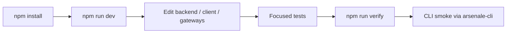

## 🧱 Monorepo Shape

Arsenale is a mixed Go and JavaScript monorepo.

| Area | Path | Stack |
|------|------|-------|
| Control and runtime services | `backend/` | Go 1.25 |
| Web client | `client/` | React 19, Vite 8, Vitest |
| Tunnel agent | `gateways/tunnel-agent/` | TypeScript workspace |
| Browser extension | `extra-clients/browser-extensions/` | Chrome MV3 workspace |
| CLI | `tools/arsenale-cli/` | Go |

One important correction to older contributor material: the active runtime is not a legacy Express `server/`. The live platform is Go-first and the route surface comes from `backend/cmd/control-plane-api`.

## 🔁 Daily Development Loop



Recommended day-to-day loop:

1. Keep the dev stack running with `npm run dev`.
2. Use `npm run dev:client` only when frontend-only work does not need backend restarts.
3. Run focused Go or Vitest commands while iterating.
4. Run `npm run verify` before declaring a change complete.
5. Use the CLI from `tools/arsenale-cli` as an acceptance client for auth, connection, gateway, and session flows.

## ✅ Quality Gates

Top-level scripts from `package.json`:

| Command | What it does |
|---------|--------------|
| `npm run typecheck` | Typecheck active JS workspaces |
| `npm run lint` | Run ESLint across the repo |
| `npm run sast` | Run `npm audit --audit-level=critical` |
| `npm run security` | Run the repo security scan wrapper |
| `npm run backend:test` | `go test ./...` in `backend/` |
| `npm run go:test` | Go tests across backend, gateways, and CLI |
| `npm run go:build` | Go builds across backend, gateways, and CLI |
| `npm run verify` | Generate SQL, run Go tests, typecheck, lint, audit, JS tests, and build |

Supporting scripts:

| Script | Purpose |
|--------|---------|
| `scripts/go-test-all.sh` | Aggregate Go test runner |
| `scripts/go-build-all.sh` | Aggregate Go build runner |
| `scripts/security-scan.sh` | npm audit, ESLint security, Trivy filesystem, optional image scans |
| `scripts/dev-api-acceptance.sh` | Full API and runtime acceptance against the dev stack |

## 🧪 Testing Surfaces

### Frontend

- `client/package.json` uses `vitest run` for tests.
- `client/vitest.config.ts` defines the test runtime.
- Vite and the SPA proxy behavior live in `client/vite.config.ts`.

### Go services

The backend, gateway modules, and CLI are all first-class test targets. `scripts/go-test-all.sh` currently covers:

- `backend`
- `gateways/gateway-core`
- `gateways/db-proxy`
- `gateways/guacenc`
- `gateways/rdgw`
- `gateways/ssh-gateway/grpc-server`
- `tools/arsenale-cli`

### End-to-end

`scripts/dev-api-acceptance.sh` is the highest-signal integration check in the repo. It touches:

- auth and tenant flows,
- sessions,
- gateways,
- secrets and vault,
- recordings,
- audit,
- database sessions and policies.

## 🧰 CLI Alignment Rule

`AGENT.md` is explicit: use `tools/arsenale-cli` as the primary operator and smoke-test client whenever you need real end-to-end verification.

That rule has practical consequences:

- if API contracts change, the CLI must be updated in the same change set,
- CLI smoke tests are part of the acceptance bar,
- `arsenale health`, `login`, `whoami`, `connection`, `gateway`, `session`, `rdgw`, `vault`, and `connect` are the highest-value commands to keep aligned.

Typical smoke sequence:

```bash
go build -o /tmp/arsenale-cli ./tools/arsenale-cli
/tmp/arsenale-cli --server https://localhost:3000 health
/tmp/arsenale-cli --server https://localhost:3000 login
/tmp/arsenale-cli --server https://localhost:3000 whoami
/tmp/arsenale-cli --server https://localhost:3000 connection list
/tmp/arsenale-cli --server https://localhost:3000 gateway list
```

## 📝 Conventions That Matter

| Area | Convention |
|------|------------|
| Public routes | `backend/cmd/control-plane-api/routes_*.go` |
| Service entrypoints | `backend/cmd/<service>/main.go` |
| Shared service wrapper | `backend/internal/app/app.go` |
| Client API modules | `client/src/api/*.ts` |
| Client stores | `client/src/store/*Store.ts` |
| Root env | Single `.env` at repo root |

Additional notes:

- `CONTRIBUTING.md` still contains useful process guidance, but its old Express/server architecture examples are historical and should not be used as the runtime reference.
- The current CI configuration verifies PRs targeting `develop`, `staging`, and `main`. In practice, short-lived branches should be merged with those gates in mind.
- The docs, route files, and CLI should move together whenever API behavior changes.

## 🔍 Security and Static Analysis During Development

`scripts/security-scan.sh` supports three modes:

| Mode | What it runs |
|------|---------------|
| `--quick` | `npm audit` plus ESLint security rules |
| default | quick checks plus Trivy filesystem scan |
| `--docker` | default checks plus image builds and image vulnerability scans |

This is useful when changing containers, auth, gateway code, or anything that touches secrets and networking.
