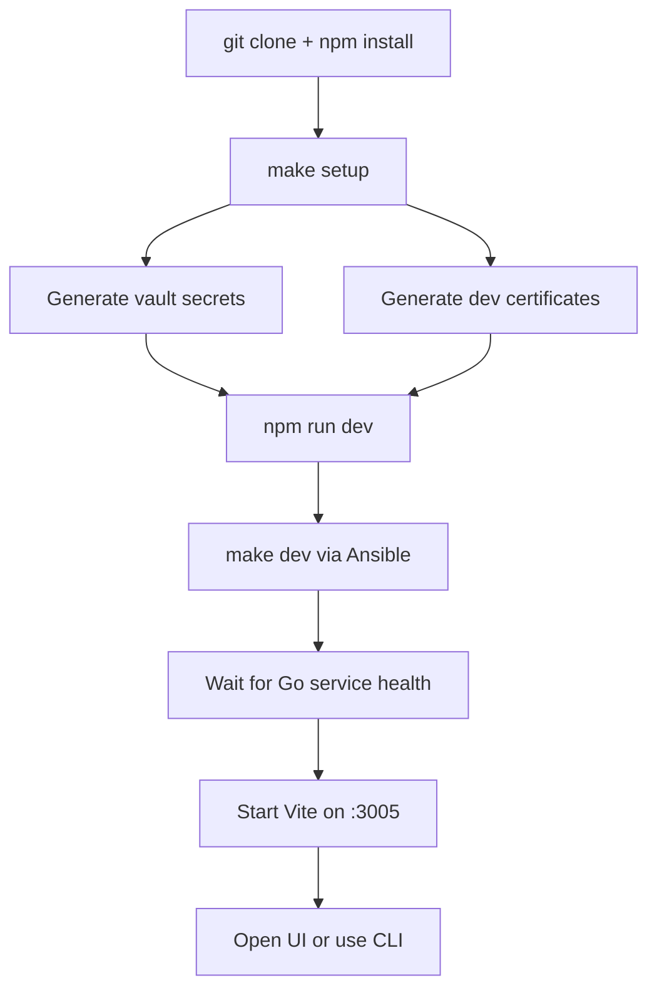

## 🎯 Overview

The fastest way to work on Arsenale locally is to let Ansible bring up the containerized Go stack and then run the React frontend in local Vite mode. That gives you:

- the full control plane and brokers,
- seeded development credentials,
- demo database fixtures,
- local HTTPS,
- and hot reloading for frontend changes.

## ✅ Prerequisites

| Requirement | Recommended Version | Why it is needed |
|-------------|---------------------|------------------|
| Node.js | `22.x` | Root workspaces, frontend build, tunnel-agent workspace |
| npm | `10.x` or newer | Workspace install and scripts |
| Go | `1.25.x` | Local backend and CLI builds when not using container-only flow |
| Podman or Docker | Recent | Local stack containers |
| Ansible | Recent | Unified dev and production deployment |
| Python 3 | `3.9+` | Ansible helpers and acceptance parsing |
| OpenSSL | `3.x` | Local CA and service certificate generation |
| Git | `2.x` | Repository operations |

## 🚀 First-Run Flow



## 🛠 Step-by-Step Setup

### 1. Clone and install dependencies

```bash
git clone https://github.com/dnviti/arsenale.git
cd arsenale
npm install
```

### 2. Generate local secrets and certificates

```bash
make setup
```

`make setup` installs required Ansible collections and creates:

- `deployment/ansible/inventory/group_vars/all/vault.yml`
- `deployment/ansible/.vault-pass` when generated locally
- `dev-certs/` with a shared CA and per-service certificates

### 3. Start the development stack

```bash
npm run dev
```

Under the hood this does two things:

1. `make dev` deploys the local containers and Go services.
2. `npm run dev -w client` starts Vite after `http://localhost:18080/healthz`, `:18090/healthz`, and `:18091/healthz` are reachable.

### 4. Open the application

| URL | Use |
|-----|-----|
| `https://localhost:3000` | Containerized client with reverse proxy |
| `https://localhost:3005` | Local Vite frontend |
| `http://127.0.0.1:18080/healthz` | Control-plane health |
| `http://127.0.0.1:18092/healthz` | Tunnel-broker health |
| `http://127.0.0.1:18093/healthz` | Query-runner health |

### 5. Sign in with the seeded dev admin

The development deploy playbook seeds an admin and tenant automatically:

```text
Email:    admin@example.com
Password: DevAdmin123!
Tenant:   Development Environment
```

## 🗄 Demo Databases Included In Dev

The development stack now provisions five non-application demo databases. They are seeded during the Ansible deploy and bootstrapped into Arsenale as ready-to-query `DATABASE` connections.

| Connection name | Protocol | Seeded database | Seed object |
|-----------------|----------|-----------------|-------------|
| `Dev Demo PostgreSQL` | PostgreSQL | `arsenale_demo` | `public.demo_customers` |
| `Dev Demo MySQL` | MySQL / MariaDB | `arsenale_demo` | `demo_customers` |
| `Dev Demo MongoDB` | MongoDB | `arsenale_demo` | `demo_customers` |
| `Dev Demo Oracle` | Oracle | `FREEPDB1` service | `demo_customers` |
| `Dev Demo SQL Server` | SQL Server | `ArsenaleDemo` | `dbo.demo_customers` |

These connections are intended for end-to-end DB proxy testing and UI smoke tests. They are separate from the application's own PostgreSQL database.

## 🧪 Quick Verification

### Browser and API

```bash
curl -k https://localhost:3000/health
curl http://127.0.0.1:18080/healthz
```

### CLI smoke

```bash
go build -o /tmp/arsenale-cli ./tools/arsenale-cli
/tmp/arsenale-cli --server https://localhost:3000 health
/tmp/arsenale-cli --server https://localhost:3000 login
/tmp/arsenale-cli --server https://localhost:3000 whoami
```

### Acceptance flow

```bash
npm run dev:api-acceptance
```

The acceptance script exercises auth, sessions, audit, gateways, secrets, and database operations against the running dev stack.

## 🧰 Everyday Commands

| Command | Purpose |
|---------|---------|
| `make dev` | Deploy the full local stack via Ansible |
| `make dev-down` | Tear the local stack down |
| `make status` | Show service status |
| `make logs SVC=arsenale-control-plane-api` | Follow a specific service log |
| `npm run dev:client` | Frontend only |
| `npm run db:migrate` | Apply migrations |
| `npm run db:status` | Show migration status |
| `npm run verify` | Full quality gate |
| `npm run backend:test` | Go test pass for the backend module |
| `npm run go:test` | Go tests across backend, gateways, and CLI |

## 🔐 Certificates and Local Trust

`dev-certs/generate.sh` creates a shared CA and the service certificates consumed by:

- the client HTTPS listener,
- PostgreSQL TLS,
- `guacd`,
- `guacenc`,
- `ssh-gateway`,
- tunnel identities.

If the browser does not trust the local certs yet, import the CA from:

```text
dev-certs/ca.pem
```

## 📁 Files Worth Knowing Early

| Path | Why it matters |
|------|----------------|
| `Makefile` | Human entry point for Ansible deploy tasks |
| `docker-compose.yml` | Generated dev stack snapshot checked into the repo |
| `deployment/ansible/playbooks/deploy.yml` | Unified deploy logic |
| `scripts/dev-api-acceptance.sh` | End-to-end API verification |
| `AGENT.md` | CLI-first smoke-test guidance |
| `client/vite.config.ts` | Local frontend proxy behavior |
