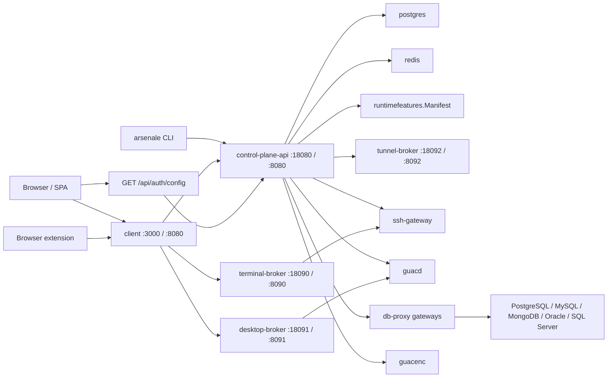

# Arsenale Documentation

Arsenale is a Go-first remote access, database access, and installer-managed deployment platform. The active runtime combines split Go services in `backend/`, a React SPA in `client/`, gateway containers in `gateways/`, and an Ansible installer that owns encrypted deployment state for both development and production.

The current architectural pivot to keep in mind is that runtime behavior is feature-gated from a shared `runtimefeatures.Manifest`. The control plane exposes that manifest through `GET /api/auth/config`, and the client consumes it to decide which pages, dialogs, session flows, and API families are active in the current install profile.

## 📚 Table of Contents

| Section | Description |
|---------|-------------|
| [Getting Started](getting-started.md) | Installation, prerequisites, first run, and dev bootstrap |
| [Architecture](architecture.md) | Service planes, capability gating, gateway topology, and DB proxy design |
| [Configuration](configuration.md) | Installer inputs, feature flags, env vars, secrets, and precedence |
| [API Reference](api-reference.md) | Public `/api`, SSE surfaces, feature-gated route families, and internal `/v1` contracts |
| [Deployment](deployment.md) | Installer flow, Podman and Kubernetes backends, TLS, and CI/CD |
| [Development](development.md) | Local workflow, quality gates, tests, feature-flag alignment, and CLI rules |
| [Troubleshooting](troubleshooting.md) | Health checks, config drift, bootstrap issues, and debugging commands |
| [LLM Context](llm-context.md) | Single-file condensed context for bots and operators |

## 🚀 Quick Start

```bash
git clone https://github.com/dnviti/arsenale.git
cd arsenale
npm install
make setup
make dev
npm run dev:client
```

If you want the repo root to orchestrate both steps, `npm run dev` runs `make dev` in `predev`, waits for the Go services to become healthy, and then starts Vite on `https://localhost:3005`.

Primary local URLs:

| URL | Purpose |
|-----|---------|
| `https://localhost:3000` | Containerized HTTPS client and reverse proxy |
| `https://localhost:3005` | Local Vite frontend with HMR |
| `http://127.0.0.1:18080/healthz` | Control-plane service health |
| `http://127.0.0.1:18090/healthz` | Terminal broker health |
| `http://127.0.0.1:18091/healthz` | Desktop broker health |
| `http://127.0.0.1:18092/healthz` | Tunnel broker health |
| `http://127.0.0.1:18093/healthz` | Query runner health |

Default dev bootstrap credentials come from `deployment/ansible/inventory/group_vars/all/vars.yml`:

```text
admin@example.com / DevAdmin123!
```

## 🧩 Technology Stack

| Layer | Technologies |
|-------|-------------|
| Frontend | React 19, Vite 8, Material UI 7, Zustand, Monaco, XTerm.js |
| Control plane | Go 1.25 split services in `backend/cmd/*` |
| Runtime brokers | `terminal-broker`, `desktop-broker`, `tunnel-broker`, `query-runner` |
| Gateways | `ssh-gateway`, `guacd`, `guacenc`, `db-proxy`, bundled `tunnel-agent` |
| Data | PostgreSQL 16, Redis 7, recordings and drive volumes |
| Installer and ops | Ansible, Podman Compose, Helm, encrypted installer artifacts |
| Operator tooling | Go CLI in `tools/arsenale-cli` |

## 🏗 Runtime Snapshot



## 📦 Repository Layout

```text
arsenale/
├── backend/                   # Go services, internal packages, migrations, contracts
├── client/                    # React SPA, API clients, dialogs, database UI, settings
├── gateways/
│   ├── db-proxy/              # DB proxy container with bundled tunnel agent
│   ├── ssh-gateway/           # SSH bastion + gRPC key management
│   ├── guacd/                 # RDP/VNC daemon with optional tunnel agent
│   ├── guacenc/               # Recording conversion sidecar
│   └── tunnel-agent/          # Zero-trust tunnel client workspace
├── deployment/ansible/        # Installer playbooks, roles, templates, and status tooling
├── deployment/helm/           # Helm chart for the Kubernetes backend
├── scripts/                   # Migration, verification, security, and acceptance helpers
├── tools/arsenale-cli/        # Go CLI used for smoke tests and operator workflows
└── docs/                      # Generated and hand-authored technical documentation
```

## 🔎 Current Source Of Truth

- Runtime behavior lives in `backend/cmd/*`, `backend/internal/*`, and `gateways/*`.
- Public route registration lives in `backend/cmd/control-plane-api/routes*.go`.
- Runtime capability switches live in `backend/internal/runtimefeatures/manifest.go`.
- Public auth and feature discovery lives in `GET /api/auth/config` via `backend/internal/publicconfig/service.go`.
- Installer entrypoints live in `deployment/ansible/playbooks/install.yml` and `deployment/ansible/playbooks/status.yml`.

## 🗺 Current Documentation Deltas

- The installer entrypoint is now `playbooks/install.yml`; `playbooks/deploy.yml` is the shared apply engine underneath it.
- Development mode always deploys the full stack, demo databases, managed gateways, and tunneled gateway fixtures.
- Production mode is installer-profile-driven and can target Podman or Kubernetes; Docker is not a supported installer backend.
- `make status` reads encrypted installer status and is part of the normal operator workflow.
