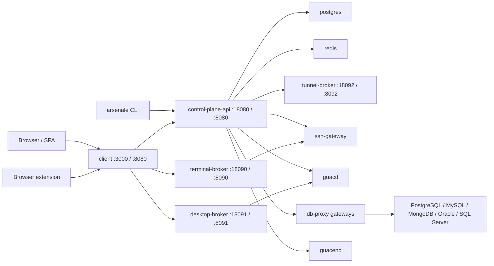

# Arsenale Documentation

**Version:** 1.7.1 | **License:** BUSL-1.1

Arsenale is a Go-first remote access and database access platform. The current runtime is built around split Go services in `backend/`, a React SPA in `client/`, dedicated gateway containers in `gateways/`, and Ansible-managed deployment for both development and production.

The most important architectural update behind this sync is that interactive database querying now runs through **DB proxy gateways** rather than direct control-plane database handling. The control plane issues sessions, applies tenancy and policy, and forwards query work to `db-proxy`, which then reaches PostgreSQL, MySQL/MariaDB, MongoDB, Oracle, or SQL Server targets directly or through the tunnel broker.

## 📚 Table of Contents

| Section | Description |
|---------|-------------|
| [Getting Started](getting-started.md) | Installation, prerequisites, first run, and dev bootstrap |
| [Architecture](architecture.md) | Service planes, request flows, gateway topology, and DB proxy design |
| [Configuration](configuration.md) | Environment variables, Ansible inputs, secret delivery, and precedence |
| [API Reference](api-reference.md) | Public `/api`, live streams, and internal `/v1` contracts |
| [Deployment](deployment.md) | Ansible, Compose, containers, TLS, demo fixtures, and CI/CD |
| [Development](development.md) | Local workflow, quality gates, tests, CLI alignment, and conventions |
| [Troubleshooting](troubleshooting.md) | Health checks, common failures, and debugging commands |
| [LLM Context](llm-context.md) | Single-file condensed context for bots and operators |

## 🚀 Quick Start

```bash
git clone https://github.com/dnviti/arsenale.git
cd arsenale
npm install
make setup
npm run dev
```

Primary local URLs:

| URL | Purpose |
|-----|---------|
| `https://localhost:3000` | Containerized HTTPS client and reverse proxy |
| `https://localhost:3005` | Local Vite frontend with HMR |
| `http://127.0.0.1:18080/healthz` | Control-plane service health |
| `http://127.0.0.1:18090/healthz` | Terminal broker health |
| `http://127.0.0.1:18091/healthz` | Desktop broker health |

Default dev bootstrap credentials are injected from `deployment/ansible/inventory/group_vars/all/vars.yml`:

```text
admin@example.com / DevAdmin123!
```

## 🧩 Technology Stack

| Layer | Technologies |
|-------|-------------|
| Frontend | React 19, Vite 8, Material UI 7, Zustand, Monaco, XTerm.js |
| Control plane | Go 1.25 split services in `backend/cmd/*` |
| Runtime brokers | `terminal-broker`, `desktop-broker`, `tunnel-broker`, `query-runner` |
| Gateways | `ssh-gateway`, `guacd`, `guacenc`, `db-proxy`, bundled `tunnel-agent` |
| Data | PostgreSQL 16, Redis 7, recordings and drive volumes |
| Auth and security | JWT, CSRF, Argon2id, AES-256-GCM, WebAuthn, TOTP, SAML, OIDC, LDAP |
| Automation | Ansible, Podman/Docker Compose, GitHub Actions, Trivy, CodeQL |
| Operator tooling | Go CLI in `tools/arsenale-cli` |

## 🏗 Runtime Snapshot



## 📦 Repository Layout

```text
arsenale/
├── backend/                   # Go services, internal packages, migrations, contracts
├── client/                    # React SPA, API clients, dialogs, database UI, settings
├── gateways/
│   ├── db-proxy/              # DB proxy container with bundled tunnel agent
│   ├── ssh-gateway/           # SSH bastion + gRPC key management
│   ├── guacd/                 # RDP/VNC daemon with optional tunnel agent
│   ├── guacenc/               # Recording conversion sidecar
│   └── tunnel-agent/          # Zero-trust tunnel client workspace
├── deployment/ansible/        # Unified dev and production deployment
├── infrastructure/dev/        # Dev fixtures, sample DB seed assets, target containers
├── scripts/                   # Migration, verification, security, acceptance helpers
├── tools/arsenale-cli/        # Go CLI used for smoke tests and operator workflows
└── docs/                      # Generated technical documentation
```

## 🔎 Current Source Of Truth

- Runtime behavior lives in `backend/cmd/*`, `backend/internal/*`, and `gateways/*`.
- The public route inventory lives in `backend/cmd/control-plane-api/routes_*.go`.
- Shared service health and metadata routes live in `backend/internal/app/app.go`.
- The DB query execution contract lives in `backend/internal/queryrunnerapi/service.go`.
- The CLI smoke-test path is documented in `AGENT.md` and implemented in `tools/arsenale-cli/`.

## 🗺 What Changed From Older Docs

- Historical `server/` references are obsolete; the active application is Go-first.
- Database sessions no longer bypass gateways; they are routed through `DB_PROXY`.
- Dev bootstrap now creates sample PostgreSQL, MySQL, MongoDB, Oracle, and SQL Server connections and seeded datasets.
- Tenant creation now auto-provisions tenant vault state and tenant SSH keys.
- Persisted database execution plans are a per-connection option and can be stored in DB audit logs.
