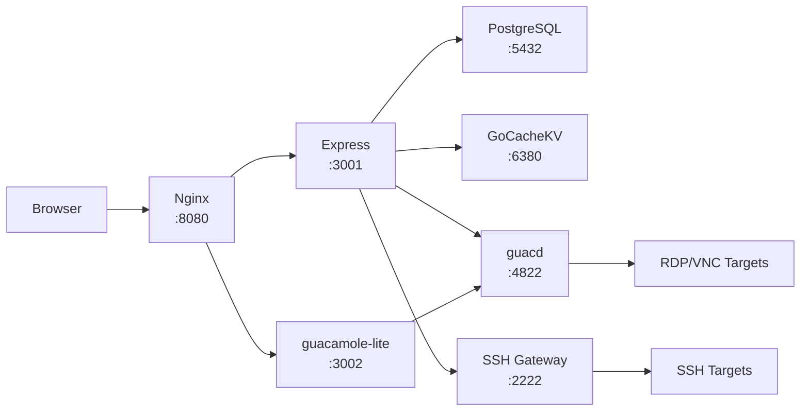

# Arsenale Documentation

**Version:** 1.7.1 | **License:** BUSL-1.1

Arsenale is a secure remote access platform that provides SSH, RDP, VNC, and database proxy access through a unified web interface. It features multi-tenancy, encrypted credential vaults, session recording, and enterprise-grade security with zero-trust networking.

## 📚 Table of Contents

| Section | Description |
|---------|-------------|
| [Getting Started](getting-started.md) | Installation, prerequisites, first run |
| [Architecture](architecture.md) | System design, components, data flow |
| [Configuration](configuration.md) | 120+ environment variables reference |
| [API Reference](api-reference.md) | 200+ REST API endpoints |
| [Deployment](deployment.md) | Ansible, Docker, CI/CD, TLS |
| [Development](development.md) | Contributing, testing, code quality |
| [Troubleshooting](troubleshooting.md) | Common errors, debugging, FAQ |
| [LLM Context](llm-context.md) | Consolidated context for AI agents |

## 🚀 Quick Start

```bash
git clone https://github.com/dnviti/arsenale.git
cd arsenale
npm install
make setup     # First time: vault + certs
npm run dev    # Start everything
```

Open `https://localhost:3000` and complete the Setup Wizard.

## 🧩 Technology Stack

| Layer | Technologies |
|-------|-------------|
| Frontend | React 19, Vite, Material-UI v7, Zustand, XTerm.js, guacamole-common-js |
| Backend | Express 5, TypeScript, Prisma 7, Socket.IO, Passport |
| Database | PostgreSQL 16 (SSL/TLS) |
| Remote Access | SSH (ssh2), RDP/VNC (guacd), Database Proxy |
| Security | JWT + refresh tokens, Argon2, AES-256-GCM, WebAuthn, TOTP, mTLS |
| Auth Providers | Google, Microsoft, GitHub, OIDC, SAML, LDAP/AD |
| Infrastructure | Ansible, Podman/Docker, GoCacheKV (Go), Nginx |
| CI/CD | GitHub Actions, CodeQL, Trivy |
| Browser Extension | Chrome Manifest V3, React |

## 🏗 Architecture Overview



## 🔐 Security Highlights

- **Zero-trust networking**: TLS/mTLS on every service-to-service connection
- **Vault encryption**: AES-256-GCM with per-user keys (Argon2-derived)
- **Multi-factor auth**: TOTP, WebAuthn/FIDO2, SMS OTP
- **Token security**: Short-lived JWTs (15 min), family-based refresh rotation, IP+UA binding
- **Anomaly detection**: Impossible travel, lateral movement (MITRE T1021)
- **Audit trail**: 70+ action types logged for compliance
- **Rate limiting**: Three-tiered (whitelist, authenticated, anonymous) with distributed counters
- **Rootless containers**: All images run as non-root users

## 📦 Workspaces

```
arsenale/
├── server/                    # Express API (TypeScript)
├── client/                    # React SPA (Vite + MUI)
├── gateways/
│   ├── tunnel-agent/          # Zero-trust tunnel client
│   ├── ssh-gateway/           # SSH bastion container
│   ├── guacd/                 # RDP/VNC daemon
│   ├── guacenc/               # Recording video converter
│   └── db-proxy/              # Database protocol proxy
├── extra-clients/
│   └── browser-extensions/    # Chrome extension
├── infrastructure/
│   └── gocache/               # In-memory cache sidecar
└── deployment/
    └── ansible/               # Deployment automation
```
