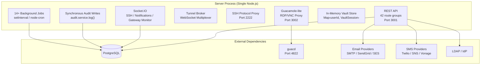
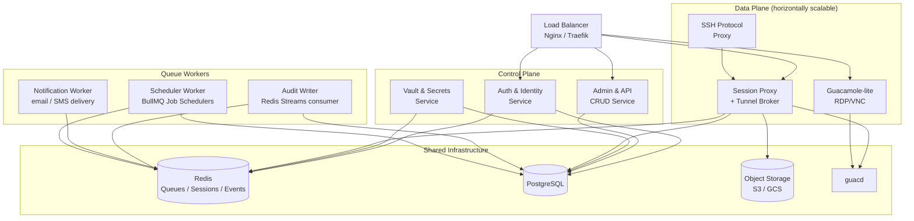
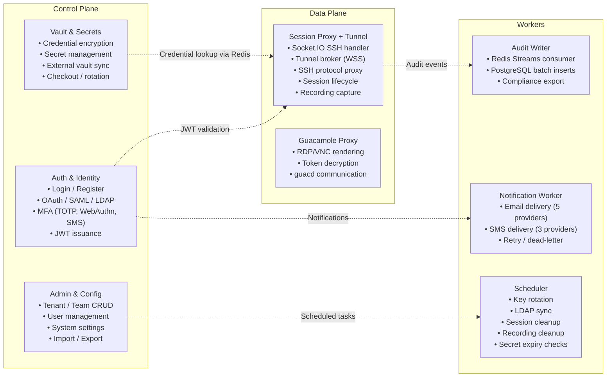
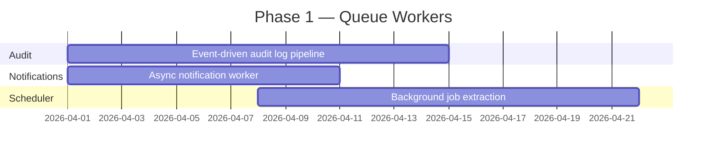
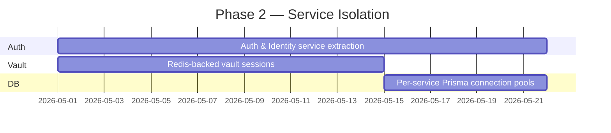
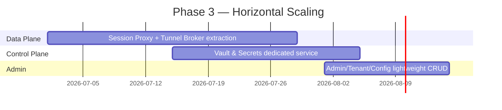

# Infrastructure Roadmap

> **Status:** Planned for a future release. This document describes the architectural evolution from the current monolithic server to a decomposed, horizontally scalable infrastructure.

## Current Architecture

Arsenale currently runs as a **single monolithic Node.js process** serving three listener ports:

### Identified Bottlenecks

| Bottleneck | Impact | Root Cause |
|-----------|--------|------------|
| Argon2/bcrypt on login | Blocks event loop 50-200ms per call | CPU-bound crypto in same process as WebSocket relay |
| Single Prisma connection pool | All 85 services share ~10-20 DB connections | Heavy session writes compete with auth lookups and audit inserts |
| In-memory state contention | Vault sessions + tunnel registry + SSH sessions in one process | No horizontal scaling; GC pressure from large Maps |
| Synchronous audit writes | ~30-40% of DB write pressure on the hot path | Every session start, connection open, and policy check triggers a Prisma insert |
| Background job timers | 14+ setInterval timers compete for event loop | Cleanup sweeps, health probes, and LDAP sync interleave with request handling |
| External API latency | 100-2000ms email/SMS calls hold event loop callbacks | Notification delivery in the request lifecycle |

## Target Architecture

The decomposition follows the **control-plane / data-plane** pattern used by Teleport, HashiCorp Boundary, and StrongDM.

### Service Boundaries

## Implementation Phases

### Phase 1 — Low-Risk, High-Impact

Queue-based extraction of fire-and-forget workloads. No changes to the REST/WebSocket API surface.

| Action | Effort | Impact | Tracking |
|--------|--------|--------|----------|
| Event-driven audit log pipeline (Redis Streams + BullMQ) | Low | Removes 30-40% DB write pressure | [IDEA-AUDIT-2046](https://github.com/dnviti/arsenale/issues/395) |
| Async notification worker (queue-based email/SMS) | Low | Eliminates 100-2000ms external API latency from main process | [IDEA-NOTIF-2050](https://github.com/dnviti/arsenale/issues/399) |
| Background job scheduler extraction (BullMQ Job Schedulers) | Medium | Frees event loop from 14+ periodic sweep timers | [IDEA-SCHED-2049](https://github.com/dnviti/arsenale/issues/398) |

**Expected outcome:** ~60% of the performance benefit with ~20% of the effort. Redis becomes the sole new infrastructure dependency.

### Phase 2 — Medium Effort, Significant Gain

Service isolation for CPU-bound and stateful components.

| Action | Effort | Impact | Tracking |
|--------|--------|--------|----------|
| Extract Auth & Identity as standalone service | Medium | CPU isolation for Argon2/bcrypt; independent scaling for SSO | [IDEA-SCALE-2047](https://github.com/dnviti/arsenale/issues/396) |
| Redis-backed vault session store | Medium | Enables horizontal scaling of any service needing credentials | [IDEA-VAULT-2048](https://github.com/dnviti/arsenale/issues/397) |
| Per-service Prisma connection pools | Low | Tuned pool sizes per workload profile | Part of service extraction |

### Phase 3 — Horizontal Scaling

Full control-plane / data-plane separation.

| Action | Effort | Impact | Tracking |
|--------|--------|--------|----------|
| Extract Session Proxy + Tunnel Broker as data-plane service | High | Horizontal scaling by session count; dedicated WebSocket/SSH resources | [IDEA-SCALE-2047](https://github.com/dnviti/arsenale/issues/396) |
| Extract Vault & Secrets as dedicated service | High | Security isolation; independent scaling | [IDEA-VAULT-2048](https://github.com/dnviti/arsenale/issues/397) |
| Extract Admin/Tenant/Config as lightweight CRUD service | Medium | Minimal resource allocation for low-traffic operations | Part of IDEA-SCALE-2047 |

## Key Design Decisions

### What stays co-located

The **tunnel broker** and **session proxy** must remain in the same service. `openStream()` returns an in-memory `Duplex` stream that cannot cross process boundaries without a streaming proxy layer (Unix domain sockets or gRPC bidirectional streams), which would add latency and complexity to the real-time data path.

### Redis as the central bus

Redis serves three roles in the target architecture:

1. **Message queue** — Redis Streams for audit events; BullMQ for job scheduling and notifications
2. **Session store** — Encrypted vault session envelopes with TTL-based expiry
3. **Pub/Sub** — Cross-service event notification (e.g., vault unlock broadcasts)

This avoids introducing multiple infrastructure dependencies (Kafka, RabbitMQ, etc.) while providing consumer group semantics equivalent to Kafka.

### Session recordings to object storage

In the target architecture, session recordings (SSH asciicast, RDP/VNC Guacamole format) are written to S3-compatible object storage instead of the local filesystem. This enables truly stateless data-plane nodes that can be scaled and replaced without data loss.

## Related Ideas

All infrastructure evolution ideas are tracked as GitHub Issues:

- [IDEA-AUDIT-2046 — Event-driven audit log pipeline via Redis Streams](https://github.com/dnviti/arsenale/issues/395)
- [IDEA-SCALE-2047 — Control-plane / data-plane architecture split](https://github.com/dnviti/arsenale/issues/396)
- [IDEA-VAULT-2048 — Redis-backed vault session store](https://github.com/dnviti/arsenale/issues/397)
- [IDEA-SCHED-2049 — Background job scheduler extraction](https://github.com/dnviti/arsenale/issues/398)
- [IDEA-NOTIF-2050 — Async notification worker](https://github.com/dnviti/arsenale/issues/399)
