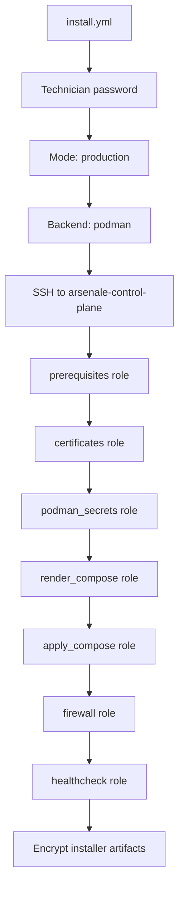
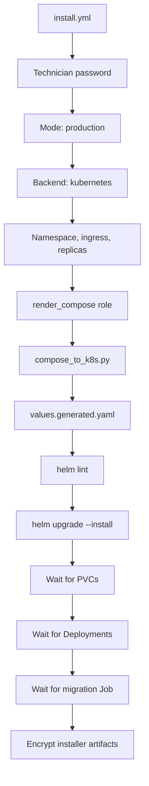
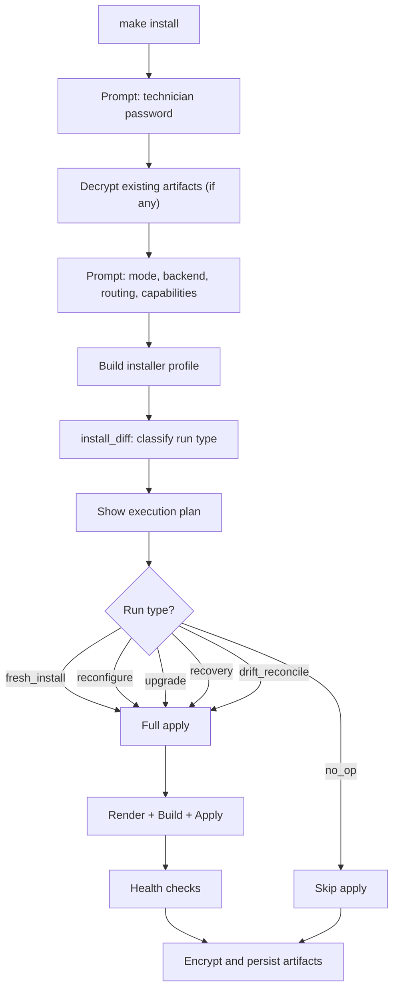

## Overview

Arsenale ships with an installer-first deployment flow driven by Ansible. The installer is:

- **CLI-only**: No web UI or GUI for installation.
- **Interactive**: Prompts for decisions (mode, backend, capabilities, routing).
- **Idempotent**: Can be rerun safely; detects no-op, reconfigure, upgrade, recovery, and drift.
- **Password-gated**: A technician password encrypts all installer artifacts at rest and is never stored on disk.
- **Backend-aware**: The same installer profile model drives both Podman Compose and Kubernetes Helm backends.

## Entry Points

Preferred entry points from the repository root:

```bash
make install     # Interactive installer (prompts for mode, backend, capabilities)
make configure   # Reconfigure an existing production install
make deploy      # Deploy or update production stack
make recover     # Re-apply from last known good encrypted state
make status      # Read encrypted installer status without deploying
make dev         # Deploy the installer-aware development stack
make dev-down    # Tear down the development stack
```

Underlying playbooks:

| Makefile Target | Playbook | Purpose |
|-----------------|----------|---------|
| `make install` | `playbooks/install.yml` | Full interactive installer |
| `make configure` | `playbooks/install.yml -e installer_mode=production` | Reconfigure |
| `make deploy` | `playbooks/install.yml -e installer_mode=production` | Deploy or update |
| `make recover` | `playbooks/install.yml -e installer_mode=production` | Recovery flow |
| `make status` | `playbooks/status.yml` | Status read |
| `make dev` | `playbooks/install.yml -e installer_mode=development` | Development |
| `make dev-down` | `playbooks/deploy.yml -e arsenale_env=development -e arsenale_state=absent` | Dev teardown |

## Modes

### Development Mode

```bash
make dev
```

- Deploys the selected installer-managed stack on localhost.
- Resolves the same capabilities and routing model as production.
- Backend is forced to **Podman**.
- Builds selected images locally from the checked-out repository.
- Runs `dev-bootstrap` to seed an admin user and tenant.
- Firewall rules are **not** applied.
- Certificates are generated under `${XDG_STATE_HOME:-$HOME/.local/state}/arsenale-dev/dev-certs/` by default.
- Demo database and tunnel fixture services are not force-enabled by `make dev`.

After completion:

| URL | Purpose |
|-----|---------|
| `https://localhost:3000` | Containerized client |
| `https://localhost:3005` | Local Vite frontend (`npm run dev:client`) |
| `http://127.0.0.1:18080/healthz` | Control-plane API health |

Default dev credentials:

```
Email:    admin@example.com
Password: DevAdmin123!
Tenant:   Development Environment
```

### Production Mode

```bash
make install    # Interactive
make deploy     # Non-interactive (uses existing profile or defaults)
```

- Deploys **only the selected capabilities**.
- Supports two backends: Podman Compose and Kubernetes via Helm.
- Podman backend: connects to a remote target host over SSH.
- Kubernetes backend: uses the local kubectl context.
- The `prerequisites` role installs system dependencies on the target.
- The `firewall` role configures nftables when enabled.
- API health endpoints are validated after deployment.
- Secrets are verified to be mounted via Podman secrets, not environment variables.

## Backends

### Podman Compose

The default backend. Deploys rootless containers via `podman-compose` on a systemd-based Linux host.



Key characteristics:

- **Rootless**: Containers run under the `arsenale` system user.
- **Systemd integration**: `loginctl enable-linger` for persistent sessions.
- **Secret injection**: Via Podman secrets at `/run/secrets/`, not environment variables.
- **Container hardening**: `read_only: true`, `cap_drop: [ALL]`, `no-new-privileges`.

### Kubernetes via Helm

Generates a Helm chart from the resolved installer profile.



The Helm chart can also be installed standalone:

```bash
helm install arsenale ./chart -f values.yaml --namespace arsenale
```

Interactive Kubernetes prompts:

| Prompt | Default | Description |
|--------|---------|-------------|
| Namespace | `arsenale` | Kubernetes namespace |
| Ingress class | `nginx` | Ingress controller class |
| Ingress host | `arsenale_domain` | Hostname for ingress rules |
| Ingress TLS | `true` | Enable TLS on ingress |
| Replica count | `1` | Replicas per service |

Docker is **not** a supported installer backend.

## Capabilities

Capabilities control which services are included in the rendered runtime. They are defined in `deployment/ansible/install/capabilities.yml`.

| Capability | Title | Default | Description | Dependencies |
|------------|-------|---------|-------------|-------------|
| `core` | Core Platform | **Required** | CLI enabled, connections, keychain | -- |
| `keychain` | Keychain | Enabled | Tenant vault, secret storage, external vault integration, password rotation | -- |
| `connections` | Connections | Enabled | SSH, RDP, VNC connections and folders | -- |
| `databases` | Databases | Enabled | Database proxy and SQL tooling | `connections` |
| `recordings` | Recordings | Enabled | Session recording and video export | `connections` |
| `zero_trust` | Zero Trust | **Disabled** | Tunnel broker, runtime agent, managed zero-trust gateway path | -- |
| `agentic_ai` | Agentic AI | Enabled | Model gateway, tool gateway, memory service, AI-assisted tooling | -- |
| `enterprise_auth` | Enterprise Auth | Enabled | SAML, OIDC, OAuth provider, LDAP surfaces | -- |
| `sharing_approvals` | Sharing And Approvals | Enabled | External sharing, approvals, check-outs | -- |
| `cli` | CLI | Enabled | Device auth and CLI support | -- |

When a capability is disabled:

- Its services are removed from the rendered Compose/Helm output via `install_model.py prune-compose`.
- Backend routes and frontend affordances for that capability are removed.
- Persistent data (database volumes) is **not** deleted during removal or recovery.

In development mode, capabilities and routing resolve exactly like production. The development-specific difference is local Podman execution with source-built images.

## Technician Password

The installer prompts for a technician password before reading or writing installer state.

**Rules**:

- Entered on fresh install; required again on every rerun.
- **Never** stored on disk. Not logged by Ansible.
- Used to encrypt/decrypt installer artifacts via AES (`scripts/install_crypto.py`).
- Must match the password used on previous runs to decrypt existing artifacts.

**Automation support**:

```bash
# Via extra variable (not recommended for production -- visible in process list)
ansible-playbook playbooks/install.yml -e installer_password="secret"

# Via password file (recommended)
ansible-playbook playbooks/install.yml -e install_password_file=/path/to/password

# Repo wrapper auto-detect
# If <repo-root>/install/password.txt exists, make dev/install/deploy/status/... use it automatically.
make dev

# Via environment variable (with the status helper)
INSTALLER_PASSWORD=secret python3 scripts/install_status.py \
  --input /opt/arsenale/install/install-status.enc \
  --password-env INSTALLER_PASSWORD
```

## Encrypted Installer Artifacts

On a target host the canonical installer artifact directory is:

```text
/opt/arsenale/install/     # Production
<repo-root>/install/       # Development
```

For headless local reruns through the repo wrapper, place the technician password in
`<repo-root>/install/password.txt`. `make dev`, `make deploy`, `make status`, and the other
installer-backed Make targets will pass that file as `install_password_file` automatically.

| Artifact | Content |
|----------|---------|
| `install-profile.enc` | Desired deployment profile (mode, backend, capabilities, routing, kubernetes config) |
| `install-state.enc` | Last applied state (profile hash, applied artifact hashes, active services, timestamps) |
| `install-status.enc` | Last run result (success/failure, timestamps, health summary, drift summary) |
| `install-log.enc` | Execution log entries (timestamp, run type, backend, mode, result, error) |
| `rendered-artifacts.enc` | Full rendered compose/helm output with SHA256 hashes |

These artifacts contain the canonical desired profile and last applied state. Generated runtime config is derived from them and is overwritten on rerun if drift is detected.

**Artifact lifecycle**:

1. On every installer run, existing artifacts are decrypted (if present) using the technician password.
2. The desired profile is compared against the existing state to classify the run.
3. After apply (or failure), updated artifacts are encrypted and persisted.
4. On failure, the status and log artifacts record the failure; the state artifact is not updated.

## Fresh Install Flow



Detailed steps:

1. Prompt for the technician password.
2. Read and decrypt any existing installer artifacts.
3. Ask only the questions relevant to the chosen mode and backend.
4. Resolve capabilities, routing, storage, and runtime choices into one desired profile.
5. Validate the profile against `profile.schema.json`.
6. Compute a diff against the existing state via `install_model.py diff`.
7. Classify the run type.
8. Show the execution plan (run type, backend, mode, services, changes).
9. Render compose or Helm artifacts.
10. Apply the backend-specific delta.
11. Run health checks.
12. Encrypt and persist profile, state, status, log, and render metadata.

## Rerun, Recovery, and Drift Repair

On rerun the installer:

1. Prompts for the technician password again.
2. Decrypts installer state and status.
3. Recomputes the desired profile and render metadata.
4. Classifies the run:

| Run Type | Trigger |
|----------|---------|
| `fresh_install` | No existing state found |
| `no_op` | Desired profile matches current state exactly (including rendered artifact hashes) |
| `reconfigure` | Capabilities, routing, or rendered artifacts changed |
| `upgrade` | Product version changed |
| `recovery` | Previous run failed; re-applying from last known good state |
| `drift_reconcile` | Runtime files were manually modified outside the installer |

5. Applies only the required delta.

**Important behaviors**:

- Manual edits to generated runtime files (`docker-compose.yml`, `.env`) are treated as drift and are overwritten from encrypted canonical state.
- A `no_op` run can be reclassified as `reconfigure` if rendered artifact hashes differ from the last applied state (e.g., template changes in a new code version).
- Persistent data (database volumes) is never deleted implicitly during capability removal or recovery.
- Backend switches (e.g., podman to kubernetes) tear down the previous backend before applying the new one.

## Status Reads

External tooling can inspect install state without querying a running Arsenale instance.

```bash
make status
```

Or directly:

```bash
INSTALLER_PASSWORD=...
python3 deployment/ansible/scripts/install_status.py \
  --input /opt/arsenale/install/install-status.enc \
  --password-env INSTALLER_PASSWORD
```

The status artifact exposes:

| Field | Description |
|-------|-------------|
| `schemaVersion` | Installer schema version |
| `productVersion` | Deployed product version |
| `mode` | `development` or `production` |
| `backend` | `podman` or `kubernetes` |
| `enabledCapabilities` | List of active capabilities |
| `lastAction` | Run type of the last installer execution |
| `lastResult` | `success` or `failure` |
| `timestamps.startedAt` | When the last run started |
| `timestamps.finishedAt` | When the last run completed |
| `healthSummary.status` | `ok`, `failed`, or `unknown` |
| `healthSummary.services` | List of active service names |
| `driftSummary.status` | `clean`, `dirty`, or `unknown` |

## Non-Interactive Usage

All installer prompts can be bypassed with extra variables for CI/CD pipelines:

```bash
ansible-playbook playbooks/install.yml --ask-vault-pass \
  -e install_password_file=/run/secrets/installer-password \
  -e installer_mode=production \
  -e installer_backend=podman \
  -e installer_capabilities_csv="keychain,connections,databases,recordings,enterprise_auth,cli" \
  -e installer_direct_gateway=true \
  -e installer_zero_trust=false

make dev DEV_CAPABILITIES=cli DEV_DIRECT_GATEWAY=false DEV_ZERO_TRUST=false
```

For Kubernetes:

```bash
ansible-playbook playbooks/install.yml --ask-vault-pass \
  -e install_password_file=/run/secrets/installer-password \
  -e installer_mode=production \
  -e installer_backend=kubernetes \
  -e installer_kube_namespace=arsenale \
  -e installer_ingress_class=nginx \
  -e installer_ingress_host=arsenale.example.com \
  -e installer_ingress_tls=true \
  -e installer_kube_replicas=3 \
  -e installer_capabilities_csv="keychain,connections,databases,recordings,enterprise_auth,cli"
```

## Kubernetes Notes

- Kubernetes installs render a values-driven Helm chart from the resolved installer profile.
- Ansible can install the chart directly, and the chart can also be installed standalone with `helm install ... -f values.yaml`.
- The client proxy uses cluster-qualified service DNS names so browser-side `/api`, `/guacamole`, and `/ws/terminal` traffic resolves correctly inside the cluster.
- `compose_to_k8s.py` handles the conversion from Docker Compose definitions to Kubernetes Deployments, Services, ConfigMaps, Secrets, and PVCs.
- Additional Kubernetes-specific variables (storage class, autoscaling, node selector, tolerations, image pull secrets) can be set via extra variables.

## Recommended Operator Flow

1. Run `make setup` once per workspace.
2. Use `make dev` for the local installer-aware development environment.
3. Use `make install` or `make deploy` for production installs.
4. Use `make configure` for intentional production changes.
5. Use `make status` for password-gated encrypted status reads.
6. Use `make recover` after interrupted or failed runs.
7. Use `make backup` before major changes.
8. Use `make rotate` periodically to rotate runtime secrets.
