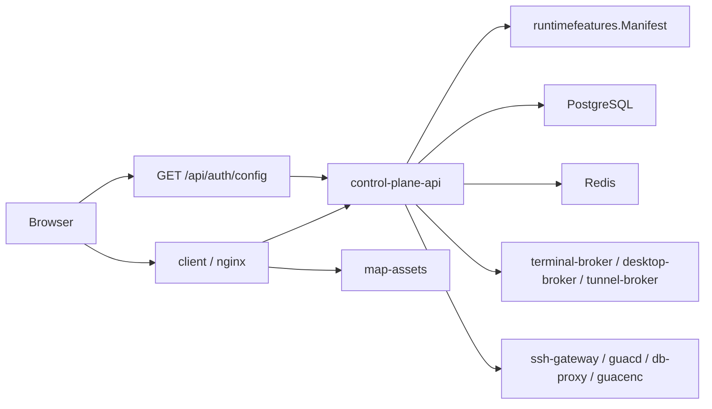

# Arsenale LLM Context

## 📌 Project Summary

Arsenale is a Go-first remote access, database access, and installer-managed deployment platform with a React frontend. It supports SSH, RDP, VNC, secrets management, tenant administration, gateway orchestration, database querying through DB proxy gateways, audit logging, and AI-assisted database tooling.

The active runtime lives in:

- `backend/` for services and internal packages
- `client/` for the SPA
- `gateways/` for protocol and tunnel containers
- `tools/arsenale-cli/` for operator and smoke-test tooling
- `deployment/ansible/` and `deployment/helm/` for installer-managed deployment

## 🧭 Runtime Planes

| Plane | Services |
|------|----------|
| Control | `control-plane-api`, `control-plane-controller`, `authz-pdp` |
| Agent | `model-gateway`, `tool-gateway`, `agent-orchestrator`, `memory-service` |
| Runtime | `terminal-broker`, `desktop-broker`, `tunnel-broker`, `query-runner`, `map-assets`, `recording-worker`, `db-proxy` |
| Execution | `runtime-agent` |

Every Go service shares these meta endpoints via `backend/internal/app/app.go`:

- `/healthz`
- `/readyz`
- `/v1/meta/service`
- `/v1/meta/architecture`

## 🎬 Session Recording

SSH sessions are recorded as asciicast `.cast` files by the SSH gateway. Desktop sessions (RDP/VNC) are recorded as Guacamole `.guac` files by guacd. The `recording-worker` (port 8094) handles conversion and retention. Key env vars: `RECORDING_ENABLED`, `RECORDING_PATH`, `RECORDING_VOLUME`, `RECORDING_RETENTION_DAYS`.

## 🤖 Agent and AI Capabilities

The capability catalog in `backend/internal/catalog/catalog.go` defines risk-rated permissions:

- `connection.read` (Low), `connection.connect.ssh` (Medium), `connection.connect.rdp` (Medium)
- `db.schema.read` (Low), `db.query.execute.readonly` (Medium), `db.query.execute.write` (High, requires approval)
- `gateway.read` (Low), `gateway.scale` (High, requires approval), `workload.deploy` (Critical, requires approval)
- `memory.read` (Low), `memory.write` (Medium), `audit.search` (Low)

Memory types: `working`, `episodic`, `semantic`, `procedural`, `artifact`.
Memory scopes: `tenant`, `principal`, `agent`, `run`, `workflow`.
AI providers: `anthropic`, `openai`, `ollama`, `openai-compatible`.
The `/api/ai/*` routes run in `control-plane-api`, so external provider DNS and egress must be available from that service.

## 🧩 Installer And Feature Profile

Current runtime shape is not static. `backend/internal/runtimefeatures/manifest.go` builds a manifest from:

- `ARSENALE_INSTALL_MODE`
- `ARSENALE_INSTALL_BACKEND`
- `ARSENALE_INSTALL_CAPABILITIES`
- `FEATURE_*`
- `CLI_ENABLED`
- `GATEWAY_ROUTING_MODE`

That manifest controls:

- which route families are registered in `backend/cmd/control-plane-api/routes*.go`
- what the SPA exposes after it loads `GET /api/auth/config`
- whether connections, GeoIP, DB proxy, keychain, multi-tenancy, recordings, zero trust, AI, enterprise auth, sharing, and CLI surfaces are active

The SPA reads the public config through `client/src/api/auth.api.ts` and stores it in `client/src/store/featureFlagsStore.ts`.
It also loads the current tenant permission snapshot from `GET /api/user/permissions` into `client/src/store/authStore.ts` so tenant settings surfaces can be hidden when the user lacks edit rights.

## 🏗 Core Request Flow



## 🔐 Public API Groups

Authoritative route registration files:

- `backend/cmd/control-plane-api/routes.go`
- `backend/cmd/control-plane-api/routes_public.go`
- `backend/cmd/control-plane-api/routes_auth*.go`
- `backend/cmd/control-plane-api/routes_user_*.go`
- `backend/cmd/control-plane-api/routes_resources.go`
- `backend/cmd/control-plane-api/routes_secrets.go`
- `backend/cmd/control-plane-api/routes_sessions.go`
- `backend/cmd/control-plane-api/routes_tenants.go`
- `backend/cmd/control-plane-api/routes_operations.go`
- `backend/cmd/control-plane-api/routes_live.go`
- `backend/cmd/control-plane-api/routes_internal.go`

Highest-value public prefixes:

- `/api/auth` — passkey-first login, password fallback, tenant-aware MFA, registration, OAuth, SAML, recovery
- `/api/user` — profile, password, avatar, effective permissions, MFA lifecycle, notification schedule
- `/api/secrets` — keychain CRUD, versioning, sharing, breach check, rotation
- `/api/vault` — personal vault lock/unlock, passkey-first re-unlock, recovery
- `/api/connections` — connection CRUD, sharing, import/export, favorites
- `/api/files` — connection-scoped RDP shared-drive staging
- `/api/files/ssh/*` — SSH file browser list/mkdir/delete/rename/upload/download
- `/api/sessions` — SSH, RDP, VNC, database, DB tunnel, heartbeat, terminate
- `/api/gateways` — gateway CRUD, derived operational status, templates, scaling, tunnel controls, instances
- `/api/db-audit` — query audit logs, firewall rules, masking policies, rate limits
- `/api/recordings` — recording list, stream, analyze, video export, audit trail
- `/api/tenants` — tenant CRUD, users, invite, permissions, IP allowlist, MFA stats
- `/api/admin` — email status, app config, system settings, auth providers
- `/api/ai` — AI config, natural-language-to-SQL generation, query optimization
- `/api/audit` — audit log search, geo summary, connection/tenant audit
- `/api/notifications` — notification list, preferences, read state
- `/api/access-policies` — access policy CRUD
- `/api/keystroke-policies` — keystroke policy CRUD
- `/api/checkouts` — approval-style credential checkout flow
- `/api/teams` — team CRUD and membership management
- `/api/tabs` — UI tab state sync

## 🗄 Database Execution Model

This remains a critical architectural rule:

- the control plane issues database sessions,
- the control plane does not directly become the database client of record,
- interactive database queries flow through `db-proxy` gateways,
- `db-proxy` exposes the shared `queryrunnerapi` routes.

Public DB session endpoints:

- `POST /api/sessions/database`
- `POST /api/sessions/database/{id}/query`
- `GET /api/sessions/database/{id}/schema`
- `POST /api/sessions/database/{id}/explain`
- `POST /api/sessions/database/{id}/introspect`
- `GET /api/sessions/database/{id}/history`

DB audit endpoints:

- `/api/db-audit/logs`
- `/api/db-audit/firewall-rules`
- `/api/db-audit/masking-policies`
- `/api/db-audit/rate-limit-policies`

Interactive query protocols currently supported:

- PostgreSQL
- MySQL / MariaDB
- MongoDB
- Oracle
- SQL Server

DB2 metadata fields exist in the connection schema, but DB2 is not active in the current query protocol switch.

## ⚙️ Configuration Truth

Authoritative inputs:

- `.env.example` for root env shape
- `deployment/ansible/inventory/group_vars/all/vars.yml` for non-secret defaults
- `deployment/ansible/inventory/group_vars/all/vault.yml` for secrets
- `deployment/ansible/install/capabilities.yml` for installer-owned capability toggles
- `deployment/ansible/playbooks/install.yml` for installer entry
- `deployment/ansible/playbooks/status.yml` for encrypted installer status reads
- `deployment/ansible/roles/deploy/templates/compose.yml.j2` for actual container env, ports, and secret mounts
- `client/vite.config.ts` for frontend local-dev proxying

## 🚀 Useful Commands

```bash
npm install
make setup
make dev
make dev control-plane
npm run dev
make status
make deploy
make recover
npm run verify
npm run dev:api-acceptance
mkdir -p ./build/go
go build -o ./build/go/arsenale-cli ./tools/arsenale-cli
./build/go/arsenale-cli --server https://localhost:3000 health
```

## 🧪 Development Bootstrap

The installer-driven development flow now resolves the same capability graph as production and builds the selected images locally on Podman.

It still seeds:

- admin credentials: `admin@example.com` / `ArsenaleTemp91Qx`
- a default tenant: `Development Environment`
- tenant membership and baseline setup state
- local `ssh-gateway` and `guacd` gateway records when `connections` is enabled
- demo databases with a deterministic ERP-style dataset: 60 customers, 72 products, 180 orders, 540 order lines, and 180 invoices per engine

With the default development capabilities, `make dev` includes the demo databases. Tunnel gateway fixtures still require `DEV_ZERO_TRUST=true`.
If `multi_tenancy` is disabled, the seeded tenant remains the platform's only organization and the create/switch organization flows stay off.

For code-only iteration, `make dev client`, `make dev gateways`, and `make dev control-plane` reuse the saved dev render artifacts and refresh only those services; installer/profile/cert/secret changes still require a full `make dev`.

## 📧 Email, SMS, And Security Config

- Email providers: `smtp`, `sendgrid`, `ses`, `resend`, `mailgun` (via `EMAIL_PROVIDER`)
- SMS providers: `twilio`, `sns`, `vonage` (via `SMS_PROVIDER`; empty for dev mode)
- Login rate limiting: `LOGIN_RATE_LIMIT_WINDOW_MS`, `LOGIN_RATE_LIMIT_MAX_ATTEMPTS`
- Rate limit whitelist: `RATE_LIMIT_WHITELIST_CIDRS` bypasses global and auth login limiters for trusted CIDRs
- Account lockout: `ACCOUNT_LOCKOUT_THRESHOLD`, `ACCOUNT_LOCKOUT_DURATION_MS`
- Session limits: `MAX_CONCURRENT_SESSIONS`, `ABSOLUTE_SESSION_TIMEOUT_SECONDS`
- Impossible travel detection: `IMPOSSIBLE_TRAVEL_SPEED_KMH` (default 900)
- WebAuthn: `WEBAUTHN_RP_ID`, `WEBAUTHN_RP_ORIGIN`, `WEBAUTHN_RP_NAME`
- LDAP: `LDAP_ENABLED`, `LDAP_SERVER_URL`, `LDAP_SYNC_ENABLED`, `LDAP_AUTO_PROVISION`
- External vault providers: HashiCorp Vault, AWS Secrets Manager, Azure Key Vault, GCP Secret Manager, CyberArk Conjur

## 🔐 Security Model

- **Vault encryption**: AES-256-GCM with Argon2id key derivation (65,536 KiB memory, 3 iterations)
- **Server encryption**: Separate `SERVER_ENCRYPTION_KEY` for tenant SSH keys and server-held material
- **Sharing**: Re-encrypted per recipient; external shares use HKDF-SHA256 with optional PIN
- **ABAC policies**: Folder > Team > Tenant specificity with time windows, MFA step-up, trusted-device requirements
- **DLP**: Tenant floor + per-connection overrides; Guacamole params + staged-file API guards for desktop, REST file browser guards for SSH

## 📁 File Transfer Model

- RDP shared-drive files are keyed by tenant, user, and connection in the shared object store, then materialized into the Guacamole drive cache under `DRIVE_BASE_PATH`.
- SSH file browsing does not use terminal WebSocket SFTP events. The SPA calls `/api/files/ssh/*` over REST and the control plane executes remote SFTP operations directly, staging upload/download payloads in the object store first.
- Threat scanning is pluggable through `FILE_THREAT_SCANNER_MODE`. The builtin scanner blocks the EICAR signature and is applied before staged payloads are delivered to the target or returned to the browser.
- The control plane requires `SHARED_FILES_S3_*` env vars for staged RDP and SSH file payloads. Development installs provision a MinIO-compatible endpoint by default; production installs must point these values at external S3-compatible storage.
- **SQL firewall**: Regex-based query blocking in db-proxy
- **Impossible travel**: Haversine distance between logins, flagged above 900 km/h default

Detailed specs: [security/encryption.md](security/encryption.md), [security/policies.md](security/policies.md), [security/authentication.md](security/authentication.md).

## 🗃 Database Schema

PostgreSQL 16 with versioned SQL migrations in `backend/migrations/`. Key entity groups: User, Tenant, Team, Connection, Session, VaultSecret, Gateway, AuditLog, AccessPolicy, Checkout, Notification. 100+ audit action types. 7 tenant roles (OWNER through GUEST). Detailed schemas: [database/](database/).

## 🌐 WebSocket Protocols

- SSH terminal: `/ws/terminal` (port 8090) — binary frames for input, output, resize, SFTP operations
- Desktop (RDP/VNC): `/guacamole` (port 8091) — Guacamole wire protocol
- SSE streams: gateway status, notifications, vault status, active sessions, audit, DB audit

## 📁 Extended References

- [guides/tunnel-implementation-guide.md](guides/tunnel-implementation-guide.md) — binary tunnel protocol spec
- [guides/zero-trust-tunnel-user-guide.md](guides/zero-trust-tunnel-user-guide.md) — tunnel deployment for Docker, K8s, systemd
- [agent-orchestration-gateway.md](agent-orchestration-gateway.md) — planned agent orchestration system
- [environment.md](environment.md) — complete 100+ env var catalog
- [components/](components/) — frontend component, store, and hook inventory

## ⚠️ Historical Notes

- Do not treat deleted `server/` paths as authoritative.
- Use plural `/api/secrets`, not older singular secret paths.
- Database connections are expected to pass through `db-proxy`, not direct control-plane drivers.
- Use `tools/arsenale-cli` as a first-class acceptance client when changing API behavior.
- Docker is not a supported installer backend; supported installer backends are Podman and Kubernetes.
