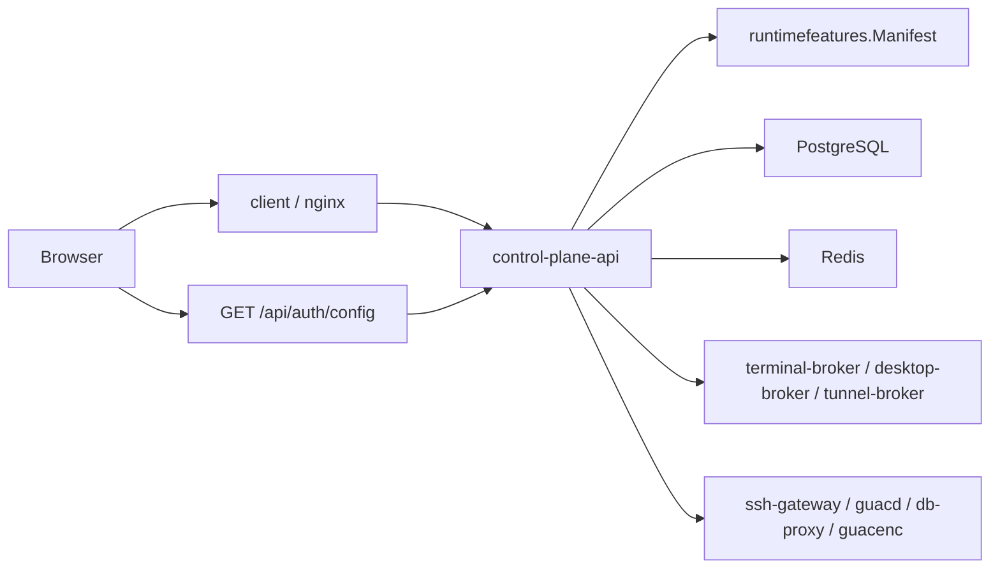

# Arsenale LLM Context

## 📌 Project Summary

Arsenale is a Go-first remote access, database access, and installer-managed deployment platform with a React frontend. It supports SSH, RDP, VNC, secrets management, tenant administration, gateway orchestration, database querying through DB proxy gateways, audit logging, and AI-assisted database tooling.

The active runtime lives in:

- `backend/` for services and internal packages
- `client/` for the SPA
- `gateways/` for protocol and tunnel containers
- `tools/arsenale-cli/` for operator and smoke-test tooling
- `deployment/ansible/` and `deployment/helm/` for installer-managed deployment

## 🧭 Runtime Planes

| Plane | Services |
|------|----------|
| Control | `control-plane-api`, `control-plane-controller`, `authz-pdp` |
| Agent | `model-gateway`, `tool-gateway`, `agent-orchestrator`, `memory-service` |
| Runtime | `terminal-broker`, `desktop-broker`, `tunnel-broker`, `query-runner`, `recording-worker`, `db-proxy` |
| Execution | `runtime-agent` |

Every Go service shares these meta endpoints via `backend/internal/app/app.go`:

- `/healthz`
- `/readyz`
- `/v1/meta/service`
- `/v1/meta/architecture`

## 🧩 Installer And Feature Profile

Current runtime shape is not static. `backend/internal/runtimefeatures/manifest.go` builds a manifest from:

- `ARSENALE_INSTALL_MODE`
- `ARSENALE_INSTALL_BACKEND`
- `ARSENALE_INSTALL_CAPABILITIES`
- `FEATURE_*`
- `CLI_ENABLED`
- `GATEWAY_ROUTING_MODE`

That manifest controls:

- which route families are registered in `backend/cmd/control-plane-api/routes*.go`
- what the SPA exposes after it loads `GET /api/auth/config`
- whether connections, DB proxy, keychain, recordings, zero trust, AI, enterprise auth, sharing, and CLI surfaces are active

The SPA reads the public config through `client/src/api/auth.api.ts` and stores it in `client/src/store/featureFlagsStore.ts`.

## 🏗 Core Request Flow



## 🔐 Public API Groups

Authoritative route registration files:

- `backend/cmd/control-plane-api/routes.go`
- `backend/cmd/control-plane-api/routes_public.go`
- `backend/cmd/control-plane-api/routes_auth*.go`
- `backend/cmd/control-plane-api/routes_user_*.go`
- `backend/cmd/control-plane-api/routes_resources.go`
- `backend/cmd/control-plane-api/routes_secrets.go`
- `backend/cmd/control-plane-api/routes_sessions.go`
- `backend/cmd/control-plane-api/routes_tenants.go`
- `backend/cmd/control-plane-api/routes_operations.go`
- `backend/cmd/control-plane-api/routes_live.go`
- `backend/cmd/control-plane-api/routes_internal.go`

Highest-value public prefixes:

- `/api/auth`
- `/api/user`
- `/api/secrets`
- `/api/connections`
- `/api/sessions`
- `/api/gateways`
- `/api/db-audit`
- `/api/recordings`
- `/api/tenants`
- `/api/admin`

## 🗄 Database Execution Model

This remains a critical architectural rule:

- the control plane issues database sessions,
- the control plane does not directly become the database client of record,
- interactive database queries flow through `db-proxy` gateways,
- `db-proxy` exposes the shared `queryrunnerapi` routes.

Public DB session endpoints:

- `POST /api/sessions/database`
- `POST /api/sessions/database/{id}/query`
- `GET /api/sessions/database/{id}/schema`
- `POST /api/sessions/database/{id}/explain`
- `POST /api/sessions/database/{id}/introspect`
- `GET /api/sessions/database/{id}/history`

DB audit endpoints:

- `/api/db-audit/logs`
- `/api/db-audit/firewall-rules`
- `/api/db-audit/masking-policies`
- `/api/db-audit/rate-limit-policies`

Interactive query protocols currently supported:

- PostgreSQL
- MySQL / MariaDB
- MongoDB
- Oracle
- SQL Server

DB2 metadata fields exist in the connection schema, but DB2 is not active in the current query protocol switch.

## ⚙️ Configuration Truth

Authoritative inputs:

- `.env.example` for root env shape
- `deployment/ansible/inventory/group_vars/all/vars.yml` for non-secret defaults
- `deployment/ansible/inventory/group_vars/all/vault.yml` for secrets
- `deployment/ansible/install/capabilities.yml` for installer-owned capability toggles
- `deployment/ansible/playbooks/install.yml` for installer entry
- `deployment/ansible/playbooks/status.yml` for encrypted installer status reads
- `deployment/ansible/roles/deploy/templates/compose.yml.j2` for actual container env, ports, and secret mounts
- `client/vite.config.ts` for frontend local-dev proxying

## 🚀 Useful Commands

```bash
npm install
make setup
make dev
npm run dev
make status
make deploy
make recover
npm run verify
npm run dev:api-acceptance
go build -o /tmp/arsenale-cli ./tools/arsenale-cli
/tmp/arsenale-cli --server https://localhost:3000 health
```

## 🧪 Development Fixtures

The development installer flow provisions:

- seeded admin credentials: `admin@example.com` / `DevAdmin123!`
- demo PostgreSQL, MySQL, MongoDB, Oracle, and SQL Server containers
- sample `DATABASE` connections for those fixtures
- tunneled `ssh-gateway`, `guacd`, and `db-proxy` fixtures
- tenant vault state, tenant SSH keys, and an orchestrator connection

## ⚠️ Historical Notes

- Do not treat deleted `server/` paths as authoritative.
- Use plural `/api/secrets`, not older singular secret paths.
- Database connections are expected to pass through `db-proxy`, not direct control-plane drivers.
- Use `tools/arsenale-cli` as a first-class acceptance client when changing API behavior.
- Docker is not a supported installer backend; supported installer backends are Podman and Kubernetes.
